---
jupytext:
  formats: md:myst
  text_representation:
    extension: .md
    format_name: myst
    format_version: 0.13
    jupytext_version: 1.16.4
kernelspec:
  display_name: Python 3
  language: python
  name: python3
---

<audio controls>
  <source src="audio/capitulo1.mp4" type="audio/mp4">
  Seu navegador não suporta o elemento de áudio.
</audio>

# 1. INTRODUÇÃO ANÁLISE ESPAÇO-TEMPORAL

A análise de dados espaciais e espaço-temporais é uma área interdisciplinar que reúne técnicas de geografia, estatística, ciência da computação e outras disciplinas para investigar fenômenos dinâmicos que variam no espaço e no tempo. Essa abordagem está diretamente relacionada ao contexto do geoprocessamento.

Os avanços tecnológicos das últimas décadas têm revolucionado a análise espaço-temporal, permitindo a coleta, armazenamento e processamento de grandes volumes de dados com alta granularidade espacial e temporal. Organizações públicas e privadas disponibilizam informações detalhadas sobre aspectos sociais, econômicos, ambientais e de saúde pública, frequentemente coletadas em alta frequência e com precisão geoespacial. 
Ao integrar as dimensões espaciais e temporais, a análise espaço-temporal oferece uma visão ampliada e detalhada de fenômenos dinâmicos. A dimensão espacial trata da localização e distribuição de eventos ou objetos no espaço físico, enquanto a dimensão temporal analisa como esses fenômenos se transformam, interagem e evoluem ao longo do tempo. Essa integração é de suma importância para compreender padrões, prever tendências futuras e avaliar mudanças com maior precisão, servindo como base para decisões fundamentadas em dados.

Uma característica central da análise espaço-temporal é sua capacidade de superar as limitações das análises estáticas, que capturam apenas um momento específico, oferecendo uma visão dinâmica e conectada dos processos ao longo do tempo. Isso permite identificar padrões, inferir relações causais, avaliar fatores subjacentes e observar como essas relações evoluem. Por exemplo, ao analisar áreas de alta criminalidade, a abordagem espaço-temporal permite correlacionar mudanças nesses padrões com variáveis como densidade populacional, condições socioeconômicas ou intervenções específicas, como o aumento da presença policial.

De acordo com Lee (2023), a transição da analítica espacial para a analítica espaço-temporal amplia as possibilidades de investigação, proporcionando uma compreensão mais profunda de fenômenos dinâmicos. Com a inclusão da dimensão temporal, torna-se possível monitorar mudanças, analisando como padrões espaciais evoluem ao longo do tempo, estudar interações entre eventos distantes no espaço mas conectados temporalmente, como a propagação de epidemias ou os impactos de políticas públicas e prever tendências ao modelar eventos futuros com base em padrões passados, como desastres naturais ou a expansão urbana.

Apesar de seus benefícios, a análise espaço-temporal enfrenta desafios consideráveis. Um dos principais é a dificuldade de conectar padrões espaciais em diferentes instantes temporais, já que muitas ferramentas de Sistemas de Informação Geográfica (SIG) oferecem capacidades limitadas para examinar processos espaço-temporais. Isso exige o desenvolvimento de métodos mais avançados para quantificar tendências e padrões, incluindo a análise de dependências espaciais e temporais, que revelam interações entre eventos em locais e tempos distintos. Problemas como o MAUP (problema de unidades de área modificáveis) e sua extensão espaço-temporal, o MATUP (problema de unidades de área e temporal modificáveis), também precisam ser considerados para garantir análises mais confiáveis.

Este capítulo apresenta uma introdução aos principais conceitos relacionados à análise de dados espaço-temporais, fornecendo uma base para compreender sua relevância, aplicações práticas e os desafios associados.

## 1.1 Exemplos de aplicação de análise espaço-temporal 

A análise espaço-temporal possui aplicações práticas em diversas áreas, incluindo planejamento urbano, saúde pública, segurança, monitoramento de fenômenos ambientais, gestão de recursos naturais, agricultura, transporte, economia, logística, e avaliação de políticas públicas, permitindo compreender e acompanhar fenômenos dinâmicos em suas dimensões espaciais e temporais.

Na saúde pública, a análise espaço-temporal é indispensável para rastrear a disseminação de doenças, identificar áreas de maior vulnerabilidade e avaliar a eficácia de intervenções. Por exemplo, estudos sobre a dengue em Kaohsiung, Taiwan (Chen, 2023), realizados entre os anos de 2004 e 2008, mostram como a análise espaço-temporal pode fornecer informações detalhadas sobre padrões de disseminação e agrupamento da doença. Durante o período de 2004–2005 (38 casos), 2005–2006 (90 casos) e 2007–2008 (131 casos), a simples distribuição espacial dos casos de dengue (figura 1) não foi suficiente para determinar se um cluster espacial em uma região também era um cluster temporal. 

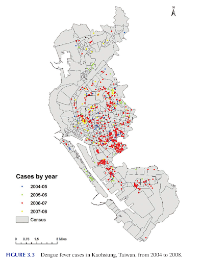

Figura 1. Distribuição dos caso de dengue em Kaohsiung, Taiwan, de 2004 a 2008. Fonte: Chen, 2023.

Ao analisar os casos por ano e usar como escala de tempo os dias do ano (figura 2), o processo espaço-temporal revelou que os casos ocorriam em períodos prolongados, principalmente de julho até janeiro do ano seguinte.

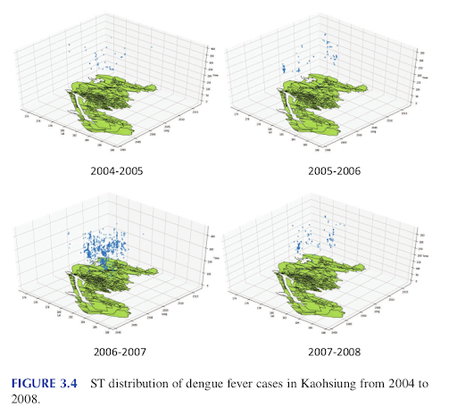

Figura 2: distribuição espaço-temporal dos casos de dengue em Kaohsiung de 2004 a 2008. Fonte: Chen, 2023.

Já o estudo realizado por Mo et al. (2020) investigou padrões espaciais e temporais durante o surto de COVID-19 utilizando técnicas de análise espaço-temporal baseadas no cubo espaço-tempo (STC). Esse estudo, conduzido entre 23 de janeiro de 2020 e 24 de fevereiro de 2020, aplicou métodos como a análise de outliers locais e a identificação de hotspots emergentes para compreender a dinâmica da disseminação da doença nesse período.

Para viabilizar as análises, os dados epidemiológicos foram estruturados para calcular a incidência diária por 100.000 habitantes. O conjunto de mapas temáticos apresentado na Figura 3 demonstra a evolução espacial dos casos confirmados acumulados em três datas: 23 de janeiro, 11 de fevereiro e 24 de fevereiro. 

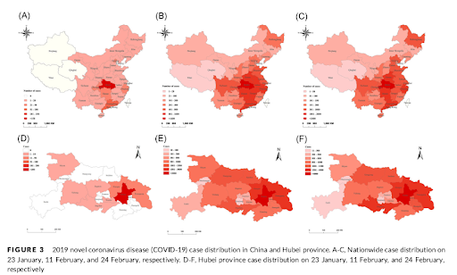

Figura 3: Distribuição de casos de coronavírus 2019 (COVID-19) na China e na província de Hubei.  A-C: Distribuição nacional de casos em 23 de janeiro, 11 de fevereiro e 24 de fevereiro, respectivamente.  D-F: Distribuição de casos na província de Hubei em 23 de janeiro, 11 de fevereiro e 24 de fevereiro, respectivamente. Fonte: Mo et al., 2020.

Os mapas da figura 3 evidenciam a rápida expansão da COVID-19 em Hubei e nas províncias vizinhas, destacando o papel central da região na propagação inicial do surto.

Na etapa seguinte, os dados foram processados em um sistema de informações geográficas (SIG) para construir um cubo espaço-temporal (Figura 4). 
Figura 4: Geração do cubo espaço-temporal dos casos de COVID-19. Fonte: Mo et al., 2020.

Em seguida, a análise de densidade Kernel foi aplicada (Figura 5), permitindo mapear as áreas com maior concentração de casos em diferentes períodos. 

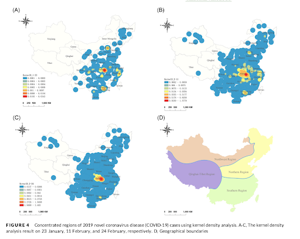

Figura 5:  Concentração de casos da doença do coronavírus 2019 (COVID-19) utilizando análise de densidade kernel. A-C: Resultados da análise de densidade kernel em 23 de janeiro, 11 de fevereiro e 24 de fevereiro, respectivamente. D: Limites geográficos da província. Fonte: Mo et al., 2020.

Os mapas resultantes destacaram um aumento progressivo na intensidade dos casos em Hubei, particularmente nas cidades de Wuhan e Shiyan, ao longo do tempo.

Além dessas análises, a análise de outliers locais e a identificação de hotspots emergentes foram etapas fundamentais do estudo. A análise de outliers locais, baseada no índice local de Moran (Moran’s I local), permitiu identificar agrupamentos estatisticamente significativos, revelando padrões como clusters alto-alto em Wuhan e Shiyan, áreas de alta incidência concentrada, e clusters baixo-baixo em outras regiões, conforme ilustrado na Figura 6. 

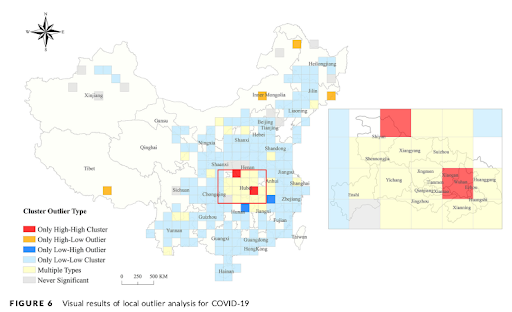

Figura 6: Resultados visuais da análise de outliers locais para a COVID-19. Fonte: Mo et al., 2020.

A identificação de hotspots emergentes, utilizando as estatísticas Getis-Ord Gi* e o teste de tendência Mann-Kendall, gerou mapas que classificaram os padrões espaço-temporais em categorias como novos, consecutivos, intensificando e persistentes (Figura 7).

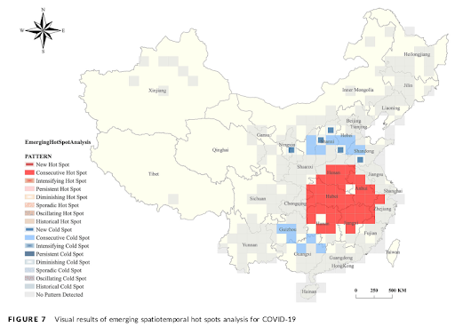

Figura 7: Resultados visuais da análise de hotspots espaço-temporais emergentes para a COVID-19. Fonte: Mo et al., 2020.

A aplicação de ferramentas analíticas, combinadas com dados epidemiológicos organizados e métodos espaço-temporais, proporcionou uma compreensão abrangente da propagação da COVID-19. Os resultados indicaram que o surto se espalhou rapidamente por todo o país em um curto período, seguido por uma redução na taxa de incidência total. A distribuição espaço-temporal dos casos foi desigual, com Wuhan e Shiyan identificadas como os principais centros de agrupamento alto-alto, enquanto regiões das províncias de Henan, Anhui, Jiangxi, Hunan e a cidade de Chongqing apresentaram padrões instáveis e múltiplos tipos de agrupamentos, configurando pontos críticos.

O uso de tecnologias baseadas no cubo espaço-temporal revelou-se eficaz para analisar padrões epidemiológicos, gerando visualizações claras e detalhadas que destacaram a distribuição e a evolução dos casos ao longo do tempo e do espaço. Esses resultados evidenciam a importância da integração de métodos espaço-temporais e visualizações intuitivas para compreender padrões complexos e apoiar a tomada de decisões durante crises de saúde pública.

Na área de segurança pública, um estudo realizado em Portland, EUA, investigou os eventos de arrombamento registrados em chamadas de emergência feitas ao serviço 911 ao longo de 2013. Detalhes completos sobre a metodologia e os resultados podem ser encontrados no trabalho de Dang e Lin (2023).
Com base em dados oficiais do governo, foi possível mapear a distribuição espacial dos eventos (Figura 8) e calcular os centros médios espaço-temporais dos arrombamentos, analisados em diferentes intervalos de tempo, incluindo semanalmente (Figura 9) e mensalmente (Figura 10).

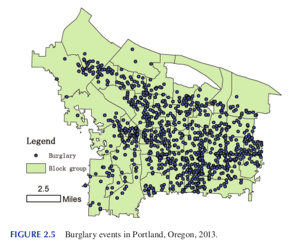

Figura 8: Eventos de furto em Portland, Oregon, 2013. Fonte: Dang e Lin (2023).

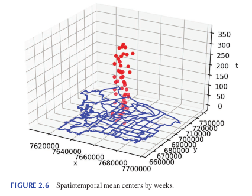

Figura 9: Centros médios espaço-temporais por semana. Dang e Lin (2023)

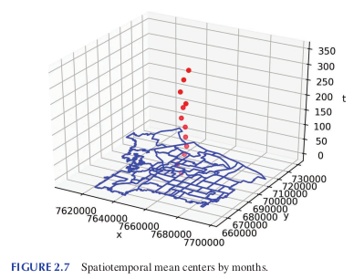

Figura 10: Centros médios espaço-temporais por mês. Dang e Lin (2023)

As análises revelaram movimentos dos centros médios ao longo do tempo, oferecendo informações detalhadas sobre como a criminalidade se deslocava e variava. Além disso, os desvios dos centros médios mensais (figura 11), forneceram uma medida quantitativa sobre as variações espaço-temporais dos crimes, permitindo um planejamento mais eficiente de intervenções e alocação de recursos.

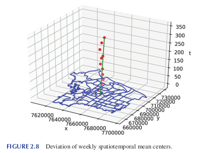

Figura 11: Desvio dos centros médios espaço-temporais mensais. Dang e Lin (2023)

Outro exemplo está no estudo de Lin e Chen (2023), que utilizou a análise espaço-temporal para investigar como os padrões de crimes violentos variam ao longo do tempo e do espaço, em nível local, na cidade de Chicago, com foco em grupos de blocos censitários.

Os dados de incidentes criminais foram obtidos no Chicago Data Portal e organizados em 12 unidades temporais, correspondentes aos meses do ano. A unidade espacial foi definida por grupos de blocos censitários, totalizando 25.704 observações em um painel espaço-temporal. As taxas de criminalidade mensal foram calculadas dividindo o número de crimes registrados pela população local de cada grupo de blocos censitários.

A análise utilizou ferramentas estatísticas espaço-temporais, como os índices Gi e Gi*, que são métricas do método de Getis-Ord amplamente empregadas para identificar padrões de agrupamento espacial. Essas ferramentas avaliam se valores altos ou baixos de uma variável estão concentrados em determinadas áreas. O índice Gi* inclui tanto os vizinhos quanto a própria unidade espacial na análise, enquanto o índice Gi considera apenas os valores dos vizinhos. Por meio desses cálculos, é possível identificar hotspots (áreas com alta concentração de valores elevados, como altas taxas de criminalidade) e coldspots (áreas com concentração de valores baixos, como taxas reduzidas de criminalidade), proporcionando uma análise detalhada da distribuição espacial de eventos. Os resultados foram apresentados em mapas mensais (Figura 12).

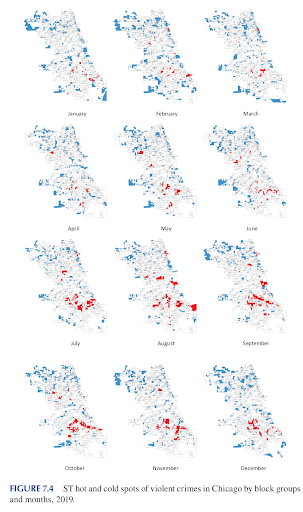

Figura 12: Hotspots e coldspots espaço-temporais de crimes violentos em Chicago, por grupos de blocos e meses, 2019. Fonte: Lin e Chen (2023).

Os mapas mensais evidenciam a distribuição de hotspots e coldspots de crimes violentos em Chicago. Os resultados revelaram que os hotspots de criminalidade eram mais frequentes entre os meses de julho e novembro, concentrados no centro e no lado sul da cidade. Essa abordagem forneceu uma ampla compreensão das mudanças espaço-temporais nos padrões de criminalidade, permitindo intervenções mais direcionadas. Além disso, diferentes unidades espaço-temporais foram exploradas para adaptar a análise às dinâmicas específicas de fenômenos de interesse.

## 1.2 Fundamentos para a modelagem de dados espaço-temporais
   
Os fundamentos da modelagem de dados espaço-temporais envolvem o estudo de conceitos que possibilitam a compreensão, organização e interpretação de fenômenos que variam ao longo do tempo e do espaço. Entender esses princípios é importante porque permite analisar dados complexos, identificar padrões, prever tendências e compreender as relações entre eventos em diferentes locais e momentos. Este capítulo apresenta uma introdução a alguns princípios teóricos que estruturam a modelagem espaço-temporal, oferecendo uma visão inicial sobre como esses conceitos ajudam a representar a dinâmica dos fenômenos no espaço e no tempo.

Inicialmente, será explorada a dimensão temporal, destacando como os dados evoluem ao longo do tempo e aspectos como granularidade, periodicidade e dinâmicas temporais. Em seguida, será introduzida a semântica dos dados espaço-temporais, com foco na definição de eventos, atributos e relações no contexto geoespacial.

### 1.2.1 A dimensão temporal

O tempo é um elemento essencial para a localização e análise de fenômenos, permitindo o estabelecimento de padrões, a predição de eventos futuros e a explicação de ocorrências. A informação temporal pode assumir diferentes formas quando dados geográficos são coletados: desde um simples instante no tempo até expressões que representam durações. Esses dados podem ser capturados em intervalos regulares ou registrados apenas quando ocorrem mudanças. No contexto dos Sistemas de Informação Geográfica (SIG), os tipos de representação temporal desempenham um papel importante na análise de eventos específicos em determinados locais, na identificação de mudanças ao longo do tempo e na avaliação de cenários variados (VASILIEV, 1997).

Diversos conceitos fundamentais relacionados ao tempo e suas propriedades têm sido amplamente discutidos na literatura das ciências da computação e da informação geográfica. Avanços notáveis foram alcançados tanto no desenvolvimento conceitual quanto na aplicação prática, com estudos de caso em diferentes domínios (YUAN, 2008).

De acordo com Worboys e Dunckham (2004), o tempo pode ser representado por diferentes estruturas, que se baseiam em três principais elementos da representação temporal: variação temporal (contínua ou discreta), ordem temporal (linear, ramificada ou circular) e granularidade (instante, intervalo, período ou elemento temporal). A Figura 13 ilustra essas estruturas temporais, conforme descrito por Worboys e Dunckham (2004).

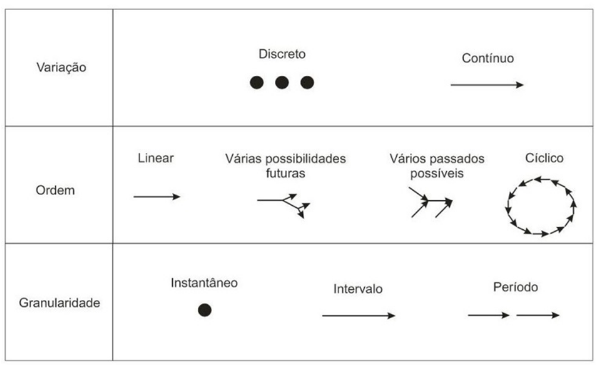

Figura 13: Estruturas temporais (modificado de Worboys e Duckham, 2004).

Quanto à variação temporal, considera-se a possibilidade de variação contínua e variação discreta. A variação temporal contínua é aplicada a processos que requerem medidas de tempo com níveis arbitrários de precisão. Por outro lado, a variação temporal discreta é utilizada quando o tempo é medido em pontos específicos ou intervalos, resultando em uma variação descontínua entre esses pontos (WORBOYS e DUNCKHAM, 2004). Um intervalo de tempo pode ser definido como o período entre dois instantes, enquanto um instante corresponde a um ponto específico no eixo temporal.

Embora a modelagem de processos dinâmicos ou mudanças contínuas seja frequentemente destacada como um objetivo de pesquisa (YUAN et al., 2004), grande parte da literatura na comunidade de ciência da informação geográfica aborda as mudanças espaço-temporais de forma discreta. Essa abordagem, embora simplificada, é mais viável para implementação prática (HORNSBY e EGENHOFER, 2000).

O tempo pode ser classificado em três categorias principais: linear, circular ou ramificado (WORBOYS e DUNCKHAM, 2004):

- **Tempo linear:** Representa uma sequência de eventos organizados em uma linha do tempo, com uma ordem de precedência clara entre os pontos. Os eventos podem ser medidos em escalas ordinais ou intervalares.

- **Tempo circular:** Refere-se a tempos recorrentes, combinando a ordem dos eventos e seus intervalos, com periodicidade que retorna à mesma referência temporal. Exemplos incluem ciclos sazonais ou horários repetitivos (DIAS et al., 2005).

- **Tempo ramificado:** Permite que um mesmo ponto na linha do tempo possua múltiplos sucessores (ramificações no futuro) ou múltiplos antecessores (ramificações no passado), abandonando a restrição de linearidade.

Embora o espaço e o tempo sejam contínuos, eles são frequentemente divididos em unidades discretas para facilitar a medição. A granularidade define essa divisão, criando partições do domínio do tempo, que podem ter comprimentos uniformes ou variáveis (CAMOSSI et al., 2006). Nesse contexto, destaca-se o conceito de chronon, que representa a menor unidade de tempo suportada por um sistema. Um chronon corresponde ao menor intervalo de tempo em que qualquer atividade registrada em um banco de dados temporal pode ocorrer (EDELWEISS e OLIVEIRA, 1994).

Os elementos primitivos associados à granularidade temporal incluem:

- **Instante de tempo:** Um ponto específico na linha do tempo.

- **Intervalo de tempo:** O período decorrido entre dois instantes.

- **Período ou elemento temporal:** Uma sequência composta por múltiplos intervalos de tempo.

### 1.2.2 Semântica dos Dados Espaço-Temporais

A semântica dos dados espaço-temporais abrange duas grandes categorias de conceitos geográficos amplamente reconhecidos: entidades e fenômenos geográficos, bem como as propriedades e relações espaciais e temporais que os caracterizam. Os fenômenos geográficos, sejam eles abstratos ou concretos, podem ocorrer de forma contínua ou discreta na natureza. Eles se diferenciam dos dados geográficos, que correspondem a feições selecionadas (geralmente numéricas) utilizadas para descrever ou medir, direta ou indiretamente, os fenômenos com características espaciais.

A análise dos fenômenos é conduzida com base em dados qualitativos ou quantitativos, descritos em escalas nominais, ordinais ou proporcionais. Esses dados podem ser representados por elementos como pontos, áreas, linhas e variáveis visuais, incluindo cor, tamanho e forma. Por outro lado, as entidades geográficas podem ser consideradas como elementos ou classes que podem ser representadas tanto em meio analógico quanto digital.

Outro conjunto de conceitos geográficos amplamente compartilhado está relacionado às noções de espaço e tempo, aplicadas em diferentes escalas geográficas. Essas noções enfatizam as relações espaciais e temporais entre entidades e fenômenos (COUCLELIS, 2005).

A visão predominante de temporalidade entre os pesquisadores está associada a uma sequência de estados, onde eventos atuam como marcos que transformam um estado no próximo (LANGRAN, 1992). Um aspecto central da modelagem espaço-temporal é a representação das mudanças que ocorrem ao longo do tempo (AHOLA et al., 2007).

As mudanças no espaço-tempo são frequentemente descritas como eventos ou coleções de eventos. Cada alteração em um objeto representa um evento, o qual gera uma nova versão desse objeto e, consequentemente, um novo estado no mapa (LANGRAN, 1992). Na modelagem espaço-temporal, Peuquet (2005) define evento como "uma mudança no estado de uma ou mais localizações, entidades ou ambos". Esses eventos desempenham um papel central na captura dos mecanismos de mudança (WORBOYS e HORNSBY, 2004).

Peerbocus et al. (2004) identificaram três principais tipos de mudanças documentadas no gerenciamento de dados espaço-temporais, com base em diferentes perspectivas na representação espaço-temporal em SIG (Figura 14):

- **Documentação sobre eventos ocorrendo no mundo real:**  
  Essa perspectiva se concentra no aspecto semântico da evolução, ou seja, a descrição de mudanças que acontecem no ambiente real.

- **Documentação sobre a evolução cartográfica:**  
  Refere-se às modificações realizadas pelo usuário na interface cartográfica, refletindo as alterações no modo como os dados são visualizados.

- **Documentação sobre a evolução do banco de dados:**  
  Contém informações detalhadas sobre os objetos atualizados no banco de dados, abordando as transformações nos dados armazenados.

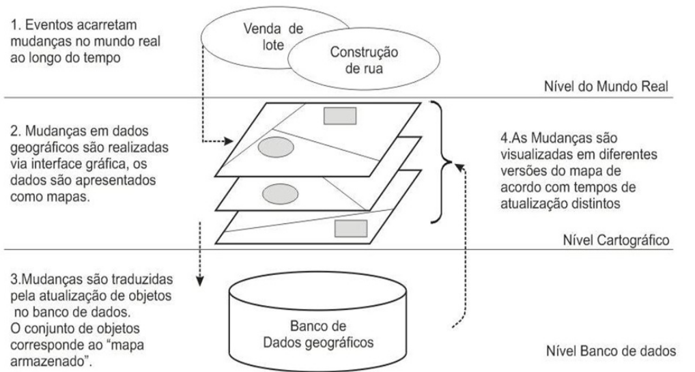

Figura 14: Perspectivas no contexto da representação espaço-temporal em SIG e diferentes níveis de mudança (modificado de Peerbocus et al., 2004).

Do ponto de vista do mundo real, uma mudança é entendida como um evento real, resultante de fenômenos naturais ou ações humanas. Já sob a perspectiva do sistema de informação, ou mais especificamente a perspectiva cartográfica, Peerbocus et al. (2004) apontam que o nível cartográfico funciona como a interface entre o usuário e o banco de dados espaço-temporal. Nesse contexto, o usuário interage com os dados armazenados no banco de dados por meio de mapas, tornando a perspectiva cartográfica o ponto de conexão em que as mudanças do mundo real são refletidas e interpretadas no sistema.

No nível do banco de dados, os eventos do mundo real são traduzidos em operações de atualização, como a criação, destruição ou modificação de objetos no banco. A granularidade dessas mudanças varia entre os níveis:

- No banco de dados, cada atualização corresponde a uma mudança específica e detalhada.
  
- No nível cartográfico, a interface visível para o usuário, uma única mudança pode ser representada por um conjunto de operações de atualização realizadas no banco de dados.

Sinton (1978) e Yuan (1996) exploraram diferentes tipos de mudanças espaço-temporais, investigando como essas mudanças podem ser medidas, representadas e analisadas. No que diz respeito a objetos, Armstrong (1988) propôs que oito subtipos de mudanças temporais podem ocorrer, resultando de combinações entre alterações nos seguintes aspectos:

- **Atributos:**
  Mudanças nas características descritivas de um objeto.

- **Morfologia:**  
  Alterações na forma ou geometria do objeto.

- **Topologia:**  
  Modificações nas relações espaciais entre objetos.

A Figura 15 ilustra esses subtipos de mudanças temporais, conforme proposto por Armstrong (1988).

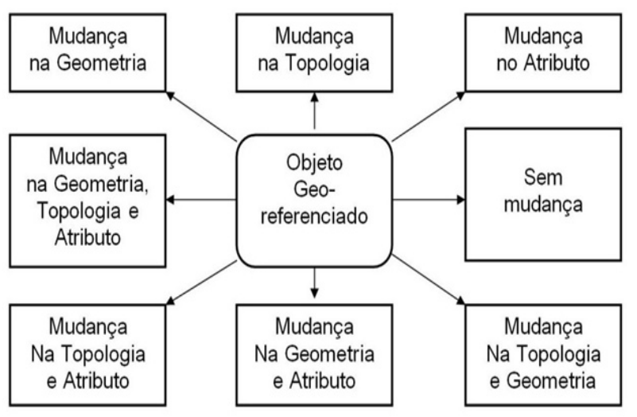

Figura 15: Oito possíveis mudanças espaço-temporais de um objeto geográfico (modificado de Sinton, 1978).

Goodchild et al. (2007) argumentam que a dinâmica do comportamento de objetos no espaço e no tempo pode ser analisada a partir de três dimensões fundamentais: estrutura interna, geometria e movimento. Essas dimensões são descritas da seguinte forma:

- **Geometria:**  
  Refere-se à forma do objeto. É possível distinguir entre objetos que mantêm a mesma forma ao longo do tempo e aqueles que sofrem alterações em sua forma.

- **Estrutura interna:**  
  Relaciona-se à composição interna do objeto. Nessa dimensão, diferencia-se entre objetos homogêneos, que não apresentam variações internas, e objetos heterogêneos, que possuem variações internas.

- **Movimento:**  
  Diz respeito à posição do objeto no espaço ao longo do tempo. Diferencia-se entre objetos que permanecem fixos em uma localização específica e aqueles que se movimentam ao longo do tempo.

Com base nas características espaciais, temporais e semânticas dos fenômenos, Price et al. (1999) propuseram uma classificação que define cinco tipos de dados utilizados em aplicações espaço-temporais (Quadro 02):

- **Dados espaciais:**  
  Representam as características espaciais de um fenômeno.

- **Dados temporais:**  
  Referem-se à dinâmica temporal do fenômeno, descrevendo sua evolução ao longo do tempo.

- **Dados espaço-temporais:**  
  Integram as características espaciais e temporais, oferecendo uma visão combinada das duas dimensões.

- **Dados semânticos:**  
  Referem-se a informações qualitativas ou descritivas que complementam os dados espaciais e temporais ao fornecerem detalhes adicionais sobre as características ou o contexto do fenômeno analisado.

- **Dados compostos:**  
  São uma combinação das três categorias anteriores, unindo dados espaciais, temporais e semânticos para uma análise mais abrangente.

## 1.3 Abordagens de Pensamento e Análise em Dados Espaço-Temporais

A análise de dados espaço-temporais exige mais do que a compreensão de conceitos básicos, ela requer o desenvolvimento de abordagens específicas de pensamento para interpretar, modelar e explorar as dinâmicas espaciais e temporais dos fenômenos. Esta seção introduz duas perspectivas importantes no contexto da análise espaço-temporal: o pensamento espacial e o pensamento estatístico.

O pensamento espacial (e espaço-temporal) é importante pois ajuda a compreender como os fenômenos estão distribuídos no espaço, como eles se relacionam entre si e como o espaço influencia os processos dinâmicos. Essa abordagem vai além da simples observação de localizações, se concentrando também nas conexões, nos padrões e nas interações que definem o contexto geográfico de um evento ou objeto.

Por outro lado, o pensamento estatístico contribui para enfrentar as incertezas e variabilidades inerentes aos dados espaço-temporais. Ele permite identificar dependências espaciais e temporais, modelar padrões complexos e realizar previsões com base em informações históricas e tendências observadas.

Ao combinar pensamento espacial com raciocínio estatístico, é possível integrar múltiplas dimensões na realização das análises, oferecendo uma visão mais abrangente e detalhada sobre os fenômenos estudados. Esta seção explora essas duas dimensões complementares do raciocínio analítico, destacando sua importância e oferecendo uma base introdutória para a aplicação prática de técnicas espaço-temporais.

### 1.3.1 Pensando espacial

O pensamento espacial (e espaço-temporal), frequentemente utilizado como base para a análise de dados espaço-temporais, está centrado em conceitos geográficos fundamentais. Entre eles, destacam-se: 

- A localização, a distribuição e os padrões de objetos e eventos no espaço geográfico e no espaço-tempo;

- A caracterização de lugares e regiões com seus atributos específicos;

- As interdependências entre diferentes localidades e os processos de interação espaço-temporal que ocorrem em períodos variados;

- A extensão geográfica do domínio de estudo; e 

- A escala de observação, que define o nível de generalização aplicado à análise.

Esses conceitos, amplamente discutidos na literatura geográfica, oferecem uma estrutura teórica para abordar problemas científicos com uma perspectiva geográfica. Como aponta Clifford et al. (2009), o pensamento espacial exige o desenvolvimento de um "hábito geográfico de pensamento", no qual os padrões e processos espaciais são analisados com rigor científico. Isso envolve desde a descrição e medição de atributos espaciais e temporais até a formulação de explicações teóricas que conectem variáveis e processos em diferentes contextos. 

A incorporação do pensamento espacial em análises quantitativas possibilita modelagens mais precisas e contextualizadas, ao considerar as particularidades geográficas e as interações entre locais. Abordagens que integram variáveis espaciais ampliam a compreensão de fenômenos complexos, permitindo identificar padrões e relações que seriam negligenciados em análises tradicionais.

#### 1.3.1.1 Compreendendo as Dinâmicas da Variação Espacial

As variações espaciais refletem diferenças significativas entre locais, moldadas por uma combinação de fatores demográficos, ambientais, sociais e econômicos. Essas diferenças ajudam a compreender os padrões observados em diferentes regiões e a identificar os processos que moldam o espaço geográfico.

Haining e Li (2020) destacam que a variação espacial pode ser analisada a partir de três dimensões principais: fatores demográficos, mobilidade populacional e condições ambientais. Essa abordagem fornece uma visão integrada, permitindo explorar as dinâmicas complexas que definem os padrões espaciais e oferecem subsídios para planejamento e tomada de decisão.

*a. Variação nos valores de atributos em relação a pontos ou áreas fixas:*

A variação nos valores de atributos em relação a pontos ou áreas fixas refere-se à maneira como certos fenômenos ou características se distribuem e se alteram no espaço em função de locais específicos ou áreas de destaque. Essa variação pode ser observada em diversas escalas e contextos, como na geografia, na economia ou em estudos urbanos.

Por exemplo, considere a densidade populacional: em muitas cidades, ela tende a ser maior nas proximidades de áreas comerciais centrais e diminui gradualmente à medida que nos afastamos desse ponto. Isso ocorre porque a área central oferece maior acesso a empregos, serviços e infraestrutura, características que atraem mais pessoas. 

Essas variações frequentemente refletem a influência de fatores geográficos, econômicos ou sociais, como centros econômicos, polos de transporte, infraestrutura, divisões administrativas ou limites ecológicos. O estudo desses padrões espaciais é importante, pois eles destacam tanto desigualdades na distribuição de recursos quanto fornecem informações sobre conectividade, acessibilidade e as dinâmicas sociais e econômicas de uma área.

Ao analisar essas variações, é possível identificar áreas prioritárias para intervenções, planejar políticas públicas mais eficientes e compreender melhor os processos que moldam o espaço geográfico. Essa análise permite, por exemplo, apontar regiões que precisam de melhorias na infraestrutura, áreas que enfrentam maior vulnerabilidade social ou localidades que apresentam oportunidades estratégicas para o desenvolvimento sustentável.

*b. Gradientes espaciais nos valores de atributos entre áreas adjacentes*

A análise da variação espacial por meio de gradientes envolve o estudo das mudanças graduais ou abruptas nos valores de atributos entre áreas próximas ou adjacentes. Esses gradientes revelam padrões de transição ou contraste, que podem refletir processos sociais, econômicos ou ambientais em uma região.

Por exemplo, considere dois bairros vizinhos com níveis de renda significativamente diferentes. Esse contraste pode indicar divisões socioeconômicas, como desigualdade no acesso a oportunidades e serviços. Além disso, pode ser consequência de políticas públicas ou históricas, como a implantação de zonas industriais ou a segregação residencial. O estudo desses gradientes também pode capturar a influência de fatores culturais, como diferenças étnicas ou hábitos de consumo, que afetam o perfil de cada localidade.

Ao explorar esses gradientes, é possível identificar zonas de transição – áreas onde mudanças importantes ocorrem, como o avanço de áreas urbanas sobre regiões rurais ou a transformação de regiões industriais em centros comerciais. Fatores como expansão urbana, degradação ambiental ou deslocamentos populacionais frequentemente desempenham um importante papel nesses processos.

*c. Configuração macroespacial*

A configuração macroespacial trata do estudo e análise do arranjo dos elementos e atributos em uma escala ampla, abrangendo regiões extensas, países inteiros ou até mesmo o cenário global. Essa abordagem se concentra em padrões espaciais de grande alcance, que ajudam a entender a organização e a interação de sistemas em níveis elevados de complexidade.

Por exemplo, a concentração de centros urbanos em áreas costeiras pode refletir fatores históricos, econômicos e ambientais, como o acesso a portos para comércio internacional. Da mesma forma, a distribuição de terras agrícolas em regiões específicas está relacionada ao clima, à disponibilidade de água e ao tipo de solo, enquanto os fluxos migratórios entre continentes indicam desigualdades regionais, conflitos, oportunidades econômicas e mudanças climáticas.

Compreender as configurações macroespaciais ajuda a lidar com desafios globais que ultrapassam fronteiras. Por exemplo, mudanças climáticas afetam o equilíbrio entre áreas agrícolas e urbanas, enquanto a urbanização acelerada exige novas estratégias de planejamento urbano e transporte. Além disso, a análise dessas configurações revela desigualdades econômicas globais, ajudando a entender por que algumas regiões prosperam enquanto outras enfrentam dificuldades.

#### 1.3.1.2 Análise de eventos no espaço geográfico: relações, escalas e efeitos de propagação.

A análise de eventos no espaço geográfico exige uma compreensão acerca das relações espaciais e de como essas conexões influenciam os processos observados. Isso se deve ao fato de que fenômenos geográficos raramente se limitam às fronteiras administrativas. Pelo contrário, eles são moldados por interações que frequentemente transcendem limites locais, criando dinâmicas complexas e interdependentes.

Fatores como mobilidade humana e influências ambientais não respeitam divisões rígidas, conectando diferentes áreas geográficas de maneiras diversas. Por exemplo, o deslocamento de pessoas entre cidades gera fluxos de mobilidade que impactam tanto os locais de origem quanto os de destino, influenciando economias locais, infraestrutura e serviços públicos. Da mesma maneira, fenômenos ambientais como a poluição do ar frequentemente ultrapassam fronteiras municipais ou regionais, afetando áreas vizinhas e criando desafios para a gestão ambiental compartilhada. Essas interações geram efeitos de propagação, nos quais eventos ou fenômenos originados em um local produzem impactos que se estendem a outras regiões.

Um aspecto crítico na análise espacial é a relação entre o tamanho das unidades espaciais estudadas e a escala dos efeitos de propagação. Processos localizados, como a construção de um grande empreendimento comercial, podem causar impactos importantes em áreas específicas, distorcendo indicadores locais. Por outro lado, efeitos de propagação de maior alcance podem criar correlações entre regiões vizinhas, evidenciando como os eventos em um local influenciam diretamente os resultados em outro.

Alinhar a escala de análise às dinâmicas espaciais subentendidas é de suma importância para evitar interpretações equivocadas. Analisar fenômenos em uma escala inadequada pode levar a conclusões imprecisas, como subestimar interações regionais ou atribuir mudanças locais a causas isoladas, ignorando fatores externos. A compreensão das escalas corretas e das interações espaciais é importante para identificar padrões, planejar intervenções estratégicas e realizar escolhas embasadas. 

#### 1.3.1.3 Interpolação espacial e estimativa para pequenas áreas

O pensamento espacial desempenha um importante papel na interpretação de variações observadas em variáveis de interesse e fundamenta métodos estatísticos que exploram a dependência espacial para resolver problemas em locais não amostrados ou em pequenas áreas. A dependência espacial, que tem como base o pressuposto de que valores próximos no espaço tendem a ser mais semelhantes do que valores distantes, é um elemento central em técnicas como interpolação espacial e estimativa para pequenas áreas. 

A Interpolação espacial é uma técnica utilizada para estimar ou prever valores de atributos em locais onde não há dados observados. Ela cria uma superfície contínua que permite visualizar a variação espacial de um fenômeno. Esse método se mostra útil para gerar mapas que representam atributos geográficos, como níveis de poluição, densidade populacional ou índices de saúde. 

Entre as abordagens mais utilizadas, destaca-se a krigagem, que ajusta os pesos visando reduzir a influência de valores localizados em clusters excessivamente densos, em um processo conhecido como cluster downweighting. A krigagem se destaca porque, além de fornecer estimativas, também oferece uma medida de incerteza associada, tornando-a uma técnica apropriada para lidar com dados espaciais irregulares.

A estimativa para pequenas áreas é uma técnica estatística voltada para aprimorar a precisão de parâmetros em áreas em que os dados disponíveis são escassos ou inexistentes. Ela é útil em contextos onde as áreas de estudo estão divididas em pequenas unidades, como setores censitários ou distritos locais, nos quais os dados observados frequentemente são insuficientes para gerar estimativas confiáveis. Essa limitação resulta em intervalos de incerteza amplos ou inadequados, comprometendo a qualidade da análise. 

O problema se torna ainda mais crítico em situações de amostragem não estratificada ou em estudos que investigam eventos raros, como a ocorrência de doenças incomuns ou tipos específicos de crimes. Nesses casos, a falta de dados robustos prejudica a interpretação dos resultados e dificulta o desenvolvimento de políticas públicas baseadas em evidências.

Para contornar esses desafios, modelos hierárquicos bayesianos são amplamente utilizados (Haining e Li, 2020). Esses modelos partem do pressuposto de que os parâmetros das pequenas áreas apresentam dependência espacial, permitindo que informações de áreas vizinhas sejam aproveitadas para fortalecer os dados limitados. Isso significa que, mesmo em cenários de escassez de dados, a correlação espacial pode ser explorada para melhorar as estimativas.

#### 1.3.1.4 Pensando espacial e temporalmente

Muitos dos fenômenos analisados nas ciências sociais, econômicas, ambientais e de saúde são resultado de processos espaço-temporais em constante transformação. Esses processos envolvem interações dinâmicas entre pessoas, lugares, eventos e o meio ambiente, sendo influenciados por fatores políticos, econômicos, sociais e ecológicos que evoluem ao longo do tempo. 

Por exemplo, a expansão de um sistema de transporte público em uma grande cidade pode ocasionar mudanças significativas na mobilidade urbana, redistribuindo a densidade populacional para áreas periféricas e influenciando os padrões de urbanização em regiões próximas. Ao longo do tempo, esses efeitos podem transformar não somente a dinâmica social, mas também a configuração ambiental, devido à ocupação de novos territórios. 

Outro exemplo é a introdução de práticas agrícolas sustentáveis em uma região, que pode reduzir a degradação do solo local e, simultaneamente, servir como modelo para áreas vizinhas. Esse efeito propagador tem o potencial de fortalecer redes de produção sustentável e impactar a segurança alimentar de maneira mais ampla.

Essa interação contínua e transformadora evidencia como os processos espaço-temporais são intrinsecamente conectados, refletindo relações dinâmicas entre diferentes entidades em uma rede geográfica que evolui ao longo do tempo.

Os processos espaço-temporais podem ser definidos como relações dinâmicas que ocorrem entre diferentes entidades — como pessoas, empresas, instituições ou fenômenos naturais — em uma rede geográfica ao longo do tempo. Essas relações refletem como eventos, ações ou mudanças em um local e período específico podem influenciar e ser influenciados por eventos em outros locais e momentos, formando padrões interconectados.

Esses processos são dinâmicos porque envolvem mudanças contínuas, como deslocamentos de pessoas, evolução de mercados, transformações ambientais ou disseminação de informações. Eles permitem compreender como e por que determinados padrões surgem nos dados. 
Por exemplo, a concentração de eventos em locais específicos, como zonas urbanas que atraem empregos, infraestrutura e serviços devido às interações entre empresas e população, resulta na formação de clusters de atividades econômicas ou sociais. Da mesma maneira, a concentração de eventos em períodos específicos, como a alta temporada turística ou épocas de eleições, pode gerar picos de interações em determinados locais, alterando temporariamente os padrões espaciais. 

Os processos espaço-temporais destacam que os fenômenos não ocorrem de forma isolada no espaço e no tempo, mas estão interligados em redes de interações. Por exemplo, o crescimento de uma indústria em uma cidade pode atrair trabalhadores de outras regiões, causando mudanças demográficas e econômicas, enquanto um evento climático extremo em uma região pode gerar efeitos colaterais em áreas vizinhas, como o aumento da migração ou impactos na cadeia de suprimentos.

A partir dessa compreensão geral, os processos espaço-temporais podem ser classificados em diferentes tipos, cada um com características específicas que ajudam a explicar como fenômenos se manifestam, se propagam ou interagem no espaço e no tempo. A seguir, são detalhados os principais tipos de processos espaço-temporais,segundo Haining e Li (2020):

*a. Processos de difusão*

A difusão refere-se à propagação de atributos, ideias ou fenômenos através de uma população ou área geográfica. Esse processo pode ser observado em diversos contextos, como:
Doenças infecciosas, como epidemias, que se espalham por meio das interações entre indivíduos suscetíveis e infectados. A distribuição espacial da população suscetível, combinada com a intensidade e a frequência dessas interações, determina a velocidade e a abrangência da propagação.
Ideias ou inovações, que se difundem através de redes sociais ou comunidades interconectadas, criando padrões espaciais de adoção.
A difusão é influenciada pela proximidade espacial (fenômenos tendem a se espalhar mais rapidamente entre locais próximos) e pelas redes de interação, como sistemas de transporte, infraestrutura de comunicação ou laços sociais. Esses fatores determinam os caminhos e a intensidade com que os fenômenos se propagam, moldando os padrões espaciais e temporais observados.

*b. Processos de dispersão*

Diferentemente da difusão, que se concentra na propagação de atributos ou fenômenos, a dispersão refere-se à realocação física ou à distribuição espacial de entidades, como pessoas, animais ou plantas, que se deslocam de um local para outro. Alguns exemplos comuns incluem:
Migração humana, que pode ser voluntária (como a busca por melhores oportunidades econômicas) ou forçada (devido a guerras, desastres naturais ou perseguições políticas). Esse movimento altera a composição demográfica e econômica tanto nas áreas de origem quanto nos destinos.
Dispersão de sementes, que ocorre por meio de fatores naturais, como o vento, água ou transporte por animais. Esse processo é importante para a regeneração de ecossistemas e a manutenção da biodiversidade.
A redistribuição espacial associada à dispersão é moldada por uma combinação de forças de "empurrão" e "atração":
Fatores de empurrão: Condições adversas que levam à saída de uma área, como pobreza, conflitos, desastres ambientais ou falta de recursos.
Fatores de atração: Características positivas que incentivam a chegada a outro local, como melhores condições econômicas, segurança, oportunidades de trabalho ou acesso a infraestrutura.
Esses processos criam padrões espaciais dinâmicos e interdependentes, influenciando tanto o ambiente natural quanto o ambiente antropizado, moldando as interações entre diferentes locais ao longo do tempo.

*c. Processos de interação envolvendo troca e transferência*

Os processos de interação envolvendo troca e transferência englobam os fluxos de recursos, bens, serviços ou informações que conectam diferentes áreas e promovem interações espaciais. Essas dinâmicas criam vínculos econômicos, sociais e culturais entre regiões, como nos seguintes exemplos:
Trocas econômicas: Mercadorias produzidas em uma região, como alimentos ou bens manufaturados, sendo exportadas e consumidas em outras. Por exemplo, produtos agrícolas de áreas rurais abastecendo centros urbanos.
Transferências de renda: Remessas financeiras enviadas por trabalhadores em áreas urbanas para suas famílias em regiões rurais, um fenômeno comum em países com alta migração interna.
Essas interações estabelecem redes de interdependência, onde as atividades em uma área influenciam diretamente outras, moldando a distribuição espacial de atributos como renda, oportunidades econômicas e taxas de crescimento. Por exemplo, regiões exportadoras podem vivenciar picos de crescimento econômico em resposta à demanda externa, enquanto áreas receptoras de transferências financeiras podem melhorar condições sociais e reduzir desigualdades internas com esses recursos.

*d. Processos de interação de ação e reação*

Esses processos referem-se às respostas dinâmicas entre agentes (econômicos, sociais, ambientais, etc.), em que uma ação tomada por um agente ou fenômeno desencadeia reações em outros, criando uma cadeia de ajustes e efeitos interdependentes. Exemplos incluem:
Regulação ambiental e respostas da indústria: A introdução de políticas ambientais mais rigorosas em uma região, como limites para emissões de carbono, pode levar as indústrias locais a adotar tecnologias mais limpas. Em resposta, outras empresas da mesma área podem seguir essa tendência para manter a competitividade ou cumprir novas exigências legais, criando um efeito cascata que promove a transição para práticas mais sustentáveis.
Mudanças no uso do solo e impactos ecológicos: O desmatamento em uma área pode reduzir a disponibilidade de habitat para espécies, levando ao deslocamento de fauna para regiões vizinhas. Isso, por sua vez, pode gerar reações ecológicas, como alterações na dinâmica de predadores e presas, que se espalham por ecossistemas interconectados.
Impactos de práticas agrícolas intensivas: O uso excessivo de fertilizantes em um local pode causar poluição em corpos d’água. Em reação, comunidades e governos podem implementar regulamentações para reduzir a contaminação, enquanto áreas vizinhas podem adotar práticas agrícolas mais sustentáveis para evitar problemas semelhantes.
Essas interações resultam em padrões espaciais dinâmicos, que refletem o equilíbrio entre competição e cooperação entre os agentes envolvidos. 

*e. Processos de convergência espacial*

A convergência espacial ocorre quando diferentes elementos necessários para a ocorrência de um evento específico se encontram no mesmo espaço e tempo. Essa ideia é amplamente explorada na Teoria da Atividade Rotineira, que destaca que determinados eventos, como crimes, só acontecem quando três condições essenciais convergem:
Um agressor motivado: Uma pessoa com a intenção e capacidade de cometer o crime.
Uma vítima ou alvo adequado: Pode ser um indivíduo vulnerável ou um objeto que apresenta valor ou atratividade para o agressor.
A ausência de um guardião capaz: A falta de vigilância, policiamento ou medidas de proteção que poderiam prevenir ou dificultar a ocorrência do crime.
Quando esses elementos convergem em um local e momento específico, criam-se condições propícias para o evento. Essa dinâmica espaço-temporal é o que explica a formação de hotspots criminais — áreas onde os crimes ocorrem com maior frequência. Esses hotspots refletem as interações entre fatores sociais (como desigualdades ou conflitos) e geográficos (como áreas pouco iluminadas ou de difícil acesso).

#### 1.3.1.5 Estimando parâmetros em unidades espaço-temporais

Quando os dados envolvem tanto dimensões temporais quanto espaciais, a autocorrelação temporal positiva desempenha um papel importante na obtenção de estimativas mais precisas (Haining e Li, 2020). Esse conceito se baseia na ideia de que valores observados próximos no tempo e no espaço tendem a ser semelhantes, permitindo que informações de diferentes períodos e localidades sejam aproveitadas para melhorar a análise. Esse processo promove um compartilhamento mais amplo de informações, o que aumenta a robustez das análises e oferece uma visão mais aprofundada dos fenômenos estudados.

No contexto de dados espaço-temporais, o conceito de vizinhos temporais refere-se aos períodos imediatamente anteriores (t-1) e posteriores (t+1) a um ponto de tempo específico (t). Por exemplo, ao estimar o risco de uma doença no tempo t, as informações de t−1 e t+1 podem ser usadas para melhorar a precisão das estimativas, desde que se assuma uma semelhança nos níveis de risco entre esses períodos. Essa abordagem adota uma visão bidirecional do tempo, ao contrário da abordagem tradicionalmente unidirecional, e complementa as dependências espaciais ao considerar as relações entre diferentes instantes temporais.

Na modelagem espaço-temporal, esse compartilhamento de informações temporais é combinado com o compartilhamento espacial, criando uma integração mais completa (Haining e Li, 2020). Isso inclui três componentes principais:

- **Vizinhos temporais (t−1, t+1):**  
  Instantes imediatamente antes e depois do ponto de tempo analisado.

- **Vizinhos espaciais (em t):**  
  Unidades geográficas próximas ao ponto de análise no mesmo período de tempo.

- **Vizinhos espaciais de vizinhos temporais (unidades próximas em t−1 e t+1):**  
  Combinações de localidades próximas em períodos temporais anteriores e posteriores.

Por exemplo, ao estimar a taxa de transmissão de uma doença em uma cidade no tempo t, a análise pode usar informações da mesma cidade nos instantes t−1 e t+1, bem como de cidades vizinhas nesses mesmos períodos. Essa abordagem permite capturar padrões de propagação espaço-temporal, como surtos que se movem de uma localidade para outra ao longo do tempo.

Essa integração de informações espaciais e temporais amplia o alcance e a qualidade das análises, permitindo que dados de diferentes períodos e localidades contribuam simultaneamente para produzir estimativas mais robustas. Além disso, ela melhora a compreensão de fenômenos espaço-temporais complexos, como a evolução de epidemias, mudanças climáticas ou padrões de mobilidade populacional.

### 1.3.2 Pensamento estatístico na análise de dados espaço-temporais

O pensamento estatístico refere-se ao raciocínio estruturado que orienta a aplicação de técnicas estatísticas para modelar dados, com o objetivo de revelar características de um sistema ou identificar relações entre variáveis. Ele vai além da simples aplicação de ferramentas matemáticas, pois envolve a compreensão do contexto, a formulação de perguntas relevantes e a escolha de métodos apropriados para responder a essas questões.
No caso da análise de dados espaciais e espaço-temporais, o pensamento estatístico é particularmente relevante, porque esses dados geralmente exibem padrões específicos (como clusters espaciais) e dependências (como a autocorrelação espacial ou temporal). Essas características exigem abordagens estatísticas especializadas, que considerem tanto as interações espaciais quanto as variações ao longo do tempo, para evitar interpretações equivocadas ou enviesadas (Haining e Li, 2020).

A análise estatística pode ser conduzida por meio de duas abordagens principais: a análise orientada por teoria e a análise orientada por dados. 
A análise orientada por teoria começa com uma hipótese fundamentada em teorias ou conhecimentos prévios, onde o modelo estatístico é projetado com base em uma expectativa clara sobre as relações entre as variáveis, derivada do contexto estudado. Por exemplo, na área de saúde pública, pode-se partir da teoria de que a proximidade a fontes de poluição aumenta o risco de doenças respiratórias. Com base nessa hipótese, o modelo seria construído para investigar essa relação, incorporando variáveis como a localização das fontes de poluição, a densidade populacional e a incidência de doenças respiratórias. A principal vantagem dessa abordagem é sua natureza direta e direcionada, permitindo testar hipóteses específicas e validar teorias previamente estabelecidas.

Já a análise orientada por dados parte das observações empíricas, explorando os dados para identificar padrões, tendências ou anomalias que possam sugerir novas hipóteses. Essa abordagem é útil em análises exploratórias, especialmente quando não há um conhecimento prévio estruturado para guiar o estudo. Um exemplo disso é a análise de dados de crimes em uma cidade, que pode revelar áreas com alta concentração de atividades criminosas. Esses padrões podem levar à formulação de novas hipóteses sobre suas causas, como a falta de iluminação pública ou a ausência de policiamento em determinados horários.  A principal vantagem dessa abordagem é sua flexibilidade, permitindo a descoberta de relações inesperadas ou a identificação de padrões que anteriormente não haviam sido considerados.

#### 1.3.2.1 Etapas do Pensamento Estatístico

O processo de pensamento estatístico pode ser dividido em etapas principais, como mostrado na Figura 16, que foi adaptada de Waller (2014), com base no trabalho clássico de Box et al. (1978) (Haining e Le, 2020). Essas etapas estruturam o raciocínio estatístico, orientando desde a formulação de hipóteses até a interpretação dos resultados.  

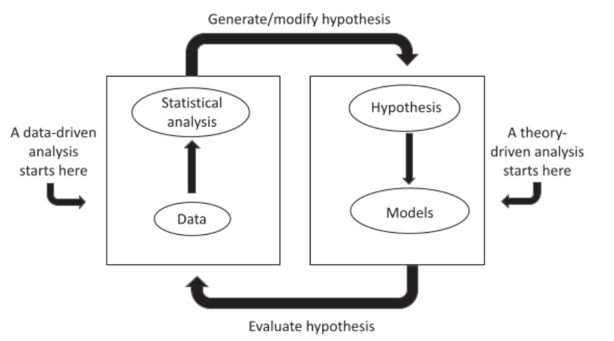

Figura 16: O processo de pensamento estatístico. Fonte: Haining e Li (2020).

Na prática, uma análise estatística pode ser conduzida por dois caminhos principais: a análise orientada por teoria e a análise orientada por dados.
Na análise orientada por teoria, parte-se de uma hipótese fundamentada em uma teoria prévia ou em conhecimentos já estabelecidos sobre o fenômeno em questão. A teoria orienta a construção do modelo estatístico, definindo quais variáveis devem ser incluídas (covariáveis) e quais dados precisam ser coletados para testar a hipótese. Por exemplo, na área da saúde pública, uma hipótese poderia ser que a exposição a fontes de poluição está associada a um aumento na incidência de doenças respiratórias. O modelo seria projetado para investigar essa relação, considerando fatores como localização das fontes de poluição, densidade populacional e registros de saúde.

A abordagem orientada por dados começa com a análise de um conjunto de observações empíricas, buscando identificar padrões ou gerar novas hipóteses. Essa abordagem é útil em cenários onde não há uma teoria clara para guiar a investigação. Por exemplo, na vigilância de doenças, a identificação de clusters geográficos (agrupamentos de casos em um espaço geográfico específico) pode levar à formulação de novas hipóteses sobre as causas da concentração de casos, como fatores ambientais ou condições socioeconômicas.

Essas duas abordagens não são mutuamente exclusivas, mas sim complementares, especialmente em análises espaciais. Em muitos casos, padrões descobertos por meio de análises orientadas por dados podem servir como ponto de partida para hipóteses mais estruturadas que, posteriormente, são testadas em análises orientadas por teoria. Por outro lado, análises orientadas por teoria frequentemente geram novas perguntas que podem ser exploradas com métodos orientados por dados, criando um processo iterativo de descoberta e validação. Esse ciclo reflete o estado atual do conhecimento sobre o fenômeno em estudo e promove avanços contínuos na compreensão de sistemas complexos.

Dois aspectos fundamentais devem ser enfatizados em qualquer análise estatística:
A importância do conhecimento teórico do sistema: Um modelo estatístico é inseparável do contexto do domínio de estudo. A interpretação dos parâmetros e dos resultados depende diretamente do conhecimento prévio sobre o fenômeno analisado, sendo essencial compreender o sistema para evitar conclusões equivocadas.
A natureza iterativa da análise estatística: O processo de análise não é linear; cada iteração — desde a escolha do modelo até a comparação e validação — pode aprofundar o entendimento sobre o sistema em estudo. A avaliação e a comparação de modelos são passos importantes nesse processo, permitindo que o pesquisador refine continuamente suas conclusões.

#### 1.3.2.2 Abordagens frequentista e bayesiana no pensamento estatístico para análises espaço-temporais

As abordagens frequentista e bayesiana representam duas escolas fundamentais da estatística (Haining e Li, 2020), cada uma com suas próprias filosofias, métodos e aplicações.

A abordagem frequentista, também conhecida como estatística clássica, interpreta a probabilidade como a frequência relativa de um evento observada em experimentos repetidos. Essa visão considera os parâmetros desconhecidos, como médias ou proporções, como valores fixos, que não possuem variabilidade. O foco do frequentismo está nos dados observados e em como eles podem ser utilizados para inferir os valores desses parâmetros.
Por exemplo, ao estimar o peso médio de maçãs em um pomar, o frequentismo assume que o peso médio é um valor fixo. A estimativa é baseada apenas na amostra coletada, sem considerar quaisquer informações prévias ou crenças sobre o intervalo provável de pesos. O método não incorpora incertezas além das observadas nos dados da amostra, tornando-o direto, mas limitado em cenários onde existem dependências ou informações prévias relevantes.

A abordagem bayesiana, por outro lado, trata os parâmetros como variáveis aleatórias. Ela utiliza probabilidades para representar incertezas sobre esses parâmetros e incorpora informações prévias (distribuições a priori) ao processo de análise. Por meio do Teorema de Bayes, essas informações são combinadas com os dados observados para produzir estimativas atualizadas (distribuições a posteriori), que refletem tanto o conhecimento prévio quanto as evidências mais recentes. Voltando ao exemplo do peso das maçãs, o método bayesiano assumiria que o peso médio é uma variável aleatória com um intervalo conhecido, como 100g a 150g, com base em dados históricos ou conhecimento prévio. Ao coletar uma nova amostra, essas informações prévias seriam ajustadas para produzir uma estimativa atualizada que reflete tanto os dados novos quanto o intervalo inicialmente conhecido.

As diferenças entre essas abordagens tornam-se relevantes em análises espaciais e espaço-temporais, onde os dados frequentemente apresentam padrões e dependências.

Na abordagem frequentista, assume-se que os parâmetros em diferentes áreas ou períodos são independentes. Por exemplo, ao analisar a renda média de diferentes bairros, cada local seria tratado de forma isolada, ignorando relações espaciais ou temporais entre os bairros. Isso pode levar a conclusões que desconsideram padrões interdependentes.

Já a abordagem Bayesiana reconhece e incorpora dependências espaciais e temporais, tratando parâmetros de áreas ou períodos próximos como relacionados. Por exemplo, ao analisar a redução da criminalidade em bairros adjacentes, o método bayesiano considera que áreas próximas tendem a influenciar umas às outras, permitindo capturar interações que o frequentismo ignora. Isso é útil em contextos como vigilância epidemiológica, onde a incidência de doenças em uma região pode estar diretamente conectada às regiões vizinhas.

## 1.4. Desafios e limitações na análise de dados espaciais e espaço-temporais

Desafios e limitações na análise de dados espaciais e espaço-temporais envolvem questões como a dependência espacial e temporal, a heterogeneidade, a incerteza associada aos dados e modelos, além da escassez de informações disponíveis (Haining e Li, 2020). A seguir, será apresentada uma introdução a cada um desses desafios, destacando suas características mais relevantes.

### 1.4.1 Dependência Espacial e Temporal

A análise de dados espaciais e espaço-temporais exige uma compreensão das dependências espaciais e temporais, características que diferenciam esse tipo de dado dos conjuntos de dados tradicionais. Essas dependências refletem a autocorrelação positiva, na qual valores próximos no espaço e/ou no tempo tendem a ser mais semelhantes entre si do que valores distantes. Essa propriedade é essencial para modelar fenômenos espaciais e espaço-temporais, mas também introduz desafios metodológicos.

A dependência espacial ocorre quando os valores de atributos em áreas geográficas adjacentes estão correlacionados. Isso significa que a observação de um valor em uma localização específica pode fornecer informações úteis sobre locais vizinhos. A dependência temporal, por outro lado, reflete a continuidade de eventos ao longo do tempo. Em muitos casos, os valores observados em um determinado período são influenciados pelos valores registrados nos períodos imediatamente anteriores ou posteriores. 

Quando essas duas dimensões se combinam, surge a dependência espaço-temporal, na qual valores próximos no espaço e no tempo estão simultaneamente correlacionados. Essa interconectividade é evidente em muitos fenômenos, como a propagação de doenças, onde o surto em uma cidade pode afetar áreas vizinhas em períodos subsequentes, ou no mercado imobiliário, onde a valorização de imóveis em um bairro pode influenciar regiões adjacentes ao longo do tempo, criando uma correlação entre espaço e tempo.

A presença de dependências espaciais e/ou temporais viola as suposições clássicas de independência dos erros em modelos de regressão. Mesmo após a inclusão de covariáveis relevantes, os resíduos do modelo podem exibir padrões de autocorrelação, indicando a existência de variáveis omitidas que possuem propriedades espaciais ou temporais semelhantes. Essa autocorrelação nos resíduos compromete a validade estatística, resultando em estimativas imprecisas dos parâmetros e em testes estatísticos não confiáveis.

### 1.4.2 Heterogeneidade

Um conjunto de dados é considerado homogêneo quando apresenta características estatísticas uniformes em todos os seus subconjuntos. Por outro lado, dados são classificados como heterogêneos quando há variações estatísticas significativas entre diferentes subconjuntos. A heterogeneidade pode ser espacial, temporal ou espaço-temporal e geralmente depende do tamanho ou da extensão da área ou do período analisado, ao invés de ser uma característica intrínseca do atributo em estudo.

No sentido mais amplo, a heterogeneidade se refere à variação nas propriedades estatísticas dos dados ao longo do espaço e do tempo. Por exemplo, diferentes áreas podem apresentar níveis distintos de renda, taxas de criminalidade ou riscos de doenças, enquanto essas mesmas variáveis podem variar ao longo do tempo. Além disso, a relação entre variáveis independentes e a variável resposta também pode variar entre regiões ou ao longo do tempo.

Lidar com a heterogeneidade em dados espaciais e espaço-temporais exige a consideração da incerteza associada às estimativas, uma vez que as variações observadas podem ser influenciadas tanto por diferenças reais entre áreas ou períodos quanto por flutuações aleatórias, erros de medição ou falta de dados. Por exemplo, ao analisar tendências locais em séries temporais, as diferenças aparentes entre regiões podem refletir tanto ruídos nos dados quanto limitações nos métodos de coleta, além das condições reais do sistema em estudo. Por esse motivo, a avaliação da incerteza é uma etapa indispensável em qualquer análise de dados heterogêneos.

A heterogeneidade espacial e temporal também apresenta desafios para a construção de modelos estatísticos, que precisam equilibrar flexibilidade e viabilidade. Um dos principais desafios é garantir que os modelos sejam capazes de capturar variações locais sem introduzir um número excessivo de parâmetros, o que pode tornar as estimativas inviáveis, especialmente em cenários com dados limitados. Para enfrentar essa limitação, é comum assumir que os parâmetros em uma área estão relacionados aos parâmetros de áreas vizinhas. Essa abordagem, fundamentada na dependência espacial, permite o compartilhamento de informações entre regiões, reduzindo a quantidade de parâmetros necessários e aumentando a confiabilidade das estimativas.

### 1.4.3 Escassez de dados

A escassez de dados é um problema recorrente em análises espaciais e espaço-temporais, principalmente em contextos que envolvem populações pequenas, eventos raros ou resoluções analíticas muito detalhadas. Esse problema é evidente em situações em que o volume de dados disponíveis é insuficiente para gerar estimativas confiáveis. Por exemplo, em estudos criminais realizados em pequenas áreas, como setores censitários, o número de registros pode ser extremamente baixo, resultando em alta variabilidade estatística. Da mesma maneira, análises que investigam doenças raras em pequenas áreas ou curtos intervalos temporais frequentemente enfrentam dificuldades para produzir estimativas robustas, devido à falta de dados representativos.

Outro contexto em que a escassez de dados se torna frequente ocorre quando é necessário realizar análises em escalas espaciais ou temporais mais detalhadas do que aquelas originalmente disponíveis. Isso é comum em pesquisas em nível nacional, em que os dados coletados em nível agregado podem não ser adequados para análises regionais ou locais, especialmente quando a amostragem não é estratificada espacialmente. Nessas situações, mesmo que as populações em determinadas regiões sejam grandes, o número de observações disponíveis para cada área específica pode ser insuficiente para garantir estimativas precisas.

A escassez de dados tem implicações na análise estatística, afetando tanto a precisão quanto a confiabilidade das estimativas. Em áreas ou períodos com poucos dados, é comum que pequenas variações nos valores observados resultem em grandes discrepâncias em medidas como taxas ou proporções, tornando difícil a comparação entre regiões ou instantes no tempo. Além disso, estimativas com alta incerteza dificultam a identificação de padrões consistentes ou a priorização de áreas para intervenção, prejudicando a tomada de decisões fundamentadas em evidências.

### 1.4.4 Incerteza

Na análise estatística de dados espaciais e espaço-temporais, a incerteza está presente em diversas etapas do processo e pode ser classificada em três categorias principais: incerteza nos dados, incerteza no modelo e incerteza nos parâmetros. Cada uma dessas categorias influencia diretamente a qualidade das análises e das interpretações e deve ser cuidadosamente considerada.

*a. Incerteza nos Dados*

A incerteza nos dados é originada por fatores relacionados à coleta, processamento e representação desse dados. Entre as principais fontes estão:
Erros de coleta e registro: Dados podem ser comprometidos por processos de amostragem inadequados, representatividade limitada ou erros de medição. Por exemplo, sensores remotos podem registrar valores imprecisos devido a condições atmosféricas ou falhas nos equipamentos.

- **Aleatoriedade dos fenômenos:** Muitos eventos, como a ocorrência de doenças ou acidentes, possuem uma natureza estocástica, ou seja, apresentam variabilidade aleatória intrínseca que dificulta previsões precisas. Isso significa que, mesmo com modelos robustos, é impossível prever com exatidão eventos individuais devido à complexidade dos processos subjacentes.

- **Valores ausentes e dados incompatíveis:** Informações ausentes ou inconsistências nos conjuntos de dados prejudicam a análise, especialmente quando os dados precisam ser agregados em determinadas escalas espaciais ou temporais. Por exemplo, dados reportados em diferentes resoluções espaciais (como bairros e setores censitários) ou escalas temporais (mensal e anual) são difíceis de integrar de forma coerente, o que pode levar a interpretações equivocadas ou enviesadas dos resultados. Essa incompatibilidade exige técnicas de interpolação, transformação ou harmonização para padronizar os dados, mas essas abordagens frequentemente introduzem incertezas adicionais. Além disso, valores ausentes podem distorcer análises estatísticas ou modelos preditivos, dependendo da proporção e da localização dos dados faltantes no conjunto analisado. O tratamento adequado desses desafios é essencial para garantir a validade e a confiabilidade das conclusões extraídas.

*b. Incerteza no Modelo (ou Processo)*

A incerteza no modelo decorre do fato de que todo modelo estatístico é uma simplificação da realidade. Modelos não conseguem capturar completamente a complexidade do mundo real, priorizando utilidade sobre perfeição. Como Box (1976) afirmou: "Todos os modelos estão errados, mas alguns são úteis."
Essa incerteza surge de várias limitações:

- **Simplificações e escolhas do modelo:**  
  Decisões sobre quais variáveis incluir, como modelar a relação entre elas e que suposições fazer (como normalidade dos erros ou linearidade das relações) afetam diretamente a confiabilidade do modelo.

- **Multiplicidade de explicações:**  
  Diferentes fenômenos podem ser explicados por modelos alternativos. Por exemplo, a distribuição espacial de casos de uma doença pode ser atribuída à proximidade de fontes de contaminação ambiental ou às condições socioeconômicas da população local. A escolha de um modelo depende da teoria subjacente e das hipóteses levantadas, mas nenhum modelo pode capturar perfeitamente todas as dimensões ou interações envolvidas no fenômeno.

- **Dados observacionais:**  
  Em estudos em que experimentos controlados nem sempre são viáveis, dados observacionais frequentemente apresentam vieses e fatores interferentes que dificultam o estabelecimento de relações causais robustas.

*c. Incerteza nos Parâmetros*

Os parâmetros de um modelo estatístico, como coeficientes de regressão, variâncias dos erros ou valores imputados, são estimativas baseadas nos dados disponíveis. Contudo, essas estimativas estão sempre sujeitas a incertezas.
Essa incerteza pode surgir de vários fatores:

- **Interdependência entre parâmetros:**  
  As estimativas de parâmetros individuais são influenciadas pelas incertezas associadas a outros parâmetros do modelo, criando um efeito de propagação da incerteza ao longo da análise.

- **Modelagem de trajetórias:**  
  Em avaliações de intervenções, como políticas públicas ou programas de saúde, é necessário estimar tanto os efeitos nas áreas tratadas como as trajetórias esperadas para as áreas não tratadas. A incerteza nessas estimativas de contrafactuais (o que teria acontecido sem a intervenção) é importante para avaliar com precisão o impacto real da intervenção.

- **Sensibilidade a dados limitados:**  
  Em situações com poucos dados ou alta variabilidade, as estimativas de parâmetros podem ser imprecisas, resultando em intervalos de confiança amplos e dificultando a interpretação dos resultados.

## 1.5 Ferramentas e Tecnologias para Análise de dados espaço-temporais

O uso de ferramentas e tecnologias especializadas é indispensável para viabilizar análises espaço-temporais, possibilitando o processamento de grandes volumes de dados, a visualização interativa e a modelagem de padrões. A seguir, são apresentadas ferramentas relevantes no contexto da análise espaço-temporal, organizadas por categorias, destacando suas aplicações e funcionalidades específicas.

Ressalta-se que este texto não tem o objetivo de esgotar o assunto, considerando a amplitude e a complexidade do tema, além da constante evolução tecnológica. Existem diversas ferramentas disponíveis no mercado, cada uma com suas particularidades e aplicações específicas. A escolha da ferramenta mais adequada dependerá das necessidades do usuário, das características dos dados e do tipo de análise a ser realizada. Assim, o foco será em apresentar uma visão geral que auxilie na compreensão do potencial dessas tecnologias, sem a pretensão de abordar todas as possibilidades existentes.

### 1.5.1 Plataformas de software para Geoprocessamento

Softwares comumente utilizados no contexto do geoprocessamento oferecem funcionalidades para manipulação, visualização e modelagem de dados dinâmicos. Eles permitem integrar, processar e interpretar dados espaciais e temporais, possibilitando a compreensão de fenômenos complexos. Entre os principais softwares utilizados para essas análises atualmente, destacam-se:

- **QGIS:**  
  Uma plataforma de código aberto que suporta análises espaço-temporais por meio de plugins como o TimeManager, permitindo a visualização de mudanças espaciais ao longo do tempo.

- **ArcGIS:**  
  Um software comercial que oferece ferramentas avançadas, como o Space Time Pattern Mining, utilizado para identificar padrões dinâmicos e criar cubos espaço-temporais.

- **GRASS GIS:**  
  Uma solução de código aberto com funcionalidades para séries temporais e modelagem de paisagens dinâmicas, ideal para análises avançadas.

- **ENVI e SNAP:**  
  Softwares especializados em sensoriamento remoto, voltados para o processamento e análise de imagens de satélite, com capacidades para detectar mudanças espaciais ao longo do tempo.

- **TerrSet (IDRISI):**  
  Uma ferramenta integrada para modelagem ambiental e mudanças no uso do solo, com suporte a simulações com base em cenários futuros.

### 1.5.2 Banco de dados com extensão espacial

Os bancos de dados com extensão espacial oferecem suporte para o armazenamento, gerenciamento e consulta de grandes volumes de dados espaciais e temporais. Eles são projetados para lidar com geometrias complexas, realizar consultas espaciais avançadas e integrar dados espaciais com outras fontes de dados. Entre os principais sistemas de banco de dados geoespaciais e espaço-temporais, destacam-se:

- **PostGIS:**  
  Uma extensão do PostgreSQL que adiciona suporte para dados espaciais e espaço-temporais, permitindo análises complexas, como cálculos de distância, interseções, buffers e consultas que integram aspectos temporais, como séries temporais geoespaciais. É utilizado em aplicações escaláveis, integrações com SIG e modelagem de dados dinâmicos.

- **SpatiaLite:**  
  Uma extensão para SQLite, ideal para projetos que exigem portabilidade e simplicidade no armazenamento e consulta de dados espaciais e séries temporais. Suporta operações básicas de análise espacial e pode ser combinado com dados temporais para consultas simples, sendo eficiente em dispositivos móveis ou projetos de pequeno porte.

- **Oracle Spatial and Graph:**  
  Parte do banco de dados Oracle, fornece recursos avançados para análises espaciais e espaço-temporais, além de modelagem de redes e gerenciamento de séries temporais geoespaciais. Utilizado em grandes projetos corporativos, é ideal para modelar dependências dinâmicas e eventos temporais associados a dados espaciais.

- **Microsoft SQL Server Spatial:**  
  Oferece suporte nativo para dados espaciais e séries temporais, permitindo consultas e análises que integram dimensões temporais diretamente em ambientes corporativos. Sua capacidade de lidar com dados espaço-temporais torna-o uma solução prática para empresas que precisam de análises detalhadas e integrações corporativas.

- **MongoDB com GeoJSON:**  
  Um banco de dados NoSQL que suporta dados geoespaciais em formatos como GeoJSON, podendo incluir aspectos temporais nas consultas. É utilizado em aplicações modernas e interativas baseadas em localização, como análise de mobilidade, rastreamento em tempo real e outras aplicações dinâmicas.

### 1.5.3 Linguagens de programação

As linguagens de programação são populares para a análise e modelagem espaço-temporal, permitindo flexibilidade e escalabilidade no tratamento de dados que variam no espaço e no tempo. Elas oferecem ferramentas e bibliotecas específicas para manipulação, visualização e modelagem. Entre as linguagens mais relevantes para análises espaço-temporais, destacam-se:

- **Python:**  
  Uma das linguagens mais versáteis e amplamente utilizadas na análise de dados espaciais e temporais. Algumas das principais bibliotecas para esse tipo de análise são:

  - **GeoPandas e Rasterio:** Para manipulação e análise de dados geoespaciais.
  - **PySAL:** Focado na análise espacial, incluindo clusters e dependências espaciais.
  - **scikit-mobility:** Específico para análises de mobilidade e trajetórias.
  - **Matplotlib:** Para criar visualizações detalhadas e personalizadas.
  - **TensorFlow e PyTorch:** Para redes neurais e aprendizado de máquina aplicado a dados espaço-temporais.
  - **DGL (Deep Graph Library):** Biblioteca para modelagem de redes neurais baseadas em grafos, útil para dependências espaciais e temporais.
  - **PyTorch Geometric:** Voltado para implementação de modelos de aprendizado profundo em dados estruturados como grafos, muito relevante para análises espaço-temporais.

- **R:**  
  Reconhecida pela sua especialização em estatística e análise de dados espaciais. Alguns dos principais pacotes para esse tipo de análise são:

  - **stars e sf:** Para manipulação e análise de dados geoespaciais.
  - **gstat:** Focado em análise geoestatística.
  - **spBayes e INLA:** Utilizados em modelos estatísticos espaço-temporais avançados.
  - **ggplot2:** Para criação de mapas e visualizações estatísticas.
  - **spatioTemporal e spdep:** Específicos para análises de dependências espaciais e temporais em dados complexos.
  - **keras e tensorflow:** Ferramentas para implementar redes neurais e aprendizado de máquina dentro do ambiente R.

- **Outras linguagens relevantes:**

  - **Julia:** Cada vez mais popular para computação de alto desempenho e manipulação de grandes volumes de dados espaciais.
  - **JavaScript (Leaflet, D3.js):** Amplamente utilizada para criar visualizações interativas e aplicações baseadas em mapas.
  - **MATLAB:** Utilizado em análises específicas e simulações com dados geoespaciais e temporais.

### 1.5.4 Plataformas de computação espacial em nuvem

As plataformas de computação espacial permitem o processamento de grandes volumes de dados geoespaciais de forma escalável e eficiente. Essas plataformas eliminam a necessidade de infraestrutura local de alto desempenho ao utilizar servidores remotos para processamento e armazenamento. Entre as principais plataformas de computação espacial em nuvem, destacam-se:

- **Google Earth Engine (GEE):**  
  Plataforma que fornece acesso a grandes volumes de dados geoespaciais, como imagens de satélite (Landsat, Sentinel, MODIS) e dados climáticos. Permite análises espaço-temporais em larga escala, como detecção de mudanças ambientais, análise de desmatamento e previsão climática, com suporte para criação de scripts em JavaScript e Python.

- **Microsoft Planetary Computer:**  
  Plataforma baseada em nuvem que fornece acesso a dados ambientais globais e ferramentas para análise geoespacial. Integra APIs e bibliotecas para manipulação e processamento de dados em Python, como Dask e Xarray, otimizadas para séries temporais espaciais.

- **AWS (Amazon Web Services) com S3 e Open Data Registry:**  
  Oferece serviços para armazenamento e processamento de dados geoespaciais, com acesso a grandes volumes de dados públicos, como coleções do Landsat e Sentinel. Tem suporte para frameworks personalizados em linguagens como Python e R para análises avançadas.

- **Esri ArcGIS Online e ArcGIS Image for ArcGIS Online:**  
  Solução baseada em nuvem da Esri que permite análise espacial interativa, criação de mapas dinâmicos e processamento de dados raster em larga escala. Inclui ferramentas para integrar análises espaço-temporais com fluxos de trabalho baseados na nuvem.

- **OpenEO:**  
  Plataforma open-source que permite a análise de dados de sensoriamento remoto em nuvem utilizando uma API unificada. Integra-se com várias infraestruturas de processamento em nuvem e oferece suporte para linguagens como Python e R.

- **Brazil Data Cube (BDC):**  
  Infraestrutura em nuvem desenvolvida pelo INPE (Instituto Nacional de Pesquisas Espaciais), voltada para o gerenciamento e análise de séries temporais de dados de sensoriamento remoto. Oferece cubos de dados espaciais e temporais pré-processados, com foco em mudanças ambientais e no uso da terra no território brasileiro. Integra APIs e bibliotecas para análise em Python, permitindo o desenvolvimento de análises avançadas e personalizadas.

### 1.5.5 Visualização espaço-temporais

A visualização espaço-temporais desempenham um importante papel na transformação de dados complexos em informações claras, interativas e acessíveis. Ferramentas especializadas possibilitam a representação de padrões espaciais e temporais, a análise de mudanças ao longo do tempo e a exploração intuitiva de dados dinâmicos. A seguir, destacamos algumas das principais ferramentas utilizadas para visualização e modelagem espaço-temporal.

- **Kepler.gl:**  
  Ferramenta de código aberto para visualizações interativas, com suporte a grandes volumes de dados. É voltada para análises de trajetórias, clusters espaciais e séries temporais.

- **CesiumJS:**  
  Biblioteca JavaScript para visualização de dados 3D geoespaciais. Ideal para simulações dinâmicas, visualização de terrenos e análise de fenômenos espaço-temporais.

- **deck.gl:**  
  Biblioteca para renderização de dados em mapas interativos, com suporte para visualizações avançadas e séries temporais.

- **Tableau e Power BI:**  
  Plataformas de análise de dados que suportam integração com dados geoespaciais e séries temporais, permitindo a criação de relatórios interativos e mapas dinâmicos.

### 1.5.6 Técnicas e softwares específicos

#### 1.5.6.1 Scan Espacial

O scan espacial é uma técnica estatística utilizada para identificar clusters espaciais, temporais ou espaço-temporais, sendo comumente utilizado em áreas como saúde pública e segurança. Ferramentas como o SaTScan e o ClusterSeer são utilizadas para a detecção de hotspots (áreas de alta concentração) e coldspots (áreas de baixa concentração), permitindo a compreensão de padrões críticos. Além disso, a realização de análises de densidade e identificação de padrões, utilizando métodos como o **Índice de Moran** e a **Kernel Density Estimation**, possibilita uma compreensão mais profunda de fenômenos espaciais e temporais. 

#### 1.5.6.2 Autômatos celulares

Os autômatos celulares (CA) são modelos computacionais utilizados para simular sistemas dinâmicos em grades espaciais, onde cada célula evolui ao longo do tempo seguindo regras de transição específicas. Esses modelos são amplamente aplicados em áreas como modelagem de crescimento urbano, mudanças no uso do solo e simulação de dinâmicas espaciais e temporais em paisagens. Eles permitem analisar como padrões emergem e se desenvolvem ao longo do tempo, sendo aplicadas em estudos que envolvem cenários futuros e a previsão de alterações espaciais.

Exemplos de software que implementam autômatos celulares são:

- **SLEUTH:**  
  Modelo voltado para a simulação de crescimento urbano e mudanças no uso do solo.

- **NetLogo:**  
  Plataforma para modelagem baseada em agentes e autômatos celulares. Possibilita a simulação de sistemas dinâmicos com regras predefinidas.

- **TerrSet (IDRISI):**  
  Ferramenta integrada que combina autômatos celulares com outras técnicas de modelagem ambiental para projetar mudanças no uso da terra e analisar cenários sustentáveis.

#### 1.5.6.3 Modelos com base em agentes

As plataformas de modelagem com base em agentes (ABM) são ferramentas que permitem simular interações entre indivíduos ou entidades em ambientes espaciais e temporais, representando as dinâmicas que surgem dessas interações. Elas são comumente aplicadas em áreas como a simulação de dinâmicas populacionais, análise de mobilidade humana, estudo de comportamentos emergentes em sistemas complexos e modelagem da disseminação de doenças. Essas plataformas possibilitam compreender padrões e impactos em contextos espaço-temporais variados. Entre as principais ferramentas utilizadas para esse tipo de modelagem, destacam-se:

- **NetLogo:**  
  Plataforma de fácil utilização para modelagem de agentes, ideal para simular sistemas complexos com dinâmicas espaciais e temporais.

- **GAMA:**  
  Ferramenta que permite a criação de modelos sofisticados, com foco em simulações detalhadas de sistemas complexos em grande escala.

- **Repast:**  
  Plataforma voltada à modelagem com base em agentes, comumente utilizada em pesquisas acadêmicas e aplicações corporativas.

#### 1.5.6.4 Simulação com base em regras e modelos de transição

As tecnologias que utilizam regras definidas para simular processos dinâmicos, como mudanças no uso e cobertura da terra, são de grande relevância em análises espaço-temporais voltadas para a compreensão e para a previsão de transformações ambientais. Elas permitem modelar sistemas complexos ao longo do tempo, possibilitando a análise de padrões emergentes e o impacto de diferentes cenários.

Entre as principais ferramentas utilizadas estão:

- **Dinamica EGO:**  
  Plataforma para a modelagem de mudanças ambientais que permite criar simulações detalhadas e explorar cenários futuros com base em regras predefinidas.

- **LANDIS-II:**  
  Software especializado na modelagem de paisagens dinâmicas, com foco em processos ecológicos e mudanças de longo prazo no uso do solo e na cobertura da terra.

- **TerrSet:**  
  Uma solução integrada que combina modelagem ambiental com análises espaço-temporais, permitindo projeções detalhadas de mudanças no uso do solo e cenários de sustentabilidade.

