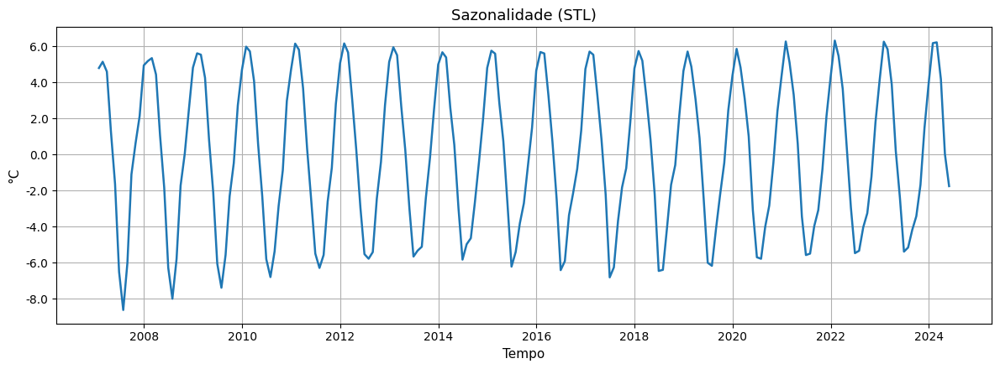

---
jupytext:
  formats: md:myst
  text_representation:
    extension: .md
    format_name: myst
    format_version: 0.13
    jupytext_version: 1.16.4
kernelspec:
  display_name: Python 3
  language: python
  name: python3
---


# 2. SÉRIES TEMPORAIS E AUTOCORRELAÇÃO

# 2. TÍTULO DO CAPÍTULO

[**Abrir no Google Colab**](https://colab.research.google.com/github/Alexandrogschafer/spatio-temporal-data-analysis/blob/main/capitulo2.ipynb)

```{raw} html
<p><strong>Ouça o resumo do capítulo em áudio:</strong></p>
<audio controls preload="none">
  <source src="audio/capitulo2.mp3" type="audio/mpeg">
  Seu navegador não suporta a reprodução de áudio.
</audio>


Uma série temporal é um conjunto de dados organizados na ordem em que foram coletados ao longo do tempo. Em outras palavras, é um registro de como um fenômeno muda de um momento para outro.  
O foco não está apenas nos valores em si, mas na evolução desses valores com o passar do tempo.

Podemos imaginar uma série temporal como um “filme” do fenômeno observado: cada ponto de dados é um quadro desse filme, mostrando o que aconteceu em um instante específico. Ao juntar todos os quadros na sequência correta, conseguimos ver o comportamento do fenômeno ao longo do tempo.

```{admonition} Exemplos práticos de séries temporais
:class: tip
- Chuvas diárias: registrar, dia após dia, a quantidade de chuva que caiu em uma cidade.  
- Temperaturas mensais: acompanhar a temperatura média de cada mês em um determinado local.  
- Contagem de veículos: medir quantos carros passam por uma estrada a cada hora ou a cada dia.  
- Produção agrícola anual: acompanhar a produção de uma cultura específica a cada safra.
```

Logo abaixo, podemos visualizar um exemplo real de série temporal para o caso de temperatura mensal.
O gráfico mostra a temperatura média mensal registrada ao longo de vários anos pela Estação Climatológica A827 do INMET, localizDada no município de Bagé-RS.


Figura 1: Série temporal da temperatura média mensal (°C) – Estação Climatológica A827/INMET, Bagé-RS.


**Diferença entre dados transversais (espaciais) e dados temporais**

```{admonition} Dados transversais ou espaciais
:class: note
São dados coletados em vários lugares diferentes, no mesmo momento no tempo.  
Exemplo: medir a temperatura hoje em várias cidades de um estado.  
Esse tipo de dado mostra como algo varia no espaço, mas não ao longo do tempo.
```

```{admonition} Dados temporais
:class: note
São dados coletados ao longo do tempo em um mesmo lugar ou fenômeno.  
Exemplo: medir a temperatura ao longo de vários anos em uma única cidade.  
Esse tipo de dado mostra como algo varia no tempo, permitindo identificar tendências e padrões.
```

Em muitas análises de geoprocessamento e ciências ambientais, trabalhamos com os dois tipos ao mesmo tempo (dados espaço-temporais).
Entender primeiro as séries temporais é essencial para depois combinar essas dimensões com mapas e informações espaciais.


## **2.1 Componentes de uma Série Temporal**

Uma série temporal pode parecer apenas uma sequência de números ao longo do tempo, mas por trás dela existem padrões e comportamentos que podemos identificar. Para entender melhor, costumamos “dividir” mentalmente uma série temporal em componentes. Cada componente mostra uma parte diferente do comportamento dos dados.

Esses componentes ajudam a interpretar a série e a preparar análises mais avançadas, como previsões ou detecção de anomalias. Vamos conhecer os principais:

**a) Tendência**

A tendência mostra se, ao longo do tempo, os valores estão aumentando, diminuindo ou permanecendo estáveis.  
Exemplo: a média das temperaturas anuais de uma cidade pode estar subindo gradualmente por conta das mudanças climáticas.

Ao identificar a tendência, conseguimos ver o comportamento geral do fenômeno, sem nos perder nas variações do dia a dia.


Figura 2: Tendência (STL) da série temporal – Estação Climatológica A827/INMET, Bagé-RS.


**b) Sazonalidade**

A sazonalidade representa padrões que se repetem regularmente em intervalos de tempo previsíveis.
Exemplo: aumento das vendas no comércio no final do ano; maior quantidade de chuvas no verão.

São variações ligadas a fatores como estações do ano, meses, dias da semana ou horários do dia.

Reconhecer a sazonalidade é útil para diferenciar o que é um padrão normal do que é uma variação atípica.



Figura 3: Sazonalidade (STL) da série temporal – Estação Climatológica A827/INMET, Bagé-RS.


**c) Ciclos**

Os ciclos também são variações ao longo do tempo, mas não têm intervalos fixos como a sazonalidade.
Exemplo: períodos de crescimento e retração na economia, que podem durar anos e não seguem um calendário definido.

São movimentos de médio ou longo prazo, mais difíceis de prever.

```{admonition} Em resumo
:class: note
- **Sazonalidade** = padrões regulares, repetitivos.  
- **Ciclos** = padrões de longo prazo, sem regularidade fixa.
```

(Neste exemplo, os ciclos de longo prazo estão embutidos no gráfico de tendência. Eles podem aparecer como oscilações suaves ao longo dos anos.)

**d) Ruído (ou irregularidade)**

O ruído é a parte da série que não segue nenhum padrão aparente. São as variações aleatórias, provocadas por fatores imprevisíveis ou erros de medição.
Exemplo: um dia chuvoso inesperado em meio a uma semana seca; uma falha de sensor.

Embora o ruído seja inevitável, ele pode ser reduzido ou filtrado em análises para que possamos ver mais claramente os outros componentes.


Figura 4: Resíduo (ruído) da série temporal – Estação Climatológica A827/INMET, Bagé-RS.


**Por que separar os componentes?**

Ao separar tendência, sazonalidade, ciclos e ruído, conseguimos:

* Compreender melhor o comportamento do fenômeno.
* Prever valores futuros com mais precisão.
* Detectar anomalias (algo fora do padrão).

Essa visão mais detalhada é a base para qualquer estudo de séries temporais, inclusive quando integramos dados espaciais (em mapas) e temporais ao mesmo tempo.


## **2.2 Preparação dos Dados Temporais**

Antes de começar qualquer análise, é essencial organizar os dados. Essa etapa é chamada de **preparação dos dados temporais**. Ela garante que as informações estejam no formato certo, completas e bem estruturadas para que possamos aplicar gráficos, cálculos e métodos de análise sem erros.

Podemos imaginar essa fase como **arrumar a mesa de trabalho antes do projeto**: se tudo estiver organizado, o trabalho flui muito mais rápido e os resultados ficam mais confiáveis.

**Como estamos fazendo isso no notebook**

**a) Imports e estilo**

O código começa importando as bibliotecas que serão usadas ao longo do capítulo (pandas, numpy, matplotlib, statsmodels etc.) e configurando parâmetros de estilo para que os gráficos fiquem com aparência consistente.

```{code-cell} python
from IPython.display import display, Markdown, HTML
from matplotlib.ticker import FormatStrFormatter
from statsmodels.graphics.tsaplots import plot_acf, plot_pacf
from statsmodels.tsa.seasonal import STL, seasonal_decompose
from statsmodels.tsa.holtwinters import ExponentialSmoothing
from statsmodels.tsa.statespace.sarimax import SARIMAX
from statsmodels.stats.diagnostic import acorr_ljungbox
import statsmodels.api as sm
from sklearn.metrics import mean_squared_error
import itertools
import numpy as np
import pandas as pd
import matplotlib.pyplot as plt
import base64
from io import BytesIO

plt.rcParams["figure.figsize"] = (12, 5)
plt.rcParams["axes.grid"]      = True
plt.rcParams["axes.titlesize"] = 13
plt.rcParams["axes.labelsize"] = 11
```

*(As funções auxiliares serão apresentadas conforme forem utilizadas nas próximas seções para facilitar a compreensão.)*

**b) Carregamento e organização das datas**

Os dados da série histórica foram **embutidos diretamente no código em formato Base64**, evitando a necessidade de download de arquivos externos.  
O bloco de código decodifica essa string Base64 e monta o `DataFrame` com os mesmos parâmetros do arquivo original:

* o separador `;`
* a conversão da coluna `"Data"` para `datetime` (utilizada como índice)
* e o separador decimal como vírgula


```{code-cell} python
# Conteúdo Base64 do CSV
csv_base64 = """
RGF0YTtUZW1wTWVuc2FsCjIwMDctMDEtMzE7MjMsNQoyMDA3LTAyLTI4OzIzLDkxMjUKMjAwNy0wMy0zMTsyMywyNzQxOTM1NDgzODcwOTYKMjAwNy0wNC0zMDsyMCwxNTMzMzMzMzMzMzMzMwoyMDA3LTA1LTMxOzEyLDU1NDgzODcwOTY3NzQyCjIwMDctMDYtMzA7MTIsMjExNjY2NjY2NjY2NjY4CjIwMDctMDctMzE7OSw4MzE1OTY3NzQxOTM1NDgKMjAwNy0wOC0zMTsxMSw2MzcwOTY3NzQxOTM1NDgKMjAwNy0wOS0zMDsxNyw4ODY2NjY2NjY2NjY2NjcKMjAwNy0xMC0zMTsxOSwwMDQ4Mzg3MDk2Nzc0MgoyMDA3LTExLTMwOzE4LDcwMTY2NjY2NjY2NjY2NAoyMDA3LTEyLTMxOzIzLDE4ODcwOTY3NzQxOTM2CjIwMDgtMDEtMzE7MjMsNTkxOTM1NDgzODcwOTcKMjAwOC0wMi0yOTsyMywwOTQ4Mjc1ODYyMDY4OTcKMjAwOC0wMy0zMTsyMiwwMjU4MDY0NTE2MTI5CjIwMDgtMDQtMzA7MTgsMjA1CjIwMDgtMDUtMzE7MTUsMzc5MDMyMjU4MDY0NTE2CjIwMDgtMDYtMzA7MTEsMTU1CjIwMDgtMDctMzE7MTUsMjI5ODM4NzA5Njc3NDIKMjAwOC0wOC0zMTsxMywwMTQ1MTYxMjkwMzIyNTYKMjAwOC0wOS0zMDsxMyw3MTgzMzMzMzMzMzMzMzQKMjAwOC0xMC0zMTsxNyw3NTE2MTI5MDMyMjU4MDUKMjAwOC0xMS0zMDsyMSw0NDE2NjY2NjY2NjY2NjMKMjAwOC0xMi0zMTsyMiwyNzc0MTkzNTQ4Mzg3MQoyMDA5LTAxLTMxOzIyLDc1OTY3NzQxOTM1NDg0CjIwMDktMDItMjg7MjMsMTQ4MjE0Mjg1NzE0Mjg1CjIwMDktMDMtMzE7MjIsMTcwOTY3NzQxOTM1NDgKMjAwOS0wNC0zMDsxOCw5OTE2NjY2NjY2NjY2NjcKMjAwOS0wNS0zMTsxNiw3NDgzODcwOTY3NzQxOTUKMjAwOS0wNi0zMDsxMSwyNDgzMzMzMzMzMzMzMzEKMjAwOS0wNy0zMTs5LDgzMTU5Njc3NDE5MzU0OAoyMDA5LTA4LTMxOzE1LDQzODcwOTY3NzQxOTM1NgoyMDA5LTA5LTMwOzE0LDc2ODMzMzMzMzMzMzMzNAoyMDA5LTEwLTMxOzE3LDEwOTY3NzQxOTM1NDg0CjIwMDktMTEtMzA7MjEsNDU2NjY2NjY2NjY2NjY3CjIwMDktMTItMzE7MjIsMDY5MzU0ODM4NzA5NjgKMjAxMC0wMS0zMTsyMyw3NzU4MDY0NTE2MTI5CjIwMTAtMDItMjg7MjQsMjUKMjAxMC0wMy0zMTsyMiwzNTY0NTE2MTI5MDMyMjUKMjAxMC0wNC0zMDsxOCwzNTMzMzMzMzMzMzMzMwoyMDEwLTA1LTMxOzE1LDU2MjkwMzIyNTgwNjQ1MQoyMDEwLTA2LTMwOzEzLDE0MTY2NjY2NjY2NjY2NwoyMDEwLTA3LTMxOzEyLDUwODA2NDUxNjEyOTAzMgoyMDEwLTA4LTMxOzEyLDQyNDE5MzU0ODM4NzA5OAoyMDEwLTA5LTMwOzE1LDY0ODMzMzMzMzMzMzMzMgoyMDEwLTEwLTMxOzE2LDQKMjAxMC0xMS0zMDsxOCw5NjMzMzMzMzMzMzMzMwoyMDEwLTEyLTMxOzIzLDY1NjQ1MTYxMjkwMzIyNgoyMDExLTAxLTMxOzI1LDgwMDIwNjg5NjU1MTcyOAoyMDExLTAyLTI4OzIzLDUxMDcxNDI4NTcxNDI4MwoyMDExLTAzLTMxOzIxLDcwODA2NDUxNjEyOTAzNQoyMDExLTA0LTMwOzE4LDk2NjY2NjY2NjY2NjY2NQoyMDExLTA1LTMxOzE0LDg4MDY0NTE2MTI5MDMyNQoyMDExLTA2LTMwOzEyLDIyMzMzMzMzMzMzMzMzMwoyMDExLTA3LTMxOzExLDQ5NTE2MTI5MDMyMjU4CjIwMTEtMDgtMzE7MTIsOTAzMjI1ODA2NDUxNjEyCjIwMTEtMDktMzA7MTUsMTE2NjY2NjY2NjY2NjY3CjIwMTEtMTAtMzE7MTcsMTAzMjI1ODA2NDUxNjE1CjIwMTEtMTEtMzA7MjAsNzcKMjAxMS0xMi0zMTsyMSwzMjkwMzIyNTgwNjQ1MgoyMDEyLTAxLTMxOzI0LDMyNTgwNjQ1MTYxMjkwNQoyMDEyLTAyLTI5OzI0LDc0NjU1MTcyNDEzNzkzCjIwMTItMDMtMzE7MjEsOTE5MzU0ODM4NzA5NjgKMjAxMi0wNC0zMDsxNywzNTgzMzMzMzMzMzMzMzQKMjAxMi0wNS0zMTsxNyw1OTY3NzQxOTM1NDgzODgKMjAxMi0wNi0zMDsxMywzMgoyMDEyLTA3LTMxOzEwLDAzNzA5Njc3NDE5MzU0OAoyMDEyLTA4LTMxOzE3LDQxOTM1NDgzODcwOTY3NgoyMDEyLTA5LTMwOzE2LDA3MTY2NjY2NjY2NjY2NQoyMDEyLTEwLTMxOzE5LDAxOTM1NDgzODcwOTY4CjIwMTItMTEtMzA7MjEsOTYKMjAxMi0xMi0zMTsyMyw4MTI5MDMyMjU4MDY0NQoyMDEzLTAxLTMxOzIyLDA2MTI5MDMyMjU4MDY0MwoyMDEzLTAyLTI4OzIyLDc5ODIxNDI4NTcxNDI4OAoyMDEzLTAzLTMxOzE5LDUyMDk2Nzc0MTkzNTQ4MwoyMDEzLTA0LTMwOzE4LDY1NQoyMDEzLTA1LTMxOzE0LDQ0MTkzNTQ4Mzg3MDk2NwoyMDEzLTA2LTMwOzEyLDQ3CjIwMTMtMDctMzE7MTIsNjE2MTI5MDMyMjU4MDY0CjIwMTMtMDgtMzE7MTEsNTY3NzQxOTM1NDgzODcyCjIwMTMtMDktMzA7MTUsODgxNjY2NjY2NjY2NjY2CjIwMTMtMTAtMzE7MTcsMzA0ODM4NzA5Njc3NDIKMjAxMy0xMS0zMDsyMCw0MQoyMDEzLTEyLTMxOzI0LDE4MjI1ODA2NDUxNjEyNwoyMDE0LTAxLTMxOzI0LDg4NTQ4Mzg3MDk2Nzc0MwoyMDE0LTAyLTI4OzI0LDEzNzUKMjAxNC0wMy0zMTsyMCw0NzQxOTM1NDgzODcxCjIwMTQtMDQtMzA7MTgsNjYzMzMzMzMzMzMzMzMKMjAxNC0wNS0zMTsxNCw4MTEyOTAzMjI1ODA2NDQKMjAxNC0wNi0zMDsxMSw5MzkxNjY2NjY2NjY2NjkKMjAxNC0wNy0zMTsxNCw0MDgwNjQ1MTYxMjkwMzQKMjAxNC0wOC0zMTsxNCw2NjEyOTAzMjI1ODA2NDYKMjAxNC0wOS0zMDsxNiwzMzMzMzMzMzMzMzMzMzIKMjAxNC0xMC0zMTsxOSwzMjA5Njc3NDE5MzU0ODcKMjAxNC0xMS0zMDsyMCw5NDUKMjAxNC0xMi0zMTsyMiw0MTkzNTQ4Mzg3MDk2OAoyMDE1LTAxLTMxOzIzLDYyOTAzMjI1ODA2NDUyCjIwMTUtMDItMjg7MjMsMjcxNDI4NTcxNDI4NTcKMjAxNS0wMy0zMTsyMiw0NTMyMjU4MDY0NTE2MTMKMjAxNS0wNC0zMDsxOSw1NDE2NjY2NjY2NjY2NjgKMjAxNS0wNS0zMTsxNiw0NzU4MDY0NTE2MTI5MDQKMjAxNS0wNi0zMDsxMyw5NwoyMDE1LTA3LTMxOzEzLDY1NDgzODcwOTY3NzQyCjIwMTUtMDgtMzE7MTcsOTI5MDMyMjU4MDY0NTEzCjIwMTUtMDktMzA7MTUsMAoyMDE1LTEwLTMxOzE2LDY1OTY3NzQxOTM1NDg0CjIwMTUtMTEtMzA7MTgsOTE4MzMzMzMzMzMzMzMzCjIwMTUtMTItMzE7MjIsMzc1ODA2NDUxNjEyOTAyCjIwMTYtMDEtMzE7MjQsMjY2MTI5MDMyMjU4MDY0CjIwMTYtMDItMjk7MjUsMTA4NjIwNjg5NjU1MTcKMjAxNi0wMy0zMTsyMCw2MjU4MDY0NTE2MTI5MDIKMjAxNi0wNC0zMDsxOSwzNDA3ODY1MTY4NTM5MwoyMDE2LTA1LTMxOzksODMxNTk2Nzc0MTkzNTQ4CjIwMTYtMDctMzE7MTEsMjg4NTUzMzcwNzg2NTE2CjIwMTYtMDgtMzE7MTUsMDA2NDUxNjEyOTAzMjIzCjIwMTYtMDktMzA7MTMsOTY1CjIwMTYtMTAtMzE7MTcsODU2NDUxNjEyOTAzMjI1CjIwMTYtMTEtMzA7MTksODg2NjY2NjY2NjY2NjY3CjIwMTYtMTItMzE7MjMsNTg1NDgzODcwOTY3NzQyCjIwMTctMDEtMzE7MjMsOTU5Njc3NDE5MzU0ODQKMjAxNy0wMi0yODsyNCwyMDM1NzE0Mjg1NzE0MwoyMDE3LTAzLTMxOzIzLDA1CjIwMTctMDQtMzA7MTgsNjMxNjY2NjY2NjY2NjY4CjIwMTctMDUtMzE7MTYsMjQ2Nzc0MTkzNTQ4Mzg2CjIwMTctMDYtMzA7MTQsNzM2NjY2NjY2NjY2NjY4CjIwMTctMDctMzE7MTUsOTk1MTYxMjkwMzIyNTgKMjAxNy0wOC0zMTsxNSw4NTY0NTE2MTI5MDMyMjgKMjAxNy0wOS0zMDsxOCw0MzgzMzMzMzMzMzMzMzMKMjAxNy0xMC0zMTsxNyw3NTE2MTI5MDMyMjU4MDUKMjAxNy0xMS0zMDsxOSwyODMzMzMzMzMzMzMzMwoyMDE3LTEyLTMxOzI0LDIwMzIyNTgwNjQ1MTYxMwoyMDE4LTAxLTMxOzI0LDQzODcwOTY3NzQxOTM2CjIwMTgtMDItMjg7MjMsNjY2MDcxNDI4NTcxNDI4CjIwMTgtMDMtMzE7MjEsMjYyOTAzMjI1ODA2NDUKMjAxOC0wNC0zMDsyMiwyMDgzMzMzMzMzMzMzMwoyMDE4LTA1LTMxOzE2LDUyMDk2Nzc0MTkzNTQ4MwoyMDE4LTA2LTMwOzExLDMxMTY2NjY2NjY2NjY2NwoyMDE4LTA3LTMxOzEyLDA5Njc3NDE5MzU0ODM4OAoyMDE4LTA4LTMxOzEyLDE3MjU4MDY0NTE2MTI5MQoyMDE4LTA5LTMwOzE3LDg0CjIwMTgtMTAtMzE7MTcsNjM3MDk2Nzc0MTkzNTQ4CjIwMTgtMTEtMzA7MjEsNTgKMjAxOC0xMi0zMTsyMiwyNjYxMjkwMzIyNTgwNjQKMjAxOS0wMS0zMTsyNCwyODg3MDk2Nzc0MTkzNTUKMjAxOS0wMi0yODsyMiw5MTI1CjIwMTktMDMtMzE7MjEsMjg4NzA5Njc3NDE5MzU1CjIwMTktMDQtMzA7MTksODQ2NjY2NjY2NjY2NjY4CjIwMTktMDUtMzE7MTYsNjkzNTQ4Mzg3MDk2Nzc2CjIwMTktMDYtMzA7MTYsNzkKMjAxOS0wNy0zMTsxMiwyNDUxNjEyOTAzMjI1OAoyMDE5LTA4LTMxOzEzLDMyNTgwNjQ1MTYxMjkwNAoyMDE5LTA5LTMwOzE1LDAxNjY2NjY2NjY2NjY2NwoyMDE5LTEwLTMxOzE4LDQ1MTYxMjkwMzIyNTgwOAoyMDE5LTExLTMwOzIxLDE1NQoyMDE5LTEyLTMxOzIyLDk4Mzg3MDk2Nzc0MTkzNgoyMDIwLTAxLTMxOzI0LDA0NTE2MTI5MDMyMjU4CjIwMjAtMDItMjk7MjMsMzQ0ODI3NTg2MjA2ODk3CjIwMjAtMDMtMzE7MjQsNTI3NDE5MzU0ODM4NzEKMjAyMC0wNC0zMDsxOCw4NzE2NjY2NjY2NjY2NjMKMjAyMC0wNS0zMTsxNSwzMTc3NDE5MzU0ODM4NzIKMjAyMC0wNi0zMDsxNCwyNDY2NjY2NjY2NjY2NjYKMjAyMC0wNy0zMTsxMiwxMzM4NzA5Njc3NDE5MzYKMjAyMC0wOC0zMTsxNSw1MjA5Njc3NDE5MzU0ODQKMjAyMC0wOS0zMDsxNCw3OTUKMjAyMC0xMC0zMTsxNyw1ODU0ODM4NzA5Njc3NDIKMjAyMC0xMS0zMDsyMCwyNTE2NjY2NjY2NjY2NjUKMjAyMC0xMi0zMTsyMiwyNTgwNjQ1MTYxMjkwMzIKMjAyMS0wMS0zMTsyMyw1ODA2NDUxNjEyOTAzMjQKMjAyMS0wMi0yODsyMiw2MDcxNDI4NTcxNDI4NTgKMjAyMS0wMy0zMTsyMSw2NTY0NTE2MTI5MDMyMjYKMjAyMS0wNC0zMDsxOSw0MzY2NjY2NjY2NjY2NjcKMjAyMS0wNS0zMTsxMyw1MTEyOTAzMjI1ODA2NDYKMjAyMS0wNi0zMDsxMiwzNgoyMDIxLTA3LTMxOzEyLDg0ODM4NzA5Njc3NDE5NgoyMDIxLTA4LTMxOzE0LDk3NzQxOTM1NDgzODcxCjIwMjEtMDktMzA7MTYsNDg1CjIwMjEtMTAtMzE7MTcsOTE3NzQxOTM1NDgzODcKMjAyMS0xMS0zMDsyMCw0MjUKMjAyMS0xMi0zMTsyMiw0OTE5MzU0ODM4NzA5NjgKMjAyMi0wMS0zMTsyNSw4MDAyMDY4OTY1NTE3MjgKMjAyMi0wMi0yODsyMyw4MjMyMTQyODU3MTQyODMKMjAyMi0wMy0zMTsyMCw4MjA5Njc3NDE5MzU0ODcKMjAyMi0wNC0zMDsxNyw5MDE2NjY2NjY2NjY2NjQKMjAyMi0wNS0zMTsxMyw4ODU0ODM4NzA5Njc3NAoyMDIyLTA2LTMwOzEwLDk3NjY2NjY2NjY2NjY2OAoyMDIyLTA3LTMxOzE0LDU0MzU0ODM4NzA5Njc3NQoyMDIyLTA4LTMxOzEzLDIxMTI5MDMyMjU4MDY0NQoyMDIyLTA5LTMwOzE0LDAyMzMzMzMzMzMzMzMzMgoyMDIyLTEwLTMxOzE2LDkzNTQ4Mzg3MDk2Nzc0CjIwMjItMTEtMzA7MjAsMzQ2NjY2NjY2NjY2NjY4CjIwMjItMTItMzE7MjMsNTMyMjU4MDY0NTE2MTI4CjIwMjMtMDEtMzE7MjUsODAwMjA2ODk2NTUxNzI4CjIwMjMtMDItMjg7MjQsNjA4OTI4NTcxNDI4NTcKMjAyMy0wMy0zMTsyNCw4NDE5MzU0ODM4NzA5NwoyMDIzLTA0LTMwOzE4LDc0NjY2NjY2NjY2NjY2MwoyMDIzLTA1LTMxOzE2LDc5ODM4NzA5Njc3NDE5MgoyMDIzLTA2LTMwOzE0LDM3MTY2NjY2NjY2NjY2OAoyMDIzLTA3LTMxOzEzLDIwNDgzODcwOTY3NzQyCjIwMjMtMDgtMzE7MTUsMDQxOTM1NDgzODcwOTY5CjIwMjMtMDktMzA7MTUsOTE4MzMzMzMzMzMzMzMxCjIwMjMtMTAtMzE7MTcsMjk1MTYxMjkwMzIyNTgKMjAyMy0xMS0zMDsyMCw0NjE2NjY2NjY2NjY2NjIKMjAyMy0xMi0zMTsyMiw0NTgwNjQ1MTYxMjkwMzUKMjAyNC0wMS0zMTsyMywxNDY3NzQxOTM1NDgzODUKMjAyNC0wMi0yOTsyNSwyNjcyNDEzNzkzMTAzNDUKMjAyNC0wMy0zMTsyMiw5ODM4NzA5Njc3NDE5MzYKMjAyNC0wNC0zMDsxOSw1NDUKMjAyNC0wNS0zMTsxNyw3OTU0NTQ1NDU0NTQ1NDcK
"""

# Decodifica o Base64 em bytes
csv_bytes = base64.b64decode(csv_base64)

# Lê o DataFrame a partir dos bytes, com os mesmos parâmetros que você usava
mensal = (
    pd.read_csv(
        BytesIO(csv_bytes),
        sep=";",        # separador ponto e vírgula
        decimal=",",    # vírgula como separador decimal
        parse_dates=["Data"]
    )
    .set_index("Data")
    .sort_index()
)

# Espia as primeiras linhas
mensal.head()
```

**c) Deduplicação, grade mensal contínua e interpolação curta**

Depois garantimos que:

* as datas estão em ordem cronológica
* datas duplicadas são removidas
* a série é reindexada numa **grade mensal contínua** (`freq="ME"`) e eventuais lacunas de até 2 meses são interpoladas

```{code-cell} python
# capture quantas datas duplicadas vieram na carga original
dups_n = mensal.index.duplicated().sum()

# remove duplicatas de datas (se houver)
mensal = mensal[~mensal.index.duplicated(keep="first")]

# Série base e grade mensal contínua ('ME')
serie    = mensal["TempMensal"].astype(float)
full_idx = pd.date_range(serie.index.min(), serie.index.max(), freq="ME")
y        = serie.reindex(full_idx).interpolate(limit=2).dropna()  # até 2 lacunas consecutivas
y.name   = "TempMensal"  # nome amigável

# Mostra o índice inicial/final e tamanho
(y.index.min(), y.index.max(), len(y))
```

No fim desse bloco temos a série **`y`** — a nossa série temporal já **limpa e pronta** para análises.

**d) Ficha descritiva dos dados**

O bloco seguinte monta uma pequena “ficha técnica” com:

* período coberto
* frequência esperada
* número de observações
* percentual de faltantes
* estatísticas básicas (mínimo, média, mediana, máximo, desvio-padrão)

O código também imprime mensagens automáticas sobre **meses faltantes** e **duplicatas**. Isso ajuda a verificar se os dados estão íntegros antes de começar a análise.

```{code-cell} python
# Ficha descritiva
inicio, fim = y.index.min(), y.index.max()
n_obs, n_na = y.shape[0], y.isna().sum()
pct_na = 100 * n_na / (n_obs + n_na)

# meses faltantes após a grade
buracos = pd.date_range(inicio, fim, freq="ME").difference(y.index)

ficha = pd.DataFrame({
   "Período coberto": [f"{inicio.date()} → {fim.date()}"],
   "Frequência (esperada)": ["Mensal (ME)"],
   "Observações (não nulas)": [n_obs],
   "Faltantes (%)": [round(pct_na, 2)],
   "Mín": [round(y.min(), 2)],
   "Média": [round(y.mean(), 2)],
   "Mediana": [round(y.median(), 2)],
   "Máx": [round(y.max(), 2)],
   "Desvio-padrão": [round(y.std(ddof=1), 2)]
})
display(ficha)

print(
    "✓ Sem meses faltantes no período coberto."
    if len(buracos)==0
    else f"⚠ Meses faltantes: {len(buracos)} (ex.: {pd.Index(buracos[:3]).strftime('%Y-%m').tolist()} ...)"
)

if dups_n > 0:
    print(f"⚠ Havia {dups_n} datas duplicadas na carga original (mantivemos a primeira).")
```

**O que observar:**

* **Período coberto**: 17 anos completos de dados, o que permite análises de tendência e sazonalidade confiáveis.
* **Unidade de medida**: graus Celsius.
* **Completude**: não há dados faltantes após a preparação.
* **Variação**: valores mínimos próximos de 10 °C e máximos próximos de 26 °C.

**e) Verificação inicial com gráficos simples**

Para conhecer melhor os dados, mostramos três visualizações básicas:

1. **Histograma (distribuição)**

```{code-cell} python
plt.figure(figsize=(12,4.5))
plt.hist(y.values, bins=20, edgecolor="black", alpha=0.8)
plt.title("Distribuição das temperaturas mensais")
plt.xlabel("°C"); plt.ylabel("Frequência"); plt.grid(True, axis="y")
plt.show()
```

*Interpretação:* o histograma mostra como os valores se concentram entre **15 °C e 24 °C**, com poucas observações em extremos (abaixo de 12 °C e acima de 25 °C). Isso indica um regime térmico relativamente estável, mas com amplitude suficiente para estudos de sazonalidade.

2. **Climatologia mensal (média por mês)**

```{code-cell} python
clima = pd.DataFrame({"TempMensal": y})
clima["mes"] = clima.index.month
mmap = clima.groupby("mes")["TempMensal"].mean().reindex(range(1,13))

plt.figure(figsize=(12,4.5))
plt.bar(mmap.index, mmap.values)
plt.title("Climatologia mensal (média por mês)")
plt.xlabel("Mês"); plt.ylabel("°C"); plt.grid(True, axis="y")
plt.xticks(range(1,13), ['Jan','Fev','Mar','Abr','Mai','Jun','Jul','Ago','Set','Out','Nov','Dez'])
plt.show()
```

*Interpretação:* fica evidente a sazonalidade anual — verões mais quentes (dez–fev) e invernos mais frios (jun–jul). Essa informação é essencial para a decomposição da série em tendência e sazonalidade.

3. **Boxplot por mês**

```{code-cell} python
plt.figure(figsize=(12,5))
clima.boxplot(column="TempMensal", by="mes")
plt.title("Distribuição mensal (°C)"); plt.suptitle("")
plt.xlabel("Mês"); plt.ylabel("°C")
plt.xticks(range(1,13), ['Jan','Fev','Mar','Abr','Mai','Jun','Jul','Ago','Set','Out','Nov','Dez'])
plt.grid(True, axis="y")
plt.show()
```

*Interpretação:* o boxplot detalha a dispersão mês a mês. Nota-se maior variação em meses de transição (maio, setembro) e valores mais concentrados nos meses de inverno. Alguns outliers podem aparecer, refletindo episódios atípicos de calor ou frio.


**Resumo do Diagnóstico**

```{admonition} Insights do Diagnóstico
:class: tip
- Período coberto: 2007–2024, série mensal **completa** (≈209 observações, 0% faltantes).  
- Temperaturas entre ~9,8 °C e ~25,8 °C, média ~18,4 °C.  
- **Sazonalidade anual forte**: verões quentes (dez–fev) e invernos frios (jun–jul).  
- Distribuição estável, poucos outliers — dados ideais para **decomposição** e **previsão**.  
- **Pronto para análise**: dados limpos, padronizados e com frequência bem definida.
```

Com os dados bem preparados, conseguimos:

* Visualizar a série temporal de forma clara.
* Aplicar métodos de análise sem precisar corrigir erros no meio do caminho.
* Garantir que as conclusões tiradas sejam confiáveis e reproduzíveis.

**Esse diagnóstico prepara o terreno** para as próximas seções, onde será feita a **decomposição formal da série** e a **identificação quantitativa** de sazonalidade e tendência.


## **2.3 Visualização inicial da série temporal**

Nesta seção vamos visualizar a série temporal em um gráfico e aprender a fazer uma **leitura básica**: compreender o eixo do tempo, o eixo dos valores e reconhecer padrões visuais, como picos, vales e repetições sazonais.

**Como plotamos a série (o que o código faz)**

O bloco abaixo desenha o gráfico da série mensal de temperatura:

```{code-cell} python
# Visualização inicial
ax = y.plot(color='blue', alpha=0.85)
ax.set_title('Série Mensal — Temperatura (°C)')
ax.set_xlabel('Tempo'); ax.set_ylabel('°C')
ax.yaxis.set_major_formatter(FormatStrFormatter('%.1f'))
plt.show()
```

**Como ler o gráfico (leituras básicas)**

* **Eixo do tempo (X):** vai da esquerda (2007) para a direita (2024). Cada ponto da linha representa um mês. É possível perceber repetições anuais (um ciclo por ano).
* **Eixo dos valores (Y):** mostra a temperatura em °C. A escala está aproximadamente entre 10 °C e 26 °C, indicando a amplitude típica da série.
* **Linha da série:** picos (valores altos) e vales (valores baixos) se repetem ano a ano. A espessura e a continuidade da linha ajudam a ver a trajetória mês a mês.

**Observação inicial de padrões (o que já dá para concluir)**

* **Sazonalidade forte:** há um padrão anual claro de picos no verão e vales no inverno (a linha sobe e desce em ondas regulares a cada ano).
* **Tendência de longo prazo pouco marcada:** a altura média da série não parece subir ou descer de forma persistente ao longo dos 17 anos — isso será confirmado na decomposição.
* **Amplitude sazonal moderada:** a maior parte dos valores fica entre ~10–26 °C, coerente com o clima local.
* **Possíveis episódios atípicos:** alguns pontos fogem do “desenho” esperado (por exemplo, mínimos muito baixos ou máximos muito altos em certos anos); mais adiante investigaremos isso como anomalias.

Com essa leitura inicial, já sabemos o que a série “parece dizer”.
Nas próximas seções, vamos **quantificar essas percepções** com decomposição (tendência, sazonalidade e ruído) e, depois, explorar **médias móveis** e **autocorrelação** para descrever melhor os padrões.


## **2.4 Decomposição de Séries Temporais**

Quando observamos uma série temporal, vemos apenas uma linha única que sobe e desce ao longo do tempo. No entanto, por trás desse traçado existem padrões diferentes acontecendo simultaneamente.  
A **decomposição** é a técnica que nos permite separar essa linha em três componentes básicos — **tendência**, **sazonalidade** e **resíduo** — para entender com mais clareza o comportamento dos dados.

No gráfico abaixo, a série mensal de temperatura da Estação Climatológica A827/INMET (Bagé-RS) foi decomposta pelo método **STL**. O resultado aparece em quatro painéis: a série original, a tendência de longo prazo, a sazonalidade anual e o resíduo (o que sobra após retirar tendência e sazonalidade).

```{code-cell} python
# Decomposição (STL) + Força Sazonal
stl = STL(y, period=12, robust=True).fit()
trend, seasonal, resid = stl.trend, stl.seasonal, stl.resid

# força sazonal = 1 - var(resid) / (var(resid) + var(seasonal))
var_res = np.var(resid.dropna(), ddof=1)
var_sea = np.var(seasonal.dropna(), ddof=1)
forca_sazonal = (1 - var_res/(var_res + var_sea)) if (var_res + var_sea) > 0 else np.nan
print(f"Força sazonal (0–1): {forca_sazonal:.2f}")

fig, axes = plt.subplots(4, 1, figsize=(12, 9), sharex=True)
axes[0].plot(y, color='black'); axes[0].set_title('Original')
axes[1].plot(trend, linewidth=2); axes[1].set_title('Tendência (STL)')
axes[2].plot(seasonal); axes[2].set_title('Sazonalidade (STL)')
axes[3].plot(resid); axes[3].set_title('Resíduo (STL)')
axes[-1].set_xlabel('Tempo')
plt.tight_layout(); plt.show()
```

**Como interpretar cada painel**

* **Série Original:** mostra os valores mensais tal como foram observados. É possível perceber, a olho nu, ondas regulares correspondentes às estações do ano.
* **Tendência (STL):** destaca o movimento suave de longo prazo. No nosso caso, a temperatura média mensal oscila entre aproximadamente 17,7 °C e 19 °C ao longo dos anos, sem uma subida ou descida persistente. Isso indica que, embora haja pequenas flutuações multianuais, não há uma tendência forte e constante no período analisado.
* **Sazonalidade (STL):** revela o padrão que se repete a cada 12 meses: picos positivos no verão (dezembro a fevereiro) e valores negativos no inverno (junho e julho). A amplitude é de cerca de ±5 °C, coerente com o clima local. Essa componente explica a maior parte das variações mensais da série.
* **Resíduo (STL):** representa as variações que não se enquadram nem na tendência nem na sazonalidade. Os valores oscilam em torno de zero e mostram picos isolados — meses excepcionalmente quentes ou frios, falhas de medição ou outros eventos atípicos. É aqui que se concentram as “anomalias” da série.

O cálculo adicional feito no notebook — a **força sazonal** — fornece um número entre 0 e 1 que indica o peso da sazonalidade. Valores próximos de 1 significam sazonalidade muito forte. Para esta série, a força sazonal está em torno de **0,9**, confirmando que o padrão anual domina os dados.

**A decomposição na prática (tabela)**

Além dos gráficos, o notebook mostra uma tabela com as colunas **TempMensal (Série)**, **Tendência**, **Sazonalidade** e **Resíduo**:

```{code-cell} python
# Decomposição clássica — “tabelinha vitrine”
decomp_add = seasonal_decompose(y, model='additive', period=12, extrapolate_trend='freq')
display(pd.DataFrame({
   'TempMensal': y,
   'Tendência':  decomp_add.trend,
   'Sazonalidade': decomp_add.seasonal,
   'Resíduo':     decomp_add.resid
}).round(3).head(12))
```

Cada linha confirma a identidade aditiva:

> **TempMensal = Tendência + Sazonalidade + Resíduo**

Exemplo prático:

* **Janeiro/2007:** Tendência 17,718 °C + Sazonalidade +5,710 °C + Resíduo +0,072 °C = 23,500 °C (valor observado).
* **Julho/2007:** Tendência 17,992 °C + Sazonalidade −5,780 °C + Resíduo −2,380 °C = 9,832 °C (valor observado).

Na tabela, a coluna “Sazonalidade” mostra valores positivos nos meses quentes e negativos nos meses frios; a “Tendência” varia suavemente de um ano para outro; e o “Resíduo” aparece como desvios pequenos ou grandes do padrão esperado.

#**Por que isso importa**

Separar tendência, sazonalidade e resíduo não é um exercício abstrato:

* Ajuda a compreender melhor o comportamento do fenômeno.
* Permite prever valores futuros com mais precisão, pois cada componente pode ser modelado de forma diferente.
* Destaca meses atípicos, facilitando a detecção de anomalias.

Esta visão mais detalhada é a base para análises mais avançadas que virão nas próximas seções — **médias móveis**, **autocorrelação** e, mais adiante, **modelagem e previsão**.


## **2.5 Médias Móveis**

Quando observamos uma série mensal, como a de temperatura, vemos uma linha cheia de **picos e vales**. Esses movimentos refletem a **sazonalidade**, mas podem dificultar a percepção da **tendência geral**.  
Uma forma simples de **suavizar** a série e visualizar essa tendência é usar a **média móvel**.

A **média móvel simples** consiste em calcular, para cada ponto no tempo, a média dos valores em torno dele dentro de uma “janela” de períodos definida.  
Por exemplo, uma média móvel de **12 meses** calcula, para cada mês, a média dos 12 meses vizinhos. Isso reduz as flutuações sazonais e deixa evidente a evolução de longo prazo.

**Exemplo 1 – Média Móvel de 12 meses**

O gráfico abaixo mostra a série mensal de temperatura (linha cinza) e, sobre ela, a média móvel de 12 meses (linha laranja). Essa suavização permite ver como a temperatura média evolui sem as oscilações anuais.

```{code-cell} python
# Tendência com média móvel (12 meses)
janela = 12  # use 6, 12, 24 para comparar
mensal['MM_'+str(janela)] = mensal['TempMensal'].rolling(window=janela, center=True).mean()

plt.figure(figsize=(10,4))
plt.plot(mensal.index, mensal['TempMensal'], alpha=0.45, label='Série mensal')
plt.plot(mensal.index, mensal['MM_'+str(janela)], linewidth=2.2, label=f'Média Móvel ({janela} meses)')
plt.title('Tendência via Média Móvel')
plt.xlabel('Tempo'); plt.ylabel('°C')
plt.gca().yaxis.set_major_formatter(FormatStrFormatter('%.1f'))
plt.grid(True); plt.legend()
plt.show()
```

**Como interpretar**

* A linha laranja mostra a **tendência de longo prazo**.
* No nosso caso, ela permanece entre ~18 °C e ~19 °C ao longo dos anos, com pequenas oscilações multianuais.
* A série original (cinza) continua mostrando picos e vales sazonais, mas a média móvel os “alisa”, facilitando ver se há uma **subida ou descida geral**.

**Exemplo 2 – Comparação de diferentes janelas (6, 12 e 24 meses)**

Podemos escolher **janelas menores ou maiores**, dependendo do nível de suavização desejado.
No gráfico abaixo, a série original aparece em cinza claro, enquanto as médias móveis aparecem em cores diferentes: **6 meses (azul)**, **12 meses (laranja)** e **24 meses (verde)**.

```{code-cell} python
def add_rolling_means(s, wins=(6,12,24)):
   out = pd.DataFrame({'y': s})
   for w in wins:
       out[f"MM_{w}"] = s.rolling(window=w, center=True).mean()
   return out

mm = add_rolling_means(y, wins=(6,12,24))
ax = mm['y'].plot(color='lightgray', label='Original')
for col in ['MM_6','MM_12','MM_24']:
   mm[col].plot(ax=ax, linewidth=2, label=col.replace('_', ' '))
plt.title('Médias Móveis (6, 12 e 24 meses)')
plt.xlabel('Tempo'); plt.ylabel('°C'); plt.legend(); plt.show()
```

#**Como interpretar**

* **MM 6 meses (azul):** suaviza pouco; ainda é possível ver bastante da variação sazonal, mas com menos “ruído”.
* **MM 12 meses (laranja):** suaviza um ciclo completo anual; elimina quase toda a sazonalidade e mostra a tendência de longo prazo.
* **MM 24 meses (verde):** suaviza ainda mais, mostrando um traçado muito liso, ideal para observar oscilações de vários anos.

Em resumo: quanto **maior** a janela da média móvel, mais a série fica “lisa” e mais lenta é a resposta a mudanças recentes.
Janelas **curtas** são boas para ver tendências rápidas; janelas **longas** são melhores para tendências muito suaves.

**Por que usar médias móveis**

* Suavizar flutuações sazonais ou aleatórias.
* Evidenciar a tendência sem precisar de métodos complexos.
* Comparar diferentes janelas para ver como cada uma capta movimentos de curto, médio e longo prazo.

No nosso caso, as médias móveis confirmam que a série tem **tendência estável** ao longo dos 17 anos, com **variações anuais fortes** que desaparecem quando aplicamos uma janela maior.


## **2.6 Autocorrelação**

Ao analisar uma série temporal, queremos saber se **“o hoje” se parece com “algum tempo atrás”**.  
A essa semelhança chamamos **autocorrelação**.


Tecnicamente, a autocorrelação no **lag** (defasagem) $k$ é a correlação entre $y_t$ e $y_{t-k}$:

$$
\rho_k = \text{corr}\bigl(y_t,\, y_{t-k}\bigr)
$$


Em séries **mensais**, por exemplo:

- **lag 1** = “um mês antes”  
- **lag 12** = “um ano antes”


```{admonition} Intuição rápida
:class: tip
- **Autocorrelação positiva em lag \(k\)**: quando um mês fica **acima da média**, tende a ter sido **acima da média** também \(k\) meses antes.  
- **Autocorrelação negativa em lag \(k\)**: se um mês está **acima da média**, \(k\) meses antes tende a estar **abaixo da média** (ex.: em séries mensais, lags 6, 18, 30… podem refletir **estações opostas**: verão ↔ inverno).  
- **Autocorrelação próxima de zero**: não há relação clara com o passado nesse lag.
```

**Como medir autocorrelação (na prática)**

Você pode medir $\rho_k$ de forma simples com correlação de Pearson entre a série e uma cópia defasada:

$$
\hat{\rho}_k \;\approx\; \text{corr}\big(y_t,\; y_{t-k}\big)
$$

No Python, dá para calcular assim:

```{code-cell} python
# Exemplos de autocorrelação pontual
for k in (1, 6, 12):
    print(f"rho({k}) =", y.autocorr(lag=k))
```

> Também é possível usar `statsmodels.tsa.stattools.acf(y)` para obter todos os lags de uma vez (e, opcionalmente, intervalos de confiança).


### **2.6.1 ACF — Autocorrelação total (vários lags)**

A **ACF** (Autocorrelation Function) mostra, de uma vez, $\rho_k$ para vários lags $k$.
Ela é excelente para **detectar sazonalidade** (picos em 12, 24, 36 meses…) e para ter uma visão geral de persistência na série.

```{code-cell} python
from statsmodels.graphics.tsaplots import plot_acf

# ACF da série original (temperatura mensal)
plot_acf(y, lags=36)
plt.title('ACF — Original')
plt.show()
```

**Como ler o gráfico ACF (passo a passo)**

* **Picos em 12, 24, 36…** → forte **sazonalidade anual** (a série “se parece” com ela mesma a cada 12 meses).
* **Barras acima da faixa azul** → autocorrelação **significativa** (em geral ~95% de confiança sob hipótese de ruído branco).
* **Padrão ondulatório** → correlações positivas nos múltiplos de 12 e negativas próximas de 6, 18, 30 (estações opostas).
* **Decaimento lento** das barras conforme o lag aumenta → indício de **não estacionariedade** (a série em nível ainda “carrega memória” de longo prazo).

```{admonition} Dica para iniciantes
:class: note
A faixa azul é um **intervalo de confiança**; barras que ficam totalmente **fora** dela sugerem que a correlação naquele lag dificilmente é fruto do acaso.
```


### **2.6.2 PACF — Autocorrelação parcial**

A **PACF** (Partial Autocorrelation Function) mede a correlação entre $y_t$ e $y_{t-k}$ **removendo** o efeito dos lags intermediários $1, 2, \dots, k-1$.
Ela ajuda a identificar **ordens AR (auto-regressivas)** na parte **não sazonal**.

```{code-cell} python
from statsmodels.graphics.tsaplots import plot_pacf

# PACF da série original (temperatura mensal)
plot_pacf(y, lags=36, method='ywm')
plt.title('PACF — Original')
plt.show()
```

**Como ler o gráfico PACF (passo a passo)**

* **Pico forte em lag 1** (às vezes também em lag 2) → indício de componente **AR** de baixa ordem na parte não sazonal.
* **Picos sazonais (12, 24)** tendem a ser **menos marcantes** do que na ACF, porque a PACF “limpa” os efeitos intermediários.
* Após poucos lags, as barras **aproximam-se de zero** → a dependência **direta** (não sazonal) é curta.


**Erros comuns ao interpretar ACF/PACF**

```{admonition} Atenção
:class: warning
- Confundir **sazonalidade** (picos nos múltiplos do período) com tendência.  
- Ignorar que a **faixa azul** assume um cenário de ruído branco; em séries muito estruturadas, ela pode subestimar a dependência real.  
- Interpretar barras levemente fora da faixa como “certeza absoluta” — sempre combine com a **história da série** e outros diagnósticos.
```

**Resumo**

* A **ACF** revela **padrões repetitivos** (como a sazonalidade anual) e a **persistência** ao longo do tempo.
* A **PACF** evidencia a **dependência direta** em poucos lags e sugere **ordens AR** não sazonais.
* Para a temperatura mensal de Bagé-RS, a ACF aponta **sazonalidade forte em 12 meses**, enquanto a PACF indica **dependência curta** fora da sazonalidade.


## **2.7 Introdução à Previsão Simples**

Depois de conhecer e decompor uma série temporal, um passo natural é **estimar os valores futuros** — o que chamamos de **previsão**.  
De forma intuitiva, previsão é usar os padrões do passado — **nível**, **tendência** e **sazonalidade** — para inferir o que provavelmente acontecerá nos próximos períodos.  
É como observar um ciclo de estações do ano e imaginar como estará o clima no ano seguinte.

Existem vários métodos de previsão:

- **Métodos muito simples**: repetir o último valor observado ou calcular a média dos últimos períodos.  
- **Métodos ligeiramente mais sofisticados**: como a **suavização exponencial**, que dá mais peso aos dados mais recentes e menos peso aos antigos.  

Um dos métodos mais conhecidos dessa família é o **Holt–Winters aditivo**, que combina **tendência e sazonalidade automaticamente**.  
Ele é bastante útil q uando a série apresenta **padrões sazonais estáveis**, como é o caso da **temperatura média mensal em Bagé-RS**.


**Previsão com Holt–Winters aditivo**

No gráfico abaixo apresentamos o resultado do ajuste do modelo **Holt–Winters aditivo** à série de temperaturas mensais da Estação Climatológica A827 (INMET).  
O modelo foi treinado com os dados históricos e fez uma **previsão para os 12 meses seguintes**.

```{code-cell} python
# Holt–Winters (aditivo): ajuste + previsão (H configurável)
H = 12  # horizonte de previsão
hw = ExponentialSmoothing(
   y, trend='add', seasonal='add', seasonal_periods=12,
   initialization_method='estimated'
).fit()

fitted_hw   = hw.fittedvalues
forecast_hw = hw.forecast(H)
cutoff = y.index.max()

plt.plot(y.index, y.values, label='Observado', color='black', alpha=0.6)
plt.plot(fitted_hw.index, fitted_hw.values, label='Ajustado (HW)', linewidth=2)
plt.plot(forecast_hw.index, forecast_hw.values, label=f'Previsão HW ({H}m)', linewidth=2)
plt.axvline(cutoff, linestyle='--', alpha=0.6, label='Início da previsão')
plt.title('Holt–Winters (aditivo): ajuste e previsão')
plt.xlabel('Tempo'); plt.ylabel('°C'); plt.legend(); plt.show()
```

**Leitura do gráfico**

* **Histórico (linha preta):** valores observados mês a mês.
* **Ajuste do modelo (linha azul):** o Holt–Winters reproduz bem os picos de verão e os vales de inverno, acompanhando o padrão sazonal do histórico.
* **Previsão (linha laranja):** para os próximos 12 meses, o modelo repete a sazonalidade anual estimada, colocando valores plausíveis para cada mês do ano seguinte.
* **Linha tracejada vertical:** separa o período **observado** do período **projetado**.

### **Interpretação geral**

Como a série tem **sazonalidade forte e estável**, o **Holt–Winters** fornece uma previsão coerente, mantendo o “desenho” anual com pequenas oscilações em torno de ~18–19 °C.
Esse método é uma forma simples e rápida de projetar o comportamento futuro de séries com padrão sazonal bem definido.


## **2.8 Intervalos de Confiança e Diagnóstico de Resíduos**

Prever valores futuros é útil, mas tão importante quanto isso é **medir a incerteza da previsão** e **avaliar se o modelo capturou bem os padrões da série**.  
Nesta seção, usamos o mesmo ajuste de **Holt–Winters aditivo** da seção anterior para:

1. Visualizar **bandas de incerteza (~95%)** nas previsões.  
2. Fazer um **diagnóstico dos resíduos**, verificando se se comportam como ruído branco.


### **2.8.1 Bandas de incerteza (~95%)**

A linha prevista nunca é uma verdade absoluta. Para comunicar a margem de erro, adicionamos uma banda de cerca de 95% ao redor de cada ponto previsto.  

Aqui usamos uma aproximação simples:  
- Calculamos o **desvio-padrão dos resíduos** do ajuste.  
- Para cada previsão mensal, traçamos a faixa previsão ± 1,96·σ.  

```{code-cell} python
# Bandas de incerteza (~95%) para Holt–Winters
# Aproximação: usa desvio-padrão dos resíduos in-sample
resid_hw = (y - fitted_hw).dropna()
sigma_hw = resid_hw.std(ddof=1)

ic_hw_low = forecast_hw - 1.96 * sigma_hw
ic_hw_up  = forecast_hw + 1.96 * sigma_hw

plt.figure(figsize=(12,5))
plt.plot(y.index, y.values, label='Observado', color='black', alpha=0.6)
plt.plot(fitted_hw.index, fitted_hw.values, label='Holt–Winters (ajustado)', linewidth=2)
plt.plot(forecast_hw.index, forecast_hw.values, label=f'Previsão HW ({H}m)', linewidth=2)
plt.fill_between(forecast_hw.index, ic_hw_low, ic_hw_up, alpha=0.2, label='IC ~95% (aprox.)')
plt.title('Holt–Winters (aditivo) com bandas de incerteza aproximadas')
plt.xlabel('Tempo'); plt.ylabel('°C')
plt.gca().yaxis.set_major_formatter(FormatStrFormatter('%.1f'))
plt.grid(True); plt.legend()
plt.show()
```

**Como ler o gráfico**

* **Linha preta (Observado):** valores mensais registrados. Cada subida representa o verão; cada descida, o inverno.
* **Linha azul (Ajustado):** modelo Holt–Winters reproduzindo o histórico, acompanhando picos e vales.
* **Linha laranja (Previsão):** previsão para os 12 meses seguintes, repetindo o padrão anual.
* **Faixa azul clara:** banda de incerteza (margem de erro). Quanto mais larga, mais incerteza.

```{admonition} Nota técnica
:class: note
Essas bandas são uma **aproximação**.  
Assumem resíduos com variância constante e sem autocorrelação.  
Em análises mais avançadas, é possível construir intervalos mais rigorosos (por exemplo, via métodos *model-based* ou *bootstrap*).
```


### **2.8.2 Diagnóstico de resíduos (Holt–Winters)**

Chamamos de **resíduo** a diferença entre o valor observado e o valor ajustado pelo modelo no período conhecido.
Em um bom ajuste, os resíduos devem se parecer com **ruído branco**:

* Oscilar em torno de zero.
* Ter variância aproximadamente constante.
* Não apresentar autocorrelação.

**(a) Série temporal dos resíduos**

```{code-cell} python
# Série temporal dos resíduos — Holt–Winters
plt.figure(figsize=(12,4))
plt.plot(resid_hw.index, resid_hw.values, color='gray')
plt.axhline(0, color='black', linewidth=1)
plt.title('Resíduos — Holt–Winters')
plt.xlabel('Tempo'); plt.ylabel('°C'); plt.grid(True)
plt.show()
```

**Leitura:**
O traçado dos resíduos fica centrado em 0, alternando valores positivos e negativos de forma aleatória.
Não há “faixas” longas só de valores positivos ou negativos nem explosões de variância — sinal de bom ajuste.
Picos isolados podem ocorrer, mas não há padrão persistente.


**(b) ACF e PACF dos resíduos**

```{code-cell} python
# ACF e PACF dos resíduos — Holt–Winters
fig, ax = plt.subplots(1, 2, figsize=(12, 4))
plot_acf(resid_hw, lags=36, ax=ax[0])
ax[0].axvline(12, ls='--', color='gray', alpha=0.7)
ax[0].axvline(24, ls='--', color='gray', alpha=0.7)
ax[0].set_title('ACF — Resíduos (HW)')

plot_pacf(resid_hw, lags=36, method='ywm', ax=ax[1])
ax[1].axvline(12, ls='--', color='gray', alpha=0.7)
ax[1].axvline(24, ls='--', color='gray', alpha=0.7)
ax[1].set_title('PACF — Resíduos (HW)')
plt.show()
```

**Leitura:**

* As barras (exceto lag 0) ficam **dentro da faixa azul** → não há autocorrelação significativa.
* Não aparecem picos fortes em 12 ou 24 meses → o modelo capturou bem a sazonalidade anual.
* As barras oscilam levemente em torno de zero, sem padrão consistente → resíduos como “barulho” aleatório.

Para alunos leigos: esses gráficos são como “exames de saúde” do modelo. Se vêm “limpos”, significa que o modelo aprendeu os padrões e deixou apenas o barulho nos erros.


**(c) Teste de Ljung–Box (lags 12 e 24)**

```{code-cell} python
# Teste de Ljung–Box nos resíduos (lags sazonais)
lb_hw = acorr_ljungbox(resid_hw, lags=[12, 24], return_df=True)
print("Ljung–Box (HW) — lags 12 e 24:")
display(lb_hw)
```

**Leitura dos resultados (seu output):**

* **Hipótese nula (H₀):** “não há autocorrelação até esse lag” (os resíduos se comportam como ruído branco).
* Para aceitar H₀, queremos **p-value > 0,05**.

Como os **p-values são 0,094 e 0,087**, ambos **maiores que 0,05**, **não rejeitamos H₀** nos lags 12 e 24.
Ou seja: **não há evidência estatística de autocorrelação nos resíduos** nesses lags.

Para alunos leigos: esse teste é como um exame final dos erros do modelo. Ele verifica se sobrou algum padrão escondido em intervalos sazonais (12 meses, 24 meses). Como os p-values estão acima de 0,05, o teste diz que os resíduos parecem aleatórios. Isso confirma o que vimos nos gráficos: o modelo capturou bem os padrões e deixou só barulho nos erros.


### **2.8.3 O que levar desta seção**

* **Bandas de incerteza** comunicam que a previsão é uma faixa provável, não um valor único.
* **Resíduos ~ ruído branco = ajuste adequado**:

  * Série de resíduos centrada em 0.
  * ACF/PACF sem picos significativos (especialmente em 12 e 24).
  * Ljung–Box com p-values > 0,05.

Se algo falhar no diagnóstico, reavalie a preparação dos dados e/ou troque de modelo (p.ex., SARIMA).

Com isso, fechamos a etapa de **incerteza e validação do Holt–Winters**.
Na próxima seção, veremos como modelos **SARIMA** lidam explicitamente com dependências em defasagens e como escolher suas ordens a partir de **ACF/PACF da série diferenciada**.


## **2.9 Modelos Avançados para Previsão**

Até aqui aprendemos a **visualizar** a série, **decompor** seus componentes e construir **previsões simples** com médias móveis e Holt–Winters.  
Esses métodos são ótimos para começar, mas têm limitações: não explicam de forma explícita todas as dependências temporais nem oferecem parâmetros formais para avaliar a estrutura da série.

Agora damos um passo além com os **modelos avançados para previsão**.  
Eles descrevem matematicamente como os valores atuais dependem de valores passados, de erros anteriores e de efeitos sazonais.  
São modelos estatísticos clássicos, amplamente usados em meteorologia, economia, saúde pública, engenharia e muitas outras áreas.

Para quem está começando, pense assim:
- Os métodos simples são como “traçar uma linha média” para prever o futuro.
- Os modelos avançados são como **fazer uma equação que descreve cada movimento da série**, incluindo repetições, atrasos e oscilações.


### **2.9.1 Modelos Avançados de Previsão – Visão Geral**

Quando falamos em “modelos avançados”, não nos limitamos a um único método.  
Existem diversas abordagens estatísticas e computacionais para previsão de séries temporais, por exemplo:

- **Modelos lineares clássicos**: ARIMA, SARIMA, modelos estruturais (ETS), regressão com termos de defasagem.
- **Modelos com covariáveis**: ARIMAX, SARIMAX, modelos de intervenção.
- **Modelos de estado (State-Space)**: Kalman Filter, modelos dinâmicos bayesianos.
- **Modelos não lineares**: redes neurais, LSTM/GRU, Prophet, híbridos estatístico–machine learning.

Cada um tem suas vantagens e complexidades.  
Neste capítulo, vamos nos concentrar nos **modelos ARIMA e SARIMA**, pois:

- São **fundamentos** na análise de séries temporais clássicas.
- Estão disponíveis em praticamente todos os softwares estatísticos.
- Servem como **porta de entrada** para entender como se modela dependência temporal explicitamente.
- São adequados para séries **sazonais estáveis**, como a temperatura mensal que estamos estudando.

Modelos mais complexos (neuronais, híbridos, Prophet, etc.) podem ser explorados depois, quando o leitor já dominar os conceitos de estacionariedade, defasagem, autocorrelação e diagnóstico de resíduos.


### **2.9.2 O que são ARIMA e SARIMA — ideia básica**

Dentro dos modelos avançados, dois são especialmente conhecidos:

- **ARIMA (AutoRegressive Integrated Moving Average)**  
- **SARIMA (Seasonal ARIMA)**  

Eles combinam três blocos principais:

- **AR (Auto-Regressive, parâmetro p):** o valor atual depende de uma combinação linear de alguns valores passados (defasagens 1, 2, …).  
- **I (Integrated, parâmetro d):** número de diferenças aplicadas para “estacionarizar” a série (remover tendência de longo prazo).  
- **MA (Moving Average, parâmetro q):** o valor atual depende de choques aleatórios passados (erros) combinados linearmente.  

Quando há sazonalidade, usamos **SARIMA**:

\[
\text{SARIMA}(p,d,q)\times(P,D,Q)_s
\]

onde **P, D, Q** são os análogos sazonais (AR, diferenças e MA sazonais) e **s** é o período sazonal (aqui, s = 12 meses).

Intuição para leigos:  
- O bloco **(p,d,q)** captura a dinâmica “curta” (mês a mês).  
- O bloco **(P,D,Q)_s** captura a repetição anual (lags 12, 24, …).  

Esses modelos permitem:
- Captar dependências não visíveis a olho nu.
- Prever de forma robusta em séries longas.
- Avaliar resíduos com ferramentas estatísticas formais.


### **2.9.3 Diferenciação e leitura de ACF/PACF (guia para as ordens)**

Antes de escolher as ordens do ARIMA/SARIMA, é comum **remover tendência e sazonalidade persistente** para deixar a série mais próxima de **estacionária** (isto é, com média e variância mais estáveis ao longo do tempo).  
Para séries **mensais**, um caminho simples e eficaz é aplicar:

- **Diferença sazonal** de 12 meses (`D = 1`, período `s = 12`), e  
- **Uma 1ª diferença** não sazonal (`d = 1`).

A seguir, observamos os **correlogramas** da série já diferenciada — **ACF** (autocorrelação) e **PACF** (autocorrelação *parcial*). Eles servem como **mapa** para sugerir ordens iniciais de AR (p), MA (q) e seus análogos sazonais (P e Q).

```{code-cell} python
# Diferença sazonal (12) + 1ª diferença
y_d12_1 = y.diff(12).diff().dropna()

# ACF/PACF da série diferenciada
fig, ax = plt.subplots(1, 2, figsize=(12, 4))
plot_acf(y_d12_1, lags=36, ax=ax[0]); ax[0].set_title('ACF — Dif. sazonal + 1ª')
plot_pacf(y_d12_1, lags=36, method='ywm', ax=ax[1]); ax[1].set_title('PACF — Dif. sazonal + 1ª')
plt.show()
```

**Como ler os gráficos (passo a passo, para leigos)**

* **Eixo X (lag/defasagem):** “meses atrás”. Ex.: lag 1 = 1 mês antes; lag 12 = 1 ano antes.
* **Barras:** medem o “quanto o hoje se parece com o passado”.
* **Faixa azul:** intervalo de confiança (~95%). Barras **dentro** da faixa sugerem correlação **não significativa** (pode ser acaso).

**1) ACF — o que observar**

* Depois das diferenças, **desaparecem os picos regulares** em 12, 24, 36… (sinal de que a **sazonalidade foi removida**).
* A maior parte das barras fica **baixa** e **dentro** da faixa azul → série mais **estacionária**.
* **Picos iniciais na ACF** (se existirem) costumam sugerir **componentes MA** (q) **de baixa ordem**.
* Pequenas ondulações residuais perto de 12 ou 24 podem indicar **parte sazonal fraca** (Q pequeno).

**2) PACF — o que observar**

* Mede a correlação **direta** com cada lag, **descontando** os lags intermediários.
* **Picos iniciais na PACF** (se existirem) sugerem **componentes AR** (p) **de baixa ordem**.
* Ausência de picos pronunciados → dependência não sazonal **curta** (p pequeno).

```{admonition} Regra de bolso
:class: tip
- **Picos na ACF** → **MA** (q).  
- **Picos na PACF** → **AR** (p).  
- **Picos perto de 12, 24…** → termos **sazonais** (Q na ACF, P na PACF).  
- Se quase tudo fica dentro da faixa azul após diferenciar → tente ordens **pequenas** (0 ou 1) para p, q, P e Q.
```

**Interpretação do seu caso (temperatura mensal, após `diff(12)` e depois `diff(1)`):**

* **ACF:** barras baixas e dispersas, sem picos fortes em 12 ou 24 → **sazonalidade removida com sucesso**; possíveis efeitos de curto prazo fracos.
* **PACF:** também sem picos grandes → **dependência direta curta** (se existir, algo como AR(1) é suficiente).

**Sugestão de partida para busca de ordens (didática):**
Fixe `d = 1`, `D = 1`, `s = 12` e experimente combinações pequenas, como
$(p,q) \in \{0,1\}$ e $(P,Q) \in \{0,1\}$.
Use o **AIC** para escolher o melhor candidato e, em seguida, **valide pelos resíduos** (ACF/PACF dos resíduos + **Ljung–Box**).

```{admonition} Erros comuns ao interpretar correlogramas
:class: warning
- Confundir **tendência** com **sazonalidade**: picos fixos em 12, 24… são sazonais; decaimento suave e longo é tendência (antes de diferenciar).  
- Forçar ordens altas: se os gráficos não mostram picos claros, **comece pequeno** (0 ou 1) e deixe o AIC/diagnóstico orientar refinamentos.  
- Ignorar o diagnóstico: mesmo com bom AIC, **resíduos autocorrelacionados** indicam ajuste incompleto.
```


### **2.9.4 Busca por ordens e ajuste do modelo (AIC)**

Depois de analisar os correlogramas e aplicar as diferenças, precisamos **testar combinações de ordens** para encontrar o SARIMA mais adequado.  
Faremos uma busca **didática** em uma grade pequena para mostrar o processo passo a passo.

- **Ideia do AIC:** o AIC (*Akaike Information Criterion*) mede a qualidade do ajuste penalizando modelos mais complexos.  
- **Quanto menor o AIC, melhor** é o compromisso entre **ajuste** e **simplicidade**.  
- **Por que grade pequena?** Para séries mensais com sazonalidade estável, ordens baixas (0 ou 1) já costumam dar bons resultados e evitam problemas numéricos.

```{code-cell} python
# Busca didática por AIC (grade pequena)
# Grade: (p,d,q),(P,D,Q) ∈ {0,1}, com sazonalidade s=12
p = d = q = range(0, 2)   # 0 ou 1
P = D = Q = range(0, 2)
s = 12

best = {'aic': np.inf, 'order': None, 'sorder': None, 'model': None}

for order in itertools.product(p, d, q):
    for sorder in itertools.product(P, D, Q, [s]):
        try:
            m = SARIMAX(
                y,
                order=order,                 # (p,d,q)
                seasonal_order=sorder,       # (P,D,Q,s)
                enforce_stationarity=False,
                enforce_invertibility=False
            ).fit(disp=False)
            if m.aic < best['aic']:
                best = {'aic': m.aic, 'order': order, 'sorder': sorder, 'model': m}
        except Exception:
            # Algumas combinações podem falhar por questões numéricas/identificação. Ignoramos e seguimos.
            pass

sarima = best['model']
print(f"Melhor AIC: {best['aic']:.2f} | ordem={best['order']} | sazonal={best['sorder']}")
```

**Como interpretar a saída**

A execução acima imprime:

```
Melhor AIC: 654.57 | ordem=(1, 1, 1) | sazonal=(0, 1, 1, 12)
```

Isso quer dizer que, dentro da nossa grade pequena, o melhor modelo foi:

$$
\textbf{SARIMA}(1,1,1)\times(0,1,1)_{12}
$$

— ou seja, um modelo com:

* ARIMA de ordem (1,1,1) para a parte não sazonal;
* Diferença sazonal de 1 e MA sazonal de 1 para a parte anual.

```{admonition} Dica didática
:class: tip
- Comece com ordens baixas (0 ou 1) como fizemos aqui.  
- Amplie a grade apenas se os **diagnósticos dos resíduos** mostrarem problemas (picos sazonais remanescentes, autocorrelação forte).  
- O AIC ajuda a escolher; a **validação** vem depois: olhe **ACF/PACF dos resíduos**, **Ljung–Box** e faça **avaliação fora da amostra** (MAPE, RMSE).
```


### **2.9.5 Ajuste e Previsão com SARIMA**

Depois de escolher o modelo com menor AIC, ajustamos o **SARIMA** à série de temperatura mensal e fazemos a previsão para os próximos 12 meses.  
O código abaixo realiza o ajuste, gera as previsões e calcula automaticamente os intervalos de confiança de 95%.

```{code-cell} python
# Ajuste + previsão SARIMA (H meses à frente)
pred_obj = sarima.get_forecast(steps=H)
pred_sar = pred_obj.predicted_mean
ic_sar   = pred_obj.conf_int()

plt.figure(figsize=(12,5))
plt.plot(y, label='Observado', color='black', alpha=0.6)
plt.plot(sarima.fittedvalues, label='Ajustado (SARIMA)', linewidth=2)
plt.plot(pred_sar.index, pred_sar.values, label=f'Previsão SARIMA ({H}m)', linewidth=2)
plt.fill_between(ic_sar.index, ic_sar.iloc[:,0], ic_sar.iloc[:,1], alpha=0.2, label='IC 95%')
plt.axvline(y.index.max(), linestyle='--', alpha=0.6)
plt.title(f"SARIMA {best['order']} x {best['sorder']} — Ajuste e Previsão")
plt.xlabel("Tempo"); plt.ylabel("°C"); plt.legend(); plt.grid(True)
plt.gca().yaxis.set_major_formatter(FormatStrFormatter('%.1f'))
plt.show()
```

**Interpretação do gráfico**

Linha preta (Observado): representa a série histórica de temperatura mensal. Cada oscilação corresponde a um ano completo, com picos no verão e vales no inverno.

Linha azul (Ajustado - SARIMA): é o modelo SARIMA reproduzindo o histórico. Ele acompanha de perto os picos e vales sazonais, mostrando que conseguiu aprender o padrão anual.

Linha laranja (Previsão SARIMA - 12 meses): extensão do padrão para o futuro. O modelo projeta o mesmo comportamento para os 12 meses seguintes, mantendo coerência com a sazonalidade já observada.

Faixa azul clara (Intervalo de Confiança 95%): indica a incerteza associada a cada ponto previsto. Os valores futuros mais prováveis devem cair dentro dessa faixa. A faixa tende a ficar um pouco mais larga conforme avançamos no horizonte, refletindo maior incerteza quanto mais distante do presente.

Linha tracejada vertical: marca a divisão entre período observado (à esquerda) e período projetado (à direita).

**Explicação**

O SARIMA aprendeu o ritmo da série: subida no verão e queda no inverno. Para prever os próximos meses, ele repete esse ritmo e mostra uma faixa azul clara que indica que o valor pode variar um pouco para cima ou para baixo. Essa faixa funciona como uma margem de segurança: não é uma previsão exata, mas uma estimativa com intervalo provável.

**Conclusão parcial**

O modelo captou bem tendência e sazonalidade do histórico.
A previsão de 12 meses mantém o padrão anual coerente com o clima local.
A faixa azul clara comunica a incerteza: valores futuros não são únicos, mas pertencem a um intervalo provável.


### **2.9.6 Diagnóstico dos Resíduos (Autocorrelação)**

Depois de ajustar o modelo **SARIMA**, é necessário verificar se os **resíduos** — isto é, os erros do modelo no período conhecido — se comportam como **ruído branco**.  

Resíduos ideais devem:
- Oscilar em torno de zero, sem padrão visível.  
- Ter variação aproximadamente constante.  
- Não apresentar autocorrelação significativa em lags mensais ou sazonais.  

Para isso, analisam-se os gráficos **ACF** e **PACF** dos resíduos e aplica-se o **teste de Ljung–Box**.

```{code-cell} python
# Diagnóstico dos resíduos SARIMA (autocorrelação)
resid = sarima.resid.dropna()
fig, ax = plt.subplots(1,2, figsize=(12,4))
plot_acf(resid, lags=36, ax=ax[0]); ax[0].set_title('ACF — Resíduos SARIMA')
plot_pacf(resid, lags=36, method='ywm', ax=ax[1]); ax[1].set_title('PACF — Resíduos SARIMA')
plt.show()
```

**Interpretação dos gráficos ACF e PACF dos resíduos**

* Cada barra representa a **autocorrelação** entre o resíduo atual e o de meses passados.
* A **faixa azul** é um intervalo de confiança de aproximadamente 95%.
  Se as barras ficarem dentro dessa faixa, não há evidência estatística de correlação naquele lag.

**No gráfico ACF (à esquerda):**

* As barras estão próximas de zero e dentro da faixa azul na maior parte dos lags.
* Não se destacam picos fortes em 12 ou 24 meses (os lags sazonais).
* Isso indica que os resíduos **não apresentam autocorrelação visível** nesses atrasos.

**No gráfico PACF (à direita):**

* Mostra a correlação **parcial** após remover efeitos intermediários.
* Assim como na ACF, não aparecem picos significativos nos lags sazonais.
* Esse é um sinal positivo de que o modelo capturou bem as dependências diretas.

```{code-cell} python
# Teste de Ljung–Box para verificar autocorrelação sazonal
lb = acorr_ljungbox(resid, lags=[12,24], return_df=True)
print("Ljung–Box (lags 12 e 24):")
display(lb)
if ((lb['lb_pvalue'] < 0.05).any()):
    print("⚠ Resíduos com autocorrelação em lags sazonais. Considere ampliar a grade (p,q,P,Q) ou revisar diferenciações.")
else:
    print("✓ Sem evidência de autocorrelação sazonal remanescente nos resíduos.")
```

**Interpretação do teste de Ljung–Box**

* **Hipótese nula (H₀):** não há autocorrelação até o lag testado.
* **Regra prática:**

  * p-value > 0,05 → não rejeitar H₀ (sem evidência de autocorrelação).
  * p-value ≤ 0,05 → rejeitar H₀ (há autocorrelação remanescente).

Nos resultados apresentados, os **p-values são muito menores que 0,05**, o que indica **autocorrelação residual nos lags sazonais 12 e 24**, mesmo que visualmente os gráficos pareçam limpos.
Esse resultado sugere que ainda pode existir **estrutura sazonal não explicada pelo modelo**, possivelmente de magnitude pequena, mas estatisticamente significativa.

**Conclusão**

O modelo SARIMA reproduziu bem o padrão geral, porém os testes estatísticos indicam que ainda há algum “eco” sazonal nos resíduos.
Isso não invalida o uso do modelo para previsões de curto prazo, mas sinaliza que é possível tentar **ordens sazonais maiores**, **ajustar diferenciações** ou **incluir covariáveis (SARIMAX)** para melhorar o ajuste.

A decisão sobre refinar ou não o modelo deve combinar a **análise visual** dos gráficos com o **teste formal (Ljung–Box)**, garantindo diagnósticos consistentes antes de avançar para previsões operacionais.


### **2.9.7 Comparação Visual: Holt–Winters × SARIMA**

Depois de ajustar os dois modelos, é fundamental comparar suas previsões para entender **semelhanças e diferenças práticas**.  
O gráfico abaixo mostra, lado a lado, o histórico, os ajustes e as previsões de Holt–Winters e SARIMA para 12 meses à frente, com a banda de incerteza do SARIMA.

```{code-cell} python
# Comparação visual: Holt–Winters vs SARIMA (12 meses)
plt.figure(figsize=(12,5))
plt.plot(y.index, y.values, label='Observado', color='black', alpha=0.6)

# Ajustes in-sample
plt.plot(fitted_hw.index, fitted_hw.values, label='Holt–Winters (ajustado)', linewidth=2)
plt.plot(sarima.fittedvalues.index, sarima.fittedvalues.values, label='SARIMA (ajustado)', linewidth=2, alpha=0.85)

# Previsões
plt.plot(forecast_hw.index, forecast_hw.values, label=f'Previsão HW ({H}m)', linewidth=2, color='green')
plt.plot(pred_sar.index, pred_sar.values, label=f'Previsão SARIMA ({H}m)', linewidth=2, color='red')

# Bandas SARIMA
plt.fill_between(ic_sar.index, ic_sar.iloc[:,0], ic_sar.iloc[:,1], alpha=0.15, label='IC 95% (SARIMA)')

plt.axvline(y.index.max(), linestyle='--', alpha=0.6, label='Início da previsão')
plt.title('Comparação das Previsões: Holt–Winters vs. SARIMA')
plt.xlabel('Tempo'); plt.ylabel('°C'); plt.legend(); plt.grid(True)
plt.gca().yaxis.set_major_formatter(FormatStrFormatter('%.1f'))
plt.show()
```

**Interpretação do Gráfico**

* **Linha preta (Observado):** série histórica de temperatura mensal. Cada ciclo de subida representa o verão; cada descida, o inverno.
* **Linha azul (Holt–Winters ajustado):** o modelo HW acompanha bem os picos e vales do histórico, mostrando que captou o padrão anual.
* **Linha laranja (SARIMA ajustado):** o SARIMA também se ajusta ao histórico com excelente aderência; as duas linhas praticamente se sobrepõem.
* **Linha verde (Previsão HW):** previsão do Holt–Winters para os próximos 12 meses.
* **Linha vermelha (Previsão SARIMA):** previsão do SARIMA para os próximos 12 meses; ela segue o mesmo padrão de “onda” anual.
* **Faixa azul clara (IC 95% SARIMA):** intervalo de confiança das previsões SARIMA, representando a margem provável de erro para cada mês futuro.
* **Linha tracejada vertical:** separa o período observado do período projetado pelos modelos.

**Conclusão**

Quando há **sazonalidade estável** e **tendência discreta**, como nesta série de temperatura, **Holt–Winters e SARIMA produzem previsões muito semelhantes no curto prazo**.
A principal diferença é que **SARIMA oferece maior flexibilidade** para capturar autocorrelações específicas e, futuramente, incluir variáveis externas (como chuva, vento ou outros fatores) usando SARIMAX.
O **Holt–Winters**, por sua vez, é mais simples de implementar e interpretar, sendo ideal para cenários com padrão sazonal estável e sem necessidade de covariáveis.


### **2.9.8 Avaliação Fora da Amostra (Hold-Out de 12 Meses)**

Para avaliar a capacidade preditiva dos modelos, reservamos os **12 últimos meses** como conjunto de teste (hold-out).  
Os modelos são ajustados apenas nos dados anteriores (treino) e depois comparamos suas previsões com os valores reais do teste.


**Previsão no Período de Teste**

```{code-cell} python
# Separar treino e teste (últimos 12 meses para teste)
train = y.iloc[:-H]
test  = y.iloc[-H:]

# Holt–Winters treinado só no período de treino
hw_tr = ExponentialSmoothing(
    train, trend='add', seasonal='add', seasonal_periods=12,
    initialization_method='estimated'
).fit()
fc_hw = hw_tr.forecast(H).reindex(test.index)

# SARIMA no treino usando as melhores ordens (da busca AIC)
order_opt  = best['order']
sorder_opt = best['sorder']
sar_tr = SARIMAX(
    train, order=order_opt, seasonal_order=sorder_opt,
    enforce_stationarity=False, enforce_invertibility=False
).fit(disp=False)
fc_sar = sar_tr.get_forecast(steps=H).predicted_mean.reindex(test.index)

# Visual do backtest
plt.figure(figsize=(12,5))
plt.plot(train.index, train, label='Treino', color='gray')
plt.plot(test.index,  test,  label='Teste',  color='black', linewidth=2)
plt.plot(fc_hw.index, fc_hw, label='HW (forecast)', linewidth=2)
plt.plot(fc_sar.index, fc_sar, label='SARIMA (forecast)', linewidth=2)
plt.title('Backtest (hold-out final de 12 meses)')
plt.xlabel('Tempo'); plt.ylabel('°C'); plt.legend(); plt.grid(True)
plt.gca().yaxis.set_major_formatter(FormatStrFormatter('%.1f'))
plt.show()
```

**Interpretação do Gráfico**

* **Linha cinza (Treino):** dados usados para ajustar os modelos.
* **Linha preta (Teste):** valores reais dos últimos 12 meses, não usados no ajuste.
* **Linha azul (HW forecast):** previsão do Holt–Winters para esse período.
* **Linha laranja (SARIMA forecast):** previsão do SARIMA para esse período.

Visualmente, as duas previsões acompanham bem os valores reais, mantendo o padrão sazonal. O SARIMA e o Holt–Winters praticamente se sobrepõem no período de teste.


**Métricas de Erro (MAPE e RMSE)**

```{code-cell} python
# Funções utilitárias para métricas de erro
from sklearn.metrics import mean_squared_error

def mape(y_true, y_hat):
    """Mean Absolute Percentage Error (%)"""
    y_true = pd.Series(y_true).astype(float)
    y_hat  = pd.Series(y_hat).astype(float).reindex(y_true.index)
    return np.mean(np.abs((y_true - y_hat) / y_true)) * 100

def rmse(y_true, y_hat):
    """Root Mean Squared Error"""
    y_true = pd.Series(y_true).astype(float)
    y_hat  = pd.Series(y_hat).astype(float).reindex(y_true.index)
    return np.sqrt(mean_squared_error(y_true, y_hat))

# Resumo de métricas de erro no período de teste
resumo = pd.DataFrame({
    'Modelo': ['Holt–Winters', f'SARIMA{order_opt}{sorder_opt}'],
    'MAPE (%)': [mape(test, fc_hw), mape(test, fc_sar)],
    'RMSE': [rmse(test, fc_hw), rmse(test, fc_sar)]
}).round(3)

print("\nAvaliação fora da amostra (últimos 12 meses):")
display(resumo)
```


* **MAPE (%)**: erro percentual médio absoluto.
* **RMSE**: erro quadrático médio.
* Quanto **menores** esses valores, **melhor** a previsão.

O SARIMA obteve métricas levemente melhores que o Holt–Winters, confirmando boa capacidade preditiva.
Mesmo assim, o Holt–Winters também foi muito bem, mostrando que para horizontes curtos e sazonalidade estável os dois métodos podem empatar.


**Conclusão**

* O gráfico de backtest ajuda a verificar se as previsões seguem de perto os valores reais no período de teste.
* As métricas mostram numericamente o desempenho.
* Neste caso, ambos os modelos funcionaram bem, com vantagem ligeira para o SARIMA.
* Para análises operacionais, essa etapa é fundamental: ela confirma que o modelo não está apenas “decorando” o passado, mas também consegue prever novos dados.


### **2.9.9 Diagnóstico Final por Mês (SARIMA)**

Além de olhar os correlogramas e o teste de Ljung–Box, é útil verificar se os **resíduos do SARIMA** apresentam algum padrão sistemático ao longo dos **meses do ano**.  
A ideia é simples: se o modelo capturou bem a sazonalidade, os erros médios devem ser próximos de zero em todos os meses e a dispersão (variabilidade) parecida entre eles.


**Boxplot dos Resíduos por Mês**

```{code-cell} python
# Boxplot dos resíduos por mês (SARIMA)
resid_fim = sar_tr.resid.dropna()  # resíduos do ajuste no conjunto de treino
df_res = pd.DataFrame({'resid': resid_fim})
df_res['mes'] = df_res.index.month

plt.figure(figsize=(12,5))
df_res.boxplot(column='resid', by='mes')
plt.title('Resíduos (SARIMA) por Mês'); plt.suptitle('')
plt.xlabel('Mês'); plt.ylabel('Resíduo (°C)')
plt.xticks(range(1,13), ['Jan','Fev','Mar','Abr','Mai','Jun','Jul','Ago','Set','Out','Nov','Dez'])
plt.axhline(0, color='black', linewidth=1)
plt.grid(True, axis='y')
plt.show()
```


**Interpretação do Gráfico**

* Cada caixa (boxplot) resume os resíduos daquele mês ao longo dos anos.
* A **linha horizontal dentro da caixa** é a mediana (valor típico dos resíduos).
* As **extremidades da caixa** indicam o intervalo onde está a maior parte dos resíduos (quartis).
* Pontos fora da caixa são **outliers** (meses atípicos).

No gráfico:

* As **medianas** dos resíduos estão **próximas de zero** para praticamente todos os meses → sinal de que não há viés sazonal sistemático.
* A **dispersão** (altura das caixas) é semelhante na maior parte do ano → não há um mês específico com variância muito maior.
* Existem **outliers pontuais** (picos muito acima ou abaixo), que podem ser:

  * eventos meteorológicos extremos (ex.: ondas de calor ou frio atípicas),
  * falhas no sensor,
  * mudanças locais não explicadas pelo modelo.


**Como Usar Esse Diagnóstico**

Se os resíduos estiverem equilibrados como no gráfico, isso indica que o SARIMA capturou bem o padrão sazonal médio.
Se houver meses sistematicamente com resíduos positivos/negativos ou variância bem maior, considere:

* **Tratar outliers** e refazer o ajuste.
* **Testar ordens sazonais maiores** no SARIMA.
* **Incluir covariáveis exógenas** (chuva, vento etc.) usando SARIMAX.

* O boxplot mensal é um complemento visual ao Ljung–Box e aos correlogramas.
* Ele mostra se os resíduos ainda guardam memória sazonal em determinados meses.
* No exemplo, as caixas equilibradas e medianas próximas de zero reforçam que o modelo não deixou um padrão sazonal evidente nos erros.
* Essa checagem ajuda a decidir se o modelo já está “maduro” para uso prático ou se precisa de ajustes adicionais.


## **2.10 Validação Temporal**

Ao trabalhar com séries temporais, **a ordem do tempo é sagrada**.  
Diferente de conjuntos de dados “estáticos”, **não podemos embaralhar os registros** para treinar e testar modelos.  
Se fizermos isso, informações do **futuro vazam para o passado** (o chamado *data leakage*), e o erro de previsão fica artificialmente baixo — porque o modelo “viu” dados que, na prática, não teria à disposição.

A solução correta é **validar sempre com corte temporal**:  
separar um período futuro inteiro para teste e treinar o modelo apenas com dados anteriores.  
Isso garante que o modelo seja avaliado em condições semelhantes às de uso real.


**Esquemas mais comuns de validação temporal**

*(a) Hold-out final (um único corte)*

- **Como funciona:** separam-se os últimos *H* períodos (por exemplo, 12 meses) para teste.  
  O modelo é treinado com todos os dados até a data de corte e faz previsões para esse bloco final.

- **Quando usar:** como primeiro diagnóstico do modelo, para horizontes de curto prazo e séries relativamente estáveis.

- **Vantagens:** simples, rápido e fácil de explicar.

- **Limitação:** mede o desempenho apenas em um cenário (aquele último ano).  
  Se esse período for muito atípico, pode subestimar ou superestimar o erro.

*(b) Rolling ou Expanding Origin (janelas deslizantes)*

- **Ideia:** repetir o processo de **treinar → prever** várias vezes, movendo a “origem da previsão” no tempo.  
  Assim obtém-se vários erros e um retrato mais robusto do desempenho.

- **Expanding origin:** o conjunto de treino cresce a cada passo, usando todo o passado disponível.  
  - Exemplo: treina até 2015 → prevê 2016; treina até 2016 → prevê 2017; e assim por diante.  
  - Útil quando a série é estável e cada novo dado ajuda.

- **Rolling window:** o treino tem uma janela fixa (por exemplo, os últimos 5 anos).  
  - Bom quando a série muda ao longo do tempo, pois dá mais peso ao passado recente.

- **Como avaliar:** em cada passo, prever o mesmo horizonte *H* (por exemplo, 1 ou 12 meses à frente), guardar as métricas (MAPE, RMSE) e, no fim, calcular a média e também a dispersão (desvio-padrão, intervalos).


**Por que isso importa**

- **Evita vazamento de informação:** o modelo só “vê” os dados que estariam disponíveis na época da previsão.  
- **Torna o rigor explícito:** documenta claramente o horizonte previsto, a data do corte e o procedimento de avaliação.  
- **Produz métricas confiáveis:** os erros refletem situações realistas (com sazonalidade, choques, anos bons/ruins).


**Boas práticas (checklist rápido)**

- Defina o horizonte *H* de acordo com o uso (ex.: operação mensal → H = 1 ou H = 12).  
- Re-treine o modelo a cada origem no *rolling* ou *expanding* (não reutilize parâmetros do futuro).  
- Crie *features* (médias móveis, normalizações, imputações) somente com o conjunto de treino de cada passo.  
- Registre **média e dispersão** das métricas; se possível, compare com **baselines ingênuos** (*naïve* e *sazonal naïve*).  
- Mostre sempre um gráfico do corte (treino vs. teste) para comunicação clara.


**Resumo aplicado e encerramento**

Neste capítulo já usamos o **hold-out final de 12 meses** para comparar Holt–Winters e SARIMA.  
Em projetos reais, recomenda-se **complementar** com um *rolling* ou *expanding origin* simples para obter métricas médias mais robustas e reduzir o risco de conclusões baseadas em um único período.

Com isso, encerramos este capítulo mostrando não apenas como **visualizar, decompor e modelar séries temporais** (de métodos simples, como médias móveis e Holt–Winters, a modelos mais estruturados, como SARIMA), mas também as **boas práticas para validar previsões no tempo**. Essa abordagem evita conclusões enganosas e garante que os resultados obtidos representem cenários realistas. Ao dominar esses conceitos, o leitor passa a ter uma base sólida para aplicar, comparar e refinar modelos preditivos em séries temporais reais, ampliando a confiabilidade das análises e criando um ponto de partida seguro para técnicas mais avançadas.