---
jupytext:
  formats: md:myst
  text_representation:
    extension: .md
    format_name: myst
    format_version: 0.13
    jupytext_version: 1.16.4
kernelspec:
  display_name: Python 3
  language: python
  name: python3
---

# 5. INTRODUÇÃO ÀS SÉRIES TEMPORAIS

Uma série temporal é uma sequência de observações coletadas ao longo do tempo, geralmente em intervalos regulares. O estudo dessas séries permite identificar padrões, prever tendências futuras e compreender as relações entre variáveis ao longo do tempo. 

A análise de séries temporais no contexto geoespacial possui vasta aplicabilidade e desempenha um importante papel no estudo de fenômenos dinâmicos, como mudanças climáticas, monitoramento ambiental e planejamento urbano. Essa abordagem permite identificar padrões, fazer previsões e desenvolver estratégias para a gestão do espaço geográfico.

No monitoramento ambiental, as séries temporais são amplamente utilizadas para acompanhar transformações em ecossistemas, recursos hídricos e qualidade do ar. Na análise de mudanças no uso e cobertura do solo, por exemplo, o objetivo é identificar alterações na paisagem, como o avanço da urbanização e o desmatamento. Técnicas como séries temporais de imagens de satélite (Landsat, Sentinel) e modelos de classificação e detecção de mudanças são utilizadas para esse fim. Um caso clássico é o monitoramento do desmatamento na Amazônia ao longo dos anos por meio de séries temporais de NDVI (Índice de Vegetação por Diferença Normalizada). Da mesma forma, no monitoramento de recursos hídricos, as séries temporais ajudam a acompanhar variações em rios, lagos e reservatórios, permitindo a previsão de cheias em bacias hidrográficas com base em dados históricos de chuva e vazão. Já na análise da qualidade do ar, séries temporais de estações de monitoramento são utilizadas para identificar tendências de poluentes atmosféricos, como CO₂ e material particulado.

Na climatologia e meteorologia, a análise de séries temporais é utilizada para estudar fenômenos climáticos e prever condições meteorológicas. A previsão do tempo e do clima utiliza modelos ARIMA, redes neurais (LSTM) e métodos de decomposição para estimar padrões de precipitação, temperatura e umidade relativa do ar. Essa abordagem é útil para aplicações como a previsão de chuvas voltadas à agricultura de precisão. Além disso, a identificação de extremos climáticos, como secas e ondas de calor, pode ser feita por meio de séries temporais de temperatura e precipitação combinadas com técnicas de detecção de outliers e modelos de regressão. Um exemplo prático é a análise das tendências de secas no Nordeste brasileiro ao longo das últimas décadas.

O planejamento urbano e a mobilidade também se beneficiam da análise de séries temporais, permitindo o monitoramento do tráfego e a previsão de congestionamentos. Modelos espaço-temporais, como STARIMA e aprendizado de máquina podem ser empregados para analisar séries temporais de sensores de tráfego e otimizar o funcionamento de sistemas de transporte inteligentes. Outro aspecto importante é a expansão urbana, que pode ser monitorada por meio de séries temporais de imagens de satélite e modelos de simulação. 

Na agricultura de precisão, as séries temporais podem ser utilizadas no monitoramento de safras, com base na análise de séries temporais de NDVI, modelos de previsão e estudos de sazonalidade. Além disso, a gestão da irrigação pode ser aprimorada com o uso de séries temporais de umidade do solo e evapotranspiração, combinadas a modelos ARIMA e redes neurais. 
A gestão de desastres naturais depende de análise de séries temporais para prever e mitigar seus impactos. Na previsão de enchentes e deslizamentos, séries temporais de precipitação e vazão são utilizadas em conjunto com modelos de simulação e detecção de anomalias para antecipar eventos extremos e planejar respostas emergenciais. 

No campo da biodiversidade e ecologia, a análise de séries temporais auxilia no monitoramento de espécies e na avaliação da saúde dos ecossistemas. O acompanhamento populacional de espécies ao longo do tempo pode ser realizado com séries temporais de dados de observação e modelos de regressão e clusterização. A análise de ecossistemas, por sua vez, utiliza séries temporais de imagens de satélite, modelos de decomposição e detecção de mudanças para monitorar transformações em florestas e oceanos. Um caso relevante é o monitoramento da saúde dos recifes de coral ao longo do tempo, identificando impactos ambientais e mudanças estruturais nesses ecossistemas frágeis.

Para implementar essas aplicações, é possível fazer uso de diversas ferramentas e tecnologias. Sistemas de Informação Geográfica (SIG), como QGIS e ArcGIS, permitem a análise integrada de dados espaciais e temporais. Além disso, plataformas de big data, como Google Earth Engine e Apache Sedona, possibilitam o processamento eficiente de grandes volumes de dados espaço-temporais. No âmbito da modelagem e previsão, bibliotecas de programação como Pandas, NumPy e Scikit-learn (em Python) e forecast e raster (em R) são comumente utilizadas para análise estatística no contexto das séries temporais.

## 5.1 Estudo de caso: Análise de Padrões e Anomalias na Precipitação em Bagé (RS)

Para ilustrar os conceitos de séries temporais que serão abordados ao longo desta unidade, realizaremos um estudo de caso aplicado à análise de dados meteorológicos. O objetivo é examinar a variação da precipitação ao longo do tempo, identificar padrões climáticos de longo prazo e detectar possíveis anomalias e eventos extremos.

Este estudo utilizará registros da Estação Meteorológica Convencional de Bagé (RS), operada pelo Instituto Nacional de Meteorologia (INMET). A estação, identificada pelo código 83980, está em operação desde 31 de dezembro de 1911 e localizada em -31,305556° de latitude, -54,119444° de longitude, a uma altitude de 245,66 metros. O período analisado compreende 1988 a 2024, totalizando 36 anos de registros meteorológicos. 

## 5.2 Características Fundamentais das Séries Temporais

As séries temporais apresentam padrões distintos que ajudam a compreender sua estrutura e comportamento ao longo do tempo. Esses padrões podem ser determinados por fatores naturais, econômicos ou operacionais, e sua identificação é essencial para análises e previsões mais precisas.

Entre as principais características de uma série temporal estão a tendência, que representa uma direção geral ao longo do tempo, e a sazonalidade, que indica repetições periódicas nos dados. Além disso, algumas séries apresentam ciclos de longo prazo, que podem estar associados a fatores macroeconômicos ou climáticos.

Outra característica importante são as rupturas estruturais, que ocorrem quando há mudanças significativas na série devido a eventos externos, como políticas públicas ou alterações tecnológicas. Por fim, séries temporais podem conter eventos extremos e valores atípicos, que podem ser causados por fenômenos climáticos intensos, falhas em sensores ou mudanças inesperadas no ambiente. 

Além desses componentes sistemáticos, as séries temporais também apresentam um componente aleatório, conhecido como ruído, que representa variações imprevisíveis não explicadas pelos padrões identificados. A separação entre os padrões estruturais e o ruído é essencial para garantir análises confiáveis e a interpretação correta das dinâmicas observadas nos dados.A seguir, detalharemos cada um desses componentes.

### 5.2.1 Tendência

A tendência é um dos componentes básicos de uma série temporal e refere-se à direção geral dos dados ao longo do tempo. Ela indica se, em média, os valores da série estão aumentando, diminuindo ou permanecendo relativamente constantes ao longo do período analisado.

A tendência pode ser classificada de diferentes formas:

- Crescente: Quando os valores aumentam ao longo do tempo, indicando um comportamento de alta. Exemplo: o aumento da temperatura média global ao longo das décadas devido às mudanças climáticas.
- Decrescente: Quando os valores diminuem ao longo do tempo, sugerindo um comportamento de queda. Exemplo: a redução do nível de um reservatório de água durante um período de seca.
- Estável ou sem tendência definida: Quando os valores oscilam em torno de uma média constante sem um padrão de crescimento ou declínio evidente.

A tendência pode ser linear, quando a variação ocorre de forma constante ao longo do tempo, ou não linear, quando há acelerações ou desacelerações no crescimento ou queda. Em muitos casos, a tendência pode ser influenciada por fatores externos, como mudanças climáticas, políticas econômicas ou avanços tecnológicos.

Na análise de séries temporais, identificar e modelar a tendência é essencial para remover esse efeito antes de aplicar modelos estatísticos ou de previsão. Para isso, podem ser utilizadas técnicas como diferenciação, ajuste de regressão ou suavização, dependendo do comportamento dos dados.

#### 5.2.1.1 Analisando a Tendência da Precipitação - estação meteorológica INMET 83980

Para começar a análise dos dados de precipitação, o primeiro passo é visualizar a série temporal para identificar possíveis tendências ao longo dos anos. O gráfico de linha simples permite observar se há um padrão de aumento, redução ou estabilidade na precipitação total ao longo do tempo.

Para compreender melhor o comportamento da precipitação ao longo dos anos, podemos começar com algumas perguntas-chave que nos ajudarão a interpretar a série temporal. A partir do gráfico, podemos observar padrões gerais e levantar hipóteses sobre a variabilidade dos dados.

Reflita sobre as seguintes questões:
- Há alguma tendência clara na série temporal? A precipitação está aumentando, diminuindo ou permanece sem um padrão definido?
- Existem períodos em que a precipitação parece mais intensa?
- Observa-se grandes variações ao longo do tempo?

A série temporal não apresenta uma tendência clara de aumento ou diminuição da precipitação ao longo dos anos. A grande variabilidade nos valores ao longo do período analisado dificulta a identificação visual de uma tendência de longo prazo. 

Observam-se períodos com picos de precipitação mais elevados, especialmente nos primeiros anos da série, como na década de 1990 e início dos anos 2000. No entanto, eventos extremos ocorrem ao longo de toda a série, indicando que a precipitação intensa pode se manifestar em diferentes momentos.

A quantidade de precipitação apresenta variações significativas ao longo do tempo, com períodos de picos elevados e outros com pouca ou nenhuma precipitação. Esse comportamento é característico de séries temporais de precipitação, que tendem a apresentar alta variabilidade devido à natureza do fenômeno climático.

Para uma análise mais precisa da tendência, é possível aplicar técnicas estatísticas que ajudam a identificar padrões ao longo do tempo. Por exemplo, a média móvel suaviza a série temporal, facilitando a visualização de variações de longo prazo. A regressão linear permite verificar a existência de uma tendência estatisticamente significativa, enquanto a agregação mensal ou anual contribui para uma melhor interpretação da evolução da precipitação, reduzindo a influência de flutuações diárias e destacando comportamentos sazonais ou estruturais.

Com essas abordagens estatísticas, podemos compreender melhor a dinâmica da precipitação ao longo do tempo, diferenciando flutuações aleatórias de padrões consistentes. 

##### 5.2.1.1.1 Média Móvel (30 dias)

Inicialmente, calcularemos a média móvel de 30 dias para suavizar as variações diárias da precipitação. Esse método permite destacar tendências de longo prazo ao reduzir a influência de oscilações de curto prazo e eventos extremos isolados. A precipitação diária apresenta grande variabilidade, o que dificulta a identificação de padrões sem uma suavização adequada dos dados. A média móvel atenua essas flutuações e facilita a visualização de períodos de aumento ou redução da precipitação ao longo do tempo. 

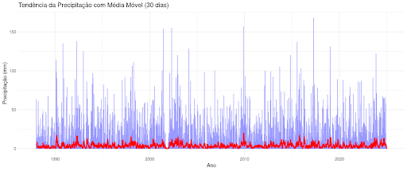

A linha azul representa a série temporal original, evidenciando a grande variabilidade diária da precipitação. Já a linha vermelha corresponde à média móvel de 30 dias, que suaviza as flutuações e permite uma melhor identificação de padrões ao longo do tempo. Observa-se a ocorrência de períodos com picos mais intensos, mas, de modo geral, a média móvel mantém-se relativamente estável ao longo dos anos. No entanto, os valores da média móvel parecem baixos, possivelmente devido ao grande número de dias sem chuva, o que dilui a média e reduz sua amplitude. Essa característica pode levar à subestimação da intensidade dos períodos chuvosos, tornando-os menos evidentes na escala linear.

Para aprimorar a interpretação dos dados, será gerado um gráfico em escala logarítmica. Como os valores de precipitação variam significativamente, essa escala permite uma melhor visualização das oscilações menores sem que eventos extremos dominem a análise.

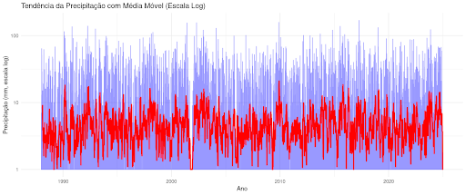

Ao aplicar a escala logarítmica, os valores da precipitação são transformados, tornando eventos menores mais visíveis e evitando que apenas os grandes picos dominem a interpretação. Com essa mudança, a linha vermelha da média móvel exibe mais variações, destacando melhor os períodos de precipitação ao longo do tempo. Embora os períodos mais secos ainda sejam evidentes, os valores menores de precipitação passam a ser melhor representados. Dessa forma, a escala logarítmica proporciona uma visualização mais equilibrada da série, permitindo identificar com mais clareza tanto os períodos de chuva quanto os de seca. 

##### 5.2.1.1.2 Regressão Linear para Identificação da Tendência

Para avaliar a tendência da precipitação ao longo do tempo, iremos ajustar um modelo de regressão linear, utilizando o tempo (anos) como variável explicativa e a precipitação total como variável dependente. Esse modelo permite verificar se há uma variação estatisticamente significativa na precipitação ao longo dos anos, indicando uma possível tendência de aumento ou redução.

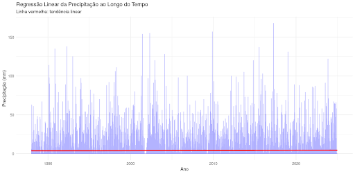

A análise da tendência linear da precipitação ao longo do tempo revela uma linha praticamente reta, sugerindo que não há variação significativa na série temporal. Além disso, a amplitude das flutuações se mantém relativamente constante, sem indícios visuais de mudanças estruturais expressivas.
O modelo de regressão linear utilizado considera a precipitação total como função do tempo (ano). Os coeficientes estimados são apresentados na tabela abaixo:

| Termo      | Estimativa | Erro Padrão | t-valor | p-valor |
|------------|-----------|-------------|---------|---------|
| Intercepto | -29.88    | 19.18       | -1.56   | 0.119   |
| Ano        | 0.0169    | 0.00956     | 1.77    | 0.077   |

Os resultados indicam que o coeficiente associado ao tempo (Ano) é 0.0169, o que sugere um leve aumento na precipitação ao longo do período analisado. No entanto, esse valor é extremamente pequeno e, do ponto de vista climático, pode ser considerado irrelevante.

O p-valor do coeficiente do tempo é 0.077, ligeiramente acima do nível de significância de 0.05. Isso significa que, com 95% de confiança, não há evidências estatísticas robustas de que a precipitação tenha aumentado ou diminuído significativamente ao longo dos anos. Dessa forma, a tendência identificada não pode ser considerada estatisticamente significativa.
Por fim, o intercepto da regressão é -29.88, mas sua interpretação prática é limitada, pois se refere a um ano fora do escopo da análise (ano 0), tornando-se irrelevante para a compreensão da evolução da precipitação no período estudado.

Os resultados indicam que não há uma tendência estatisticamente significativa de aumento ou redução da precipitação ao longo do período analisado. Embora a regressão linear sugira um leve crescimento, a ausência de significância estatística sugere que essa variação pode ser explicada pelo acaso.

**Agregação Mensal e Anual**

Para evitar os problemas de alta variabilidade dos dados diários, vamos realizar a agregação da precipitação total mensal e anual. Isso permite verificar tendências em uma escala mais ampla, eliminando flutuações diárias que podem mascarar a tendência geral.

*Análise Mensal*

A precipitação total foi somada para cada mês e ajustamos um modelo de regressão linear para verificar se há um aumento ou diminuição da precipitação mensal ao longo dos anos. Esse método ajuda a identificar padrões sazonais e avaliar se determinados períodos do ano estão ficando mais secos ou mais úmidos.

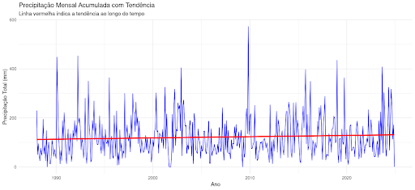

A linha azul no gráfico representa a precipitação total mensal ao longo dos anos, evidenciando alta variabilidade entre os meses. A linha vermelha indica a tendência linear, sugerindo um leve aumento na precipitação ao longo do tempo. No entanto, a grande dispersão dos dados, com meses extremamente chuvosos e outros muito secos, dificulta a visualização de uma tendência clara apenas com a regressão linear.

A análise do modelo de regressão linear mensal apresenta os seguintes coeficientes estimados:

| Termo                    | Estimativa       | Erro Padrão | t-valor | p-valor    |
|--------------------------|-----------------|-------------|---------|-----------|
| Intercepto              | 103.01 mm       | 14.30       | 7.21    | 2.52e-12  |
| Tempo (mês numérico)    | 0.00139 mm/mês  | 0.00103     | 1.35    | 0.179     |

Com base nos resultados da regressão, o intercepto de 103,01 mm representa a precipitação mensal média no início da série histórica. O coeficiente do tempo, de 0,00139 mm/mês, sugere um leve aumento da precipitação ao longo dos anos. 

No entanto, o p-valor de 0,179 indica que essa tendência não é estatisticamente significativa (p > 0,05), o que significa que não há evidências robustas de que a precipitação mensal esteja efetivamente aumentando ao longo do tempo. 

Dessa forma, embora a regressão linear sugira um leve crescimento na precipitação, essa variação pode ser resultado de flutuações aleatórias ou da influência de outros fatores externos.

*Análise Anual*

Para analisar a tendência de longo prazo na precipitação, os valores totais anuais foram calculados e um modelo de regressão linear foi ajustado. A agregação anual reduz a variabilidade presente nos dados diários, proporcionando uma abordagem mais confiável para identificar possíveis mudanças climáticas ao longo do tempo.

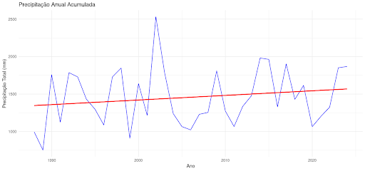

O gráfico apresenta a precipitação total acumulada por ano (linha azul) e a tendência estimada pela regressão linear (linha vermelha). A série exibe uma grande variabilidade interanual, com anos extremamente chuvosos seguidos por períodos mais secos. A linha de tendência linear sugere um leve aumento da precipitação ao longo do tempo, mas essa tendência parece pouco expressiva diante da alta dispersão dos dados.

A análise do modelo de regressão linear mensal apresenta os seguintes coeficientes estimados:

| Termo               | Estimativa       | Erro Padrão | t-valor | p-valor    |
|---------------------|-----------------|-------------|---------|-----------|
| Intercepto         | 1457.62 mm       | 62.84       | 23.20   | <0.001*** |
| Ano Centralizado   | 6.15 mm/ano      | 5.89        | 1.05    | 0.303     |

Com base nos resultados da regressão, o intercepto de 1457,62 mm representa a precipitação média anual no ano central do período analisado, aproximadamente 2006. O coeficiente do tempo, de 6,15 mm/ano, sugere um leve aumento na precipitação ao longo dos anos, mas esse crescimento é pequeno e pode não ter relevância climática significativa. Além disso, o p-valor de 0,303 indica que essa tendência não é estatisticamente significativa, ou seja, não há evidências suficientes para afirmar que a precipitação anual esteja aumentando de maneira consistente ao longo do tempo.

Embora a regressão linear sugira uma leve tendência de aumento, essa variação pode ser explicada pela alta variabilidade interanual, o que pode estar mascarando padrões mais sutis e dificultando a detecção de uma tendência clara na precipitação anual.

# 5.2.2 Sazonalidade

A sazonalidade é um padrão recorrente em uma série temporal que se repete em intervalos regulares. Esse comportamento cíclico é influenciado por fatores naturais, econômicos ou sociais e ocorre dentro de períodos previsíveis, como dias, meses ou anos.

A sazonalidade está presente em diversas áreas, sendo alguns exemplos comuns:

- Meteorologia: A variação da temperatura ao longo das estações do ano, com verões mais quentes e invernos mais frios.
- Consumo de energia: O aumento do uso de ar-condicionado no verão e de aquecedores no inverno.
- Vendas no comércio: O crescimento das vendas no final do ano devido ao Natal e às promoções da Black Friday.
- Agricultura: A produção de determinados alimentos que depende das estações do ano.

A principal característica da sazonalidade é sua periodicidade fixa, ou seja, ocorre em intervalos regulares e previsíveis. Se uma série apresenta padrões repetitivos a cada 12 meses, por exemplo, dizemos que ela tem sazonalidade anual. Se o padrão se repete a cada 7 dias, trata-se de uma sazonalidade semanal.

Na análise de séries temporais, a identificação da sazonalidade é importante para modelagem e previsão, pois seu efeito pode mascarar tendências ou padrões subjacentes
A sazonalidade em séries temporais pode ser identificada por meio de diferentes métodos gráficos e estatísticos, que ajudam a detectar padrões recorrentes ao longo do tempo. Algumas das abordagens mais utilizadas incluem:

- Visualização da média periódica: permite verificar se há padrões recorrentes em determinados períodos, como meses, semanas ou dias.
- Análise da Função de Autocorrelação (ACF) e Autocorrelação Parcial (PACF): indicam a dependência entre os valores da série em intervalos regulares, ajudando a identificar ciclos sazonais.
- Decomposição da série temporal: separa os componentes da série (tendência, sazonalidade e resíduos), facilitando a análise da periodicidade.
- Testes estatísticos (por exemplo, ANOVA): verificam se as variações entre períodos são estatisticamente significativas, indicando a presença de sazonalidade.
- A correta identificação da sazonalidade permite entender melhor a estrutura dos dados e aprimorar modelos preditivos.
  
#### 5.2.2.1 Análise da Sazonalidade da Precipitação – Estação Meteorológica INMET 83980

Para compreender a sazonalidade da precipitação, inicialmente vamos revisar a série temporal completa, identificando padrões recorrentes ao longo dos anos. Essa visualização permite uma primeira percepção sobre a existência de variações sazonais e sua regularidade.

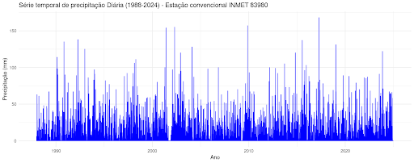

A partir da análise inicial da série temporal, algumas observações se destacam:

- Padrão Sazonal Aparente: Apesar da densidade do gráfico, nota-se uma repetição de variações ao longo dos anos, sugerindo a presença de sazonalidade na precipitação.
- Flutuações Regulares: A precipitação apresenta períodos com maior e menor intensidade em intervalos semelhantes, o que pode indicar um ciclo climático associado a fatores sazonais.
- A confirmação dessa sazonalidade será feita por meio de métodos estatísticos e gráficos específicos.

##### 5.2.2.1.1 Distribuição Mensal da Precipitação

Para compreender o comportamento sazonal da precipitação, analisamos a média mensal ao longo dos anos. Esse tipo de análise permite identificar padrões recorrentes na distribuição das chuvas e avaliar variações sazonais.

O gráfico a seguir apresenta a média da precipitação mensal ao longo dos anos, destacando possíveis padrões sazonais.

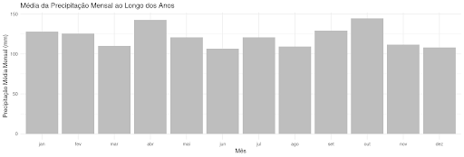

O gráfico revela que a precipitação não é distribuída de maneira uniforme ao longo do ano, evidenciando um padrão sazonal. Os meses de outubro e abril apresentam os maiores valores médios de precipitação, indicando que historicamente são períodos mais chuvosos. Em contrapartida, os meses de março, junho, agosto, novembro e dezembro registram menores valores médios, caracterizando períodos com menor volume de precipitação. Embora a diferença entre os meses mais e menos chuvosos não seja extremamente acentuada, a variação observada sugere a existência de um ciclo sazonal recorrente ao longo do ano.

A análise da média mensal da precipitação indica um padrão sazonal moderado, com períodos de maior e menor intensidade de chuvas. Esse comportamento pode estar associado a fatores climáticos regionais, como padrões atmosféricos e fenômenos sazonais. 

Para uma investigação mais aprofundada, utilizamos um boxplot da precipitação mensal, que permite visualizar a dispersão dos valores e identificar a presença de outliers.

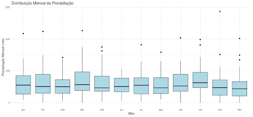

Na tabela abaixo, são apresentadas as estatísticas descritivas da precipitação mensal, incluindo os valores mínimos, o primeiro quartil (Q1), a mediana e a média para cada mês.

| Mês  | Mínimo (mm) | Q1 (mm) | Mediana (mm) | Média (mm) |
|------|------------|---------|--------------|------------|
| Jan  | 18        | 54      | 110          | 128        |
| Fev  | 0         | 59      | 101          | 126        |
| Mar  | 10        | 58      | 100          | 110        |
| Abr  | 0         | 76      | 113          | 143        |
| Mai  | 7         | 71      | 93           | 121        |
| Jun  | 12        | 68      | 101          | 106        |
| Jul  | 9         | 55      | 109          | 121        |
| Ago  | 20        | 57      | 93           | 109        |
| Set  | 0         | 71      | 105          | 129        |
| Out  | 0         | 94      | 125          | 145        |
| Nov  | 0         | 46      | 94           | 112        |
| Dez  | 0         | 42      | 87           | 108        |

A distribuição da precipitação mensal não é uniforme ao longo do ano. A mediana da precipitação varia entre 87 mm em dezembro e 125 mm em outubro, enquanto a média mensal oscila entre 106 mm em junho e 145 mm em outubro. Além disso, alguns meses, como fevereiro, abril, setembro, outubro, novembro e dezembro, registraram precipitação mínima de 0 mm, indicando que houve anos em que não choveu nesses períodos.

Os meses mais chuvosos incluem outubro, com uma mediana de 125 mm e média de 145 mm, e abril, cuja mediana é de 113 mm e a média de 143 mm. Janeiro e setembro também apresentam médias superiores a 128 mm. Esse padrão sugere que outubro e abril são historicamente os meses mais chuvosos.

Por outro lado, os meses mais secos são dezembro, novembro, maio e agosto. Dezembro apresenta uma mediana de 87 mm e média de 108 mm, enquanto novembro registra uma mediana de 94 mm e média de 112 mm. Maio e agosto possuem medianas próximas a 93 mm. Esses meses estão associados a um período de menor precipitação sazonal.

A variação da precipitação também é um fator relevante. Outubro e abril apresentam maior variabilidade, sugerindo que alguns anos registraram chuvas excepcionalmente intensas, enquanto outros foram mais secos. Em contraste, junho e dezembro possuem menor variação, indicando que a precipitação nesses meses tende a ser mais previsível. Outubro e abril podem estar relacionados a eventos extremos de precipitação, enquanto junho e dezembro apresentam um padrão mais estável ao longo dos anos.

##### 5.2.2.1.2 Decomposição da Série Temporal

A decomposição da série temporal permite separar a precipitação observada em seus principais componentes: tendência, sazonalidade e resíduos. Essa abordagem facilita a compreensão dos padrões da série ao longo do tempo, destacando diferentes dinâmicas que influenciam a precipitação mensal. O gráfico abaixo apresenta a decomposição da precipitação mensal.

A série observada representa os valores originais da precipitação ao longo do tempo, enquanto a tendência evidencia variações de longo prazo, destacando períodos mais secos ou mais úmidos. 
A sazonalidade indica padrões recorrentes ao longo dos anos, revelando meses sistematicamente mais chuvosos e outros mais secos. Por fim, os resíduos representam as variações não explicadas pela tendência ou pela sazonalidade, correspondendo a flutuações aleatórias. 

A decomposição confirma a presença de um ciclo sazonal na precipitação mensal, caracterizado por flutuações regulares ao longo dos anos. A seguir, analisamos apenas a componente sazonal da precipitação mensal, extraída da decomposição da série temporal.

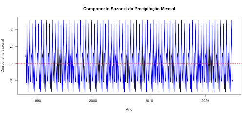

A análise da componente sazonal evidencia um padrão recorrente de oscilação na precipitação, confirmando a existência de uma sazonalidade bem definida. A presença de picos e vales anuais bem demarcados sugere que determinados meses são consistentemente mais chuvosos, enquanto outros registram menores volumes de precipitação. Essa regularidade reforça a previsibilidade da sazonalidade na série.

Além disso, a amplitude da oscilação sazonal se mantém relativamente constante ao longo do tempo, indicando que a diferença entre os meses mais úmidos e mais secos não sofreu alterações expressivas nas últimas décadas. Caso houvesse um aumento ou redução progressiva nessa amplitude, isso poderia sinalizar mudanças climáticas ou variações estruturais nos padrões de precipitação.

Outro aspecto importante é a variação periódica da sazonalidade em relação à média. O eixo de referência no gráfico representa o nível médio da sazonalidade, e os valores acima dessa linha indicam meses com precipitação superior à média, enquanto os valores abaixo correspondem a períodos mais secos. Esse comportamento periódico reforça a presença de um ciclo sazonal regular, com padrões que se repetem anualmente.

A análise confirma que a precipitação mensal segue um comportamento sazonal bem estabelecido, com períodos sistematicamente mais úmidos e outros mais secos ao longo do ano. A estabilidade desse padrão sugere que os ciclos sazonais da chuva não passaram por mudanças significativas ao longo do tempo. 

##### 5.2.2.1.3 Análise da Função de Autocorrelação (ACF) e Autocorrelação Parcial (PACF)

A Função de Autocorrelação (ACF) e a Função de Autocorrelação Parcial (PACF) são ferramentas estatísticas de grande utilidade na análise de séries temporais, sendo amplamente utilizadas para identificar padrões sazonais, dependências temporais e auxiliar na escolha de modelos preditivos.

A ACF mede o grau de correlação entre os valores da série temporal em diferentes defasagens (lags), ou seja, indica o quanto um valor em um determinado instante está relacionado com valores anteriores, como no período imediatamente anterior (t-1), dois períodos antes (t-2), três períodos antes (t-3), e assim por diante. Se a autocorrelação em um determinado lag for alta, isso significa que os valores da série possuem uma forte relação com os valores desse período anterior. 

Quando a autocorrelação apresenta oscilações regulares, pode ser um indicativo de sazonalidade. Por exemplo, se há um pico de autocorrelação em defasagens de 12 meses, isso sugere a existência de um padrão anual. No gráfico da ACF, o eixo x representa os lags (defasagens temporais), enquanto o eixo y indica a intensidade da correlação entre os valores da série e suas versões defasadas. Barras que ultrapassam as bandas de confiança sugerem correlações estatisticamente significativas.

Já a PACF mede a autocorrelação direta entre um valor e seu correspondente defasado, eliminando a influência de valores intermediários. Enquanto a ACF mede a correlação total entre um valor e os anteriores, a PACF isola a correlação entre um valor e apenas o seu lag específico. 

Se a PACF apresentar um corte abrupto após um determinado lag, isso sugere que a dependência temporal pode ser explicada por um modelo AR (Auto-Regressivo) de ordem equivalente a esse lag. Por outro lado, quando tanto a PACF quanto a ACF apresentam padrões cíclicos, pode haver indícios de sazonalidade na série.

A figura abaixo apresenta o gráfico de autocorrelação (ACF) da série temporal em nosso estudo de caso.

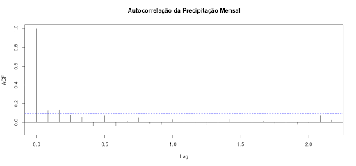

O gráfico de autocorrelação (ACF) exibe as correlações entre os valores da série de precipitação mensal e suas defasagens ao longo do tempo. As barras que ultrapassam as faixas de confiança indicam correlações estatisticamente significativas, enquanto aquelas dentro dos limites sugerem ausência de relação entre os valores ao longo dos períodos analisados.

A análise do gráfico revela que apenas o lag 0 apresenta autocorrelação estatisticamente significativa, o que era esperado, pois a série está 100% correlacionada consigo mesma. Nos demais lags, os valores permanecem dentro das faixas de confiança, indicando que a precipitação de um mês não está fortemente relacionada com a de meses anteriores. A ausência de picos marcantes nos lags 12, 24 e 36 sugere que não há um padrão sazonal bem definido, o que contraria a expectativa de ciclos anuais previsíveis na precipitação. Isso indica que a sazonalidade identificada na decomposição da série pode ser resultado de variabilidades mais irregulares e não de um comportamento cíclico fixo.

Além disso, a predominância de valores próximos de zero sugere que a série pode ser classificada como um processo próximo ao ruído branco, ou seja, sem uma estrutura clara de dependência temporal. Esse resultado reforça a hipótese de que a precipitação mensal é fortemente influenciada por eventos climáticos aleatórios, em vez de seguir um padrão sazonal fixo.

Para aprofundar a análise da dependência temporal da precipitação mensal, vamos analisar o gráfico da Função de Autocorrelação Parcial (PACF). Esse gráfico é importante para avaliar a estrutura temporal da série e identificar a presença de padrões sazonais ou de curto prazo que possam influenciar a precipitação ao longo do tempo.

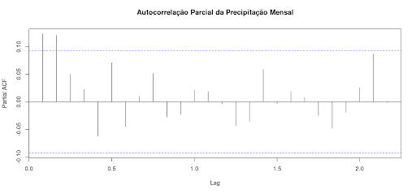

A análise do gráfico revela a ausência de um padrão auto-regressivo claro, uma vez que nenhum lag apresenta valores significativamente altos fora dos limites de significância. Isso indica que não há uma relação forte entre a precipitação de um mês e os meses anteriores, descartando a possibilidade de um modelo autoregressivo simples (AR) para previsão. Além disso, a maioria dos coeficientes de autocorrelação parcial é muito pequena, sugerindo que a influência da precipitação de um mês sobre os meses seguintes é mínima. Esse comportamento reforça a baixa dependência temporal da série.
Outro aspecto importante é a ausência de picos significativos nos múltiplos de 12 (lag 12, 24, 36), o que seria esperado caso houvesse um padrão sazonal bem definido. A falta desses sinais reforça a hipótese de que a sazonalidade observada na decomposição da série pode ser fraca ou variável ao longo do tempo.

Dessa forma, o PACF confirma as conclusões da ACF, indicando que a precipitação mensal não apresenta uma estrutura auto-regressiva significativa. Além disso, a sazonalidade da precipitação pode não ser fixa ao longo dos anos, podendo estar sujeita a variações interanuais influenciadas por fatores climáticos externos.

### 5.2.3 Ciclos

Os ciclos em séries temporais referem-se a flutuações que ocorrem em intervalos de tempo mais longos e irregulares, diferentemente da sazonalidade, que apresenta uma periodicidade fixa. Enquanto a sazonalidade ocorre em períodos regulares e previsíveis, como a variação da temperatura ao longo do ano, os ciclos não seguem um padrão rígido e podem ser influenciados por fatores externos, como políticas econômicas ou mudanças climáticas.

Na economia, um exemplo clássico são os ciclos de crescimento e recessão econômica, conhecidos como ciclos de negócios, que podem durar de alguns anos a várias décadas. No clima, fenômenos como El Niño e La Niña afetam padrões de precipitação e temperatura global de maneira irregular, ocorrendo a cada 2 a 7 anos. Já no agronegócio, as flutuações nos preços de commodities agrícolas podem ser influenciadas por variáveis como oferta, demanda e políticas comerciais, resultando em ciclos de alta e baixa nos preços ao longo do tempo.

**Identificação e Modelagem de Ciclos**

Diferente da sazonalidade, os ciclos não são facilmente previsíveis, pois podem ter durações variáveis e depender de múltiplos fatores externos. Algumas técnicas para detectar e modelar ciclos incluem:

- Análise de espectro de Fourier: Permite identificar padrões cíclicos ocultos nos dados.
- Modelos ARIMA e SARIMA: Embora sejam usados principalmente para séries estacionárias, podem capturar padrões cíclicos quando bem ajustados.
- Modelos de alisamento exponencial: Técnicas como Holt-Winters podem ser usadas para modelar tendências cíclicas.

Para investigar ciclos de longo prazo na precipitação mensal em nosso estudo de caso, vamos seguir um fluxo de análise estruturado em quatro etapas principais. Inicialmente, realizaremos uma análise exploratória da série temporal, visualizando os dados completos e aplicando técnicas de suavização, como média móvel ou LOESS, para destacar tendências de longo prazo. 

Em seguida, aplicaremos a decomposição da série temporal, separando a tendência e os ciclos sazonais, além de examinar a componente residual para identificar possíveis padrões de longo prazo. 
A terceira etapa envolve a aplicação de testes de autocorrelação para detectar dependências temporais, utilizando o gráfico de ACF (Autocorrelação) para verificar ciclos que se repetem em múltiplos anos e o gráfico de PACF (Autocorrelação Parcial) para confirmar relações diretas entre observações ao longo do tempo. 

Por fim, realizaremos uma análise espectral por meio da Transformada de Fourier (FFT), que permite identificar as frequências dominantes na série, destacando o período predominante da precipitação ao longo do tempo.

#### 5.2.3.1 Análise Exploratória Inicial

A primeira etapa da análise consiste na visualização da série temporal completa da precipitação mensal ao longo do período de 1988 a 2024.

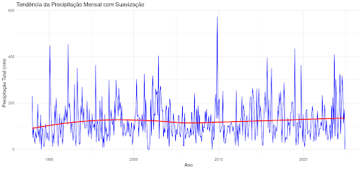

O gráfico apresenta a precipitação acumulada mensalmente ao longo do tempo. Para facilitar a identificação de padrões de longo prazo, aplicamos uma suavização LOESS, representada pela linha vermelha no gráfico. Esse método suaviza as variações curtas e destaca possíveis tendências na série. 

A análise visual sugere que, ao longo do tempo, houve um ligeiro aumento da precipitação até os anos 2000, seguido por uma estabilização. No entanto, a elevada variabilidade da precipitação ao longo dos anos indica que fatores sazonais e climáticos interanuais podem estar influenciando o regime de chuvas.

A partir dessa análise inicial, fica evidente que a precipitação mensal não é constante e apresenta oscilações, o que pode indicar a presença de ciclos de longo prazo. Para investigar melhor essas dinâmicas, o próximo passo será decompor a série temporal, separando os componentes de tendência, sazonalidade e variação residual, permitindo uma análise mais detalhada das oscilações na precipitação ao longo dos anos.

#### 5.2.3.2 Decomposição da Série Temporal

O estudo dos ciclos de longo prazo busca identificar oscilações periódicas que se repetem em escalas superiores à sazonalidade anual. A decomposição da série auxilia nesse processo ao separar a tendência, a sazonalidade e os resíduos, permitindo uma análise mais detalhada de cada um desses elementos. 

A figura abaixo apresenta a série temporal decomposta.

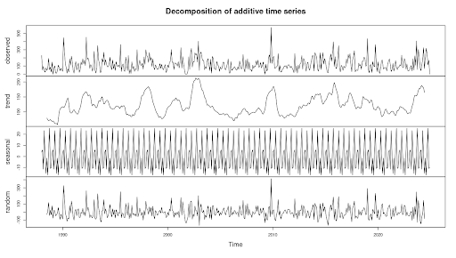

A análise da tendência revela oscilações que ocorrem ao longo de vários anos, sugerindo possíveis ciclos naturais de longo prazo, como aqueles associados a fenômenos climáticos globais, como El Niño e La Niña, ou padrões de variabilidade atmosférica e oceânica de maior duração. 

A sazonalidade, por sua vez, confirma que os padrões anuais são bem estabelecidos e consistentes ao longo do período analisado, garantindo que variações sazonais não sejam confundidas com oscilações de longo prazo. 

Os resíduos representam variações irregulares e imprevisíveis na série, e grandes oscilações podem indicar eventos extremos, como chuvas anômalas, secas prolongadas ou falhas na coleta de dados. Embora os resíduos oscilem de forma aparentemente aleatória, picos localizados sugerem desvios significativos da precipitação em determinados períodos. Além disso, a presença de clusters de valores altos ou baixos pode indicar ciclos mais longos que não foram totalmente capturados pela decomposição.

#### 5.2.3.3 Análise de Autocorrelação de Longo Prazo (ACF/PACF)

A autocorrelação de longo prazo é uma ferramenta para identificar padrões repetitivos e ciclos de longo prazo na precipitação mensal. Os gráficos de Autocorrelação (ACF) e Autocorrelação Parcial (PACF) ajudam a detectar dependências temporais na série, revelando se há periodicidade em escalas superiores à sazonalidade anual.

Para investigar ciclos de longo prazo, utilizamos um lag.max de 120 meses, o que equivale a 10 anos de defasagem. Esse intervalo nos permite verificar se há padrões recorrentes que se repetem em múltiplos anos, sugerindo a presença de oscilações climáticas prolongadas, como as associadas ao El Niño, La Niña ou outras variabilidades atmosféricas de escala decadal.

O gráfico de Autocorrelação (ACF) mostra a relação da precipitação mensal com seus próprios valores passados (lags). 

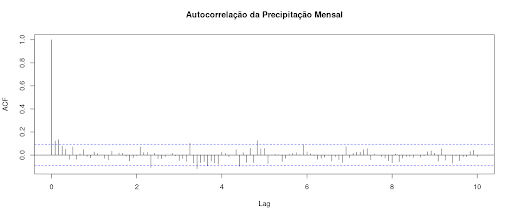

O primeiro lag sempre apresenta autocorrelação igual a 1, pois a série está perfeitamente correlacionada consigo mesma. A ausência de picos significativos em múltiplos de 12 meses indica que a sazonalidade anual não é forte ou está mascarada pela variabilidade interanual. Além disso, os valores de autocorrelação permanecem dentro dos limites de significância, sugerindo a inexistência de padrões claros de longo prazo. 

A rápida diminuição da autocorrelação mostra que eventos passados não influenciam a precipitação futura por períodos prolongados. De modo geral, o gráfico sugere que não há ciclos de longo prazo bem definidos na precipitação mensal, pois não há picos em lags superiores a 12 meses, como 24, 36 ou 48 meses. Isso indica que as variações na precipitação mensal são predominantemente aleatórias ou explicadas por fatores de curto prazo.

A figura abaixo apresenta o gráfico de Autocorrelação Parcial (PACF), mede a correlação entre a precipitação mensal e seus valores passados (lags), eliminando a influência dos lags intermediários. 

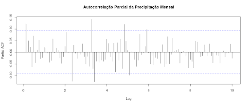

Os primeiros lags apresentam valores ligeiramente elevados, sugerindo uma leve dependência da precipitação recente sobre os meses seguintes. No entanto, a ausência de picos significativos em múltiplos de 12 meses indica que a sazonalidade anual não é fortemente marcada na série. Os valores de PACF caem rapidamente e permanecem dentro dos limites de significância, mostrando que a precipitação mensal não mantém uma relação forte com períodos muito distantes no passado. Assim, não há padrões evidentes de longo prazo, reforçando que as variações da precipitação mensal são predominantemente aleatórias ou influenciadas por fenômenos de curto prazo.

Em conclusão, a precipitação mensal não apresenta ciclos de longo prazo bem definidos. Se houvesse padrões interanuais evidentes, observaríamos picos em lags múltiplos de 12 meses, como 24, 36 ou 48 meses, o que não ocorre de forma significativa. A baixa autocorrelação em lags mais longos sugere que ciclos prolongados podem não ser detectáveis apenas pela autocorrelação e poderiam ser melhor analisados por meio de Análise Espectral, como Transformada de Fourier ou Wavelet.

#### 5.2.3.4. Análise Espectral (Transformada de Fourier)

A Análise Espectral é uma técnica utilizada para identificar frequências dominantes em séries temporais, ajudando a detectar ciclos sazonais e padrões de longo prazo. Essa abordagem permite transformar a série do domínio do tempo para o domínio da frequência, facilitando a identificação de oscilações recorrentes na precipitação. Na figura abaixo, apresenta-se o gráfico do espectro de frequência da precipitação.

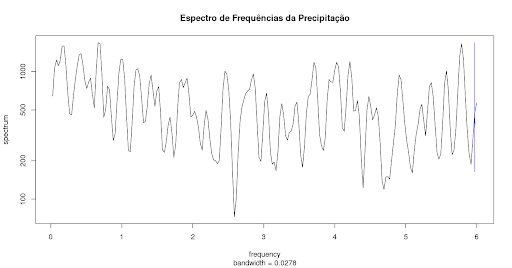

Ao analisar o gráfico do espectro de frequência da precipitação, observamos que não há um pico isolado extremamente acentuado, o que reforça a ausência de um ciclo dominante bem definido. O espectro exibe múltiplos picos distribuídos ao longo das frequências, indicando que a variabilidade da precipitação pode ser influenciada por diferentes processos climáticos atuando em distintas escalas temporais.

Não identificamos um pico claramente pronunciado em torno da frequência 1, o que sugere que a sazonalidade anual (12 meses) pode não ser um fator predominante ou estar mascarada por outras variações. Da mesma forma, não há um pico bem definido em aproximadamente 0.083 (1/12), o que indica que a sazonalidade anual não se destaca fortemente na análise espectral.

Frequências menores (à esquerda do gráfico) representam oscilações de longo prazo, como padrões plurianuais, mas não há picos evidentes nessa região, o que sugere que ciclos climáticos como El Niño e La Niña não possuem uma influência cíclica clara na precipitação analisada. Já as frequências maiores (à direita) refletem variações mais curtas, possivelmente associadas à variabilidade atmosférica de curto prazo.

No geral, o espectro confirma que a precipitação é modulada por múltiplos fatores sem um ciclo único claramente dominante, reforçando a necessidade de abordagens complementares, como análise de tendência, autocorrelação e modelagem climática, para compreender melhor a variabilidade dos dados.

### 5.2.4 Ruído em Séries Temporais

O ruído em séries temporais refere-se à variação aleatória nos dados que não segue um padrão sistemático de tendência, sazonalidade ou ciclos. Ele representa flutuações imprevisíveis, podendo ser causado por fatores externos desconhecidos, erros de medição ou fenômenos estocásticos inerentes ao processo observado. 

O ruído não apresenta um padrão repetitivo e não pode ser previsto com base em observações passadas. Em muitos casos, segue uma distribuição normal centrada em torno da média zero. Suas principais fontes incluem erros de medição, como falhas em sensores ou imprecisões na coleta de dados, eventos imprevisíveis, como catástrofes naturais ou mudanças abruptas no mercado, e processos internos do próprio sistema, onde variações aleatórias ocorrem sem explicação determinística aparente.

Um caso especial de ruído é o ruído branco, que é um tipo de variação aleatória que possui as seguintes propriedades:
- Média zero: A média dos valores do ruído ao longo do tempo é zero.
- Variância constante: A dispersão dos valores permanece estável ao longo do tempo.
- Independência temporal: O valor do ruído em um instante não está correlacionado com valores anteriores ou futuros.

Em modelagem de séries temporais, o objetivo é reduzir ou filtrar o ruído para extrair os padrões subjacentes e melhorar a precisão das previsões. Técnicas como suavização exponencial, médias móveis e modelos estatísticos (ARIMA, SARIMA) são usadas para minimizar o impacto do ruído nos dados.

A análise do ruído também é essencial para avaliar a qualidade de um modelo. Se os resíduos (diferença entre valores observados e previstos) apresentam comportamento semelhante ao ruído branco, significa que o modelo conseguiu capturar corretamente os padrões da série. Caso contrário, pode ser necessário refiná-lo.

Os resíduos representam a parte da série temporal que não foi explicada pelas componentes de tendência e sazonalidade. Portanto, analisar os resíduos nos permite avaliar se há padrões remanescentes ou se eles se comportam como um ruído branco (aleatório).

Voltando ao nosso estudo de caso, realizaremos uma análise do ruído presente na série temporal, focando na caracterização dos resíduos. O fluxo de análise seguirá os seguintes passos:

- Verificação da Distribuição dos Resíduos – Avaliaremos se os resíduos seguem uma distribuição normal ou apresentam assimetrias que possam indicar padrões ocultos.
- Análise de Autocorrelação dos Resíduos – Verificaremos se há dependências temporais nos resíduos, o que indicaria a presença de estrutura não capturada pelo modelo.
- Verificação de Heterocedasticidade – Investigaremos se a variabilidade dos resíduos se mantém constante ao longo do tempo ou se há períodos com maior dispersão, o que pode impactar a modelagem.
- Identificação de Outliers – Detectaremos valores atípicos nos resíduos que possam indicar eventos excepcionais ou falhas nos dados.
- Teste de Ruído Branco – Avaliaremos se os resíduos se comportam de maneira puramente aleatória, condição essencial para validar um bom ajuste do modelo.

Essa análise permitirá entender melhor o comportamento dos resíduos e verificar se a série temporal contém padrões adicionais.

#### 5.2.4.1 Verificação da Distribuição dos Resíduos

A partir da análise da distribuição dos resíduos, é possível verificar se eles seguem um comportamento aleatório e se a normalidade pode ser assumida. Para isso, utilizamos diferentes ferramentas gráficas e testes estatísticos.

Na figura abaixo temos a série temporal dos resíduos ao longo do tempo. 

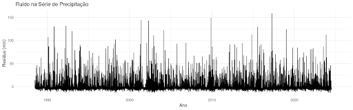

A distribuição aparentemente aleatória dos valores sugere que o modelo removeu grande parte da estrutura dos dados, mas parece que ainda há variações significativas.

A figura abaixo apresenta o histograma dos resíduos, que permite analisar a distribuição empírica dos resíduos. 

Observamos que a distribuição tem um formato aproximadamente simétrico, mas com um leve alongamento à direita, indicando a presença de valores extremos positivos. A maior concentração de resíduos próximos a zero sugere que a maioria dos erros do modelo é pequena, mas alguns desvios mais acentuados podem indicar eventos anômalos.

Na figura abaixo temos o gráfico Quantil-Quantil (Q-Q plot), que compara a distribuição dos resíduos com a distribuição normal teórica. 

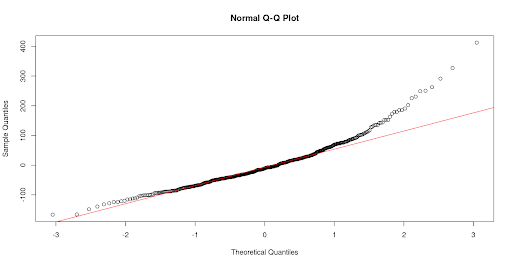

Se os pontos estiverem alinhados à linha vermelha, a distribuição dos resíduos é próxima da normal. Em nosso caso, observa-se um desalinhamento nas caudas, sugerindo a presença de outliers ou uma leve assimetria na distribuição dos resíduos, indicando que a normalidade pode estar comprometida.

Para complementar a análise gráfica, aplicaremos os testes Shapiro-Wilk e Kolmogorov-Smirnov, que verificam formalmente se os resíduos seguem uma distribuição normal.
Teste de Shapiro-Wilk:

- Estatística W = 0.93198
- Valor-p = 3.999e-13
- Como o valor-p é extremamente pequeno (menor que 0.05), rejeitamos a hipótese nula de que os resíduos seguem uma distribuição normal.

Teste de Kolmogorov-Smirnov:

- Estatística D = 0.085817
- Valor-p = 0.003448
  
Novamente, o valor-p abaixo de 0.05 sugere que os resíduos diferem significativamente de uma distribuição normal.

A análise gráfica e os testes estatísticos indicam que os resíduos não seguem uma distribuição normal. A assimetria observada no histograma e a divergência no Q-Q Plot reforçam essa conclusão. A presença de valores extremos sugere que há eventos atípicos na série, o que pode impactar futuras modelagens estatísticas. 

#### 5.2.4.2 Análise de Autocorrelação dos Resíduos

A análise de autocorrelação dos resíduos tem como objetivo verificar se há dependência temporal remanescente após a decomposição da série temporal.

Caso os resíduos sejam independentes ao longo do tempo, isso indica que a decomposição separou corretamente os padrões sistemáticos da série, restando apenas variações aleatórias. Para isso, utilizamos duas ferramentas principais: a) a Autocorrelação Simples (ACF), que mede a correlação dos resíduos com seus valores passados em diferentes defasagens (lags) e permite identificar se ainda há estrutura temporal presente, e b) a Autocorrelação Parcial (PACF), que avalia a correlação direta dos resíduos com cada lag, eliminando a influência de defasagens intermediárias. A análise conjunta dessas métricas possibilita determinar se os resíduos seguem um comportamento aleatório ou se ainda contêm padrões não capturados na decomposição.

Na figura abaixo, apresenta-se o gráfico da Função de Autocorrelação (ACF) dos resíduos.

O primeiro lag apresenta autocorrelação igual a 1, o que é esperado, pois a série sempre está perfeitamente correlacionada consigo mesma nesse ponto. Nos demais lags, os valores permanecem dentro dos intervalos de confiança, indicando ausência de autocorrelação significativa. 

Caso houvesse padrões temporais nos resíduos, seria possível observar picos notáveis em alguns lags, o que não ocorre neste caso. Dessa forma, o gráfico ACF sugere que os resíduos não apresentam estrutura temporal relevante, indicando que a decomposição foi eficiente na remoção de padrões previsíveis da série.

Na figura abaixo, temos o gráfico da Função de Autocorrelação Parcial (PACF) dos resíduos.

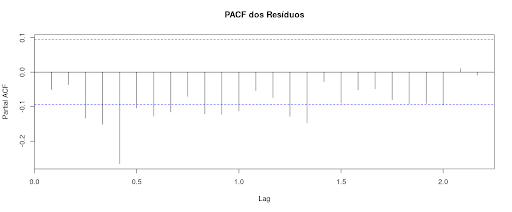

Todos os valores da PACF estão próximos de zero e dentro dos intervalos de confiança, o que reforça a ausência de dependências temporais significativas. Caso houvesse picos elevados em lags específicos, isso indicaria a presença de estrutura remanescente na série. No entanto, esse comportamento não foi observado. 

A ausência de padrões relevantes sugere que os resíduos se comportam como ruído branco, caracterizando variações aleatórias sem estrutura previsível. O gráfico PACF confirma que os resíduos não apresentam autocorrelação direta com defasagens específicas, evidenciando que a decomposição foi eficaz na captura dos padrões da série temporal.

A análise conjunta dos gráficos ACF e PACF indica que os resíduos seguem um comportamento de ruído branco, sem a presença de padrões temporais evidentes. Esse resultado sugere que a decomposição separou corretamente os componentes estruturais da série e que não há necessidade de modelagem adicional para capturar dependências temporais nos resíduos.

#### 5.2.4.3 Verificação de Heterocedasticidade

A análise da heterocedasticidade tem como objetivo verificar se os resíduos apresentam variabilidade constante ao longo do tempo. Para isso, utilizamos o gráfico da evolução dos resíduos apresentado logo abaixo, que permite identificar possíveis mudanças na amplitude dos erros, padrões estruturais e a presença de eventos extremos.

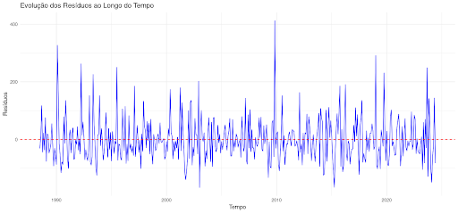

O gráfico dos resíduos ao longo dos anos revela se há flutuações sistemáticas na variância, o que pode indicar heterocedasticidade. Caso a amplitude dos resíduos se mantenha relativamente estável, podemos concluir que a variância dos erros é aproximadamente constante, caracterizando homocedasticidade.

Ao analisar o comportamento dos resíduos, observamos que eles oscilam em torno de um valor médio próximo de zero, sugerindo que a tendência foi corretamente removida na decomposição. Além disso, a amplitude dos resíduos se mantém relativamente constante ao longo do tempo, sem alterações sistemáticas que indiquem heterocedasticidade. No entanto, identificamos alguns picos isolados em determinados períodos, como por volta de 2010 e 2020, que podem estar associados a eventos extremos de precipitação. Esses pontos merecem uma análise mais detalhada para verificar se correspondem a falhas de sensores, fenômenos climáticos anômalos ou simplesmente variações naturais da série.

A distribuição dos resíduos também não apresenta padrões visuais de sazonalidade ou ciclos evidentes, o que reforça a ideia de que os resíduos se comportam como ruído branco. 

A análise visual do gráfico dos resíduos não apresenta sinais evidentes de heterocedasticidade, uma vez que a dispersão dos resíduos parece relativamente constante ao longo do tempo, sem um padrão claro de aumento ou diminuição sistemática da variabilidade. No entanto, para confirmar essa observação, aplicamos um teste estatístico que nos permite avaliar formalmente a presença de heterocedasticidade.
Iremos aplicar o Teste de Goldfeld-Quandt, que verifica se a variância dos resíduos muda entre dois segmentos da série temporal. Esse teste é apropriado para séries temporais porque permite comparar a dispersão dos resíduos em diferentes períodos, avaliando se há um crescimento ou redução significativa da variabilidade ao longo do tempo.

Os resultados do teste foram:

- Estatística GQ = 0.62898
- Graus de liberdade: df1 = 106, df2 = 106
- p-valor = 0.9911
  
A hipótese nula do teste assume que a variância dos resíduos é constante ao longo do tempo (homocedasticidade). Como o p-valor obtido é muito alto (0.9911), não há evidências estatísticas para rejeitar a hipótese nula. Isso significa que a variância dos resíduos permanece estável entre os períodos analisados, indicando que não há heterocedasticidade significativa na série.

Assim, confirmamos que os resíduos apresentam uma variabilidade aproximadamente constante, reforçando que a decomposição da série foi eficaz na remoção de padrões estruturais e que as variações observadas são compatíveis com um comportamento aleatório.

#### 5.2.4.4 Identificação de Outliers

Após verificar a ausência de heterocedasticidade nos resíduos, a próxima etapa da análise é a identificação de outliers, ou seja, valores extremos que se desviam significativamente do padrão esperado. A presença de outliers nos resíduos pode indicar eventos anômalos na série temporal, como precipitações extremas, falhas em sensores ou erros na coleta de dados.

Para detectar esses valores, utilizaremos um boxplot dos resíduos, uma ferramenta gráfica que permite visualizar a distribuição dos dados e identificar pontos discrepantes. 

No boxplot, os outliers são definidos como valores que estão fora do intervalo interquartil (IQR), ou seja, acima do terceiro quartil (Q3 + 1.5 * IQR) ou abaixo do primeiro quartil (Q1 - 1.5 * IQR).
Se identificarmos outliers nos resíduos, será necessário avaliar sua origem e impacto na análise. Em alguns casos, outliers podem representar eventos climáticos reais e devem ser mantidos na análise. Em outros, podem ser resultado de erros de medição e, dependendo do contexto, podem ser tratados ou removidos.

Na figura abaixo podemos visualizar o boxplot dos resíduos.

Na tabela a seguir apresenta-se as estatísticas descritivas dos resíduos.

| Estatística                                | Valor                    |
|--------------------------------------------|--------------------------|
| **Mínimo (Limite Inferior)**               | -166.53                  |
| **Primeiro Quartil (Q1)**                   | -48.73                   |
| **Mediana (Q2 - Valor Central)**           | -10.87                   |
| **Terceiro Quartil (Q3)**                  | 33.92                    |
| **Máximo (Limite Superior)**               | 152.30                   |
| **Número Total de Observações (n)**        | 432                      |
| **Intervalo de Confiança da Mediana**      | -17.15 a -4.59           |
| **Outliers Identificados**                 | 17 valores               |

O boxplot dos resíduos revela informações importantes sobre a distribuição e variabilidade dos valores ao longo da série. A região central do gráfico, representada pelo retângulo (box), abrange os resíduos entre o primeiro quartil (Q1 = -48.73) e o terceiro quartil (Q3 = 33.92), indicando que 50% dos valores dos resíduos estão dentro desse intervalo. A mediana (Q2 = -10.87) está levemente deslocada para valores negativos, sugerindo uma pequena assimetria na distribuição dos resíduos.

Além disso, o boxplot identifica valores extremos acima de 152.30 e abaixo de -166.53, que são classificados como outliers. No total, 17 outliers positivos foram detectados, variando entre 162.98 e 412.50, o que pode indicar a ocorrência de eventos climáticos anômalos, como períodos de precipitação extrema.

A análise também aponta que a amplitude dos resíduos é relativamente grande, com um intervalo interquartil (IQR) de aproximadamente 82.65, evidenciando uma certa dispersão dos resíduos ao longo do tempo. 

Em conclusão, o boxplot mostra que, embora a maioria dos resíduos esteja concentrada entre -48.73 e 33.92, há valores atípicos que precisariam ser analisados em maior detalhe. A verificação desses pontos permitiria determinar se os outliers são eventos relevantes da série temporal ou erros na coleta dos dados. No entanto, esta análise está fora do escopo de nosso estudo.

#### 5.2.4.5 Teste de Ruído Branco

A análise do ruído branco é útil para verificar se os resíduos da decomposição da série temporal são puramente aleatórios ou se ainda apresentam alguma estrutura remanescente. 
Em uma série bem ajustada, os resíduos devem ser independentes ao longo do tempo, sem padrões de autocorrelação. Caso contrário, isso pode indicar que ainda existem ciclos ocultos, influências externas ou falhas na modelagem que não foram completamente removidas.

Para avaliar essa questão, será aplicado o Teste de Ljung-Box, que verifica se há autocorrelação significativa nos resíduos ao longo de múltiplas defasagens. Esse teste é adequado para detectar dependências temporais que não foram eliminadas pela decomposição, ajudando a entender se os resíduos podem ser tratados como ruído branco ou se ainda há padrões não capturados.

O teste foi realizado utilizando 20 defasagens (lags), gerando os seguintes resultados:

- Valor de X² (estatística do teste): 46.564
- Graus de liberdade (df): 20
- Valor de p: 0.0006741
  
A escolha de 20 defasagens foi feita para garantir que o teste avaliasse não apenas a autocorrelação imediata entre resíduos consecutivos, mas também relações em uma escala mais ampla. Como a série analisada é mensal, essa escolha permite capturar dependências que podem ocorrer dentro de um intervalo de aproximadamente dois anos. Se houvesse padrões sazonais persistentes ou ciclos de longo prazo, eles poderiam ser identificados nesse intervalo.

Os resultados indicam um p-valor muito baixo (p < 0.05), o que nos leva a rejeitar a hipótese nula de que os resíduos são puramente aleatórios. Isso significa que ainda há dependência temporal nos resíduos, sugerindo que a decomposição da série não removeu completamente padrões de autocorrelação.

Esse resultado pode indicar algumas possíveis causas para a estrutura remanescente nos resíduos. Primeiramente, pode haver ciclos ou tendências de longo prazo ainda não capturados, o que sugere que a decomposição pode precisar ser refinada para representar melhor a dinâmica da série. Outra possibilidade é a existência de influências externas não modeladas, como fatores climáticos adicionais que afetam a precipitação. Além disso, outliers e eventos extremos podem estar contribuindo para a falta de aleatoriedade, gerando padrões residuais que não foram completamente eliminados.

Em conclusão, o Teste de Ljung-Box revelou que os resíduos não podem ser considerados ruído branco, pois ainda apresentam padrões temporais não removidos pela decomposição. 

#### 5.2.4.6 Resumo da Análise dos Resíduos

A análise dos resíduos revelou diversas características importantes sobre sua distribuição, autocorrelação, variabilidade e presença de padrões residuais não explicados.

A distribuição dos resíduos apresentou assimetria à direita, conforme indicado pelo histograma, sugerindo que há eventos extremos de precipitação que elevam os valores positivos. O gráfico Q-Q plot confirmou essa assimetria, pois os quantis empíricos se desviam da reta teórica nos extremos. Além disso, os testes de normalidade de Shapiro-Wilk e Kolmogorov-Smirnov rejeitaram a hipótese de normalidade, reforçando que os resíduos não seguem uma distribuição normal.

A análise de autocorrelação mostrou que os resíduos não apresentam dependência forte ao longo do tempo. O gráfico de ACF (Autocorrelação Simples) não indicou padrões temporais persistentes, sugerindo que grande parte da estrutura temporal foi removida pela decomposição. Da mesma forma, a PACF (Autocorrelação Parcial) não apresentou lags significativos, reforçando a ausência de correlação persistente entre os resíduos.

A verificação da heterocedasticidade indicou que a variabilidade dos resíduos se mantém relativamente constante ao longo do tempo, sem padrões evidentes de aumento ou diminuição da dispersão. Isso sugere que não há evidência forte de heterocedasticidade, embora picos eventuais possam estar associados a eventos climáticos extremos.

A análise de outliers revelou a presença de valores positivos extremos, conforme observado no boxplot. Esses outliers sugerem a ocorrência de momentos de precipitação anormalmente alta que não foram completamente explicados pela decomposição da série. Alguns desses eventos podem estar relacionados a fenômenos climáticos como El Niño ou eventos extremos de chuva, que impactam a variabilidade da precipitação ao longo do tempo.

O Teste de Ljung-Box, aplicado para verificar a aleatoriedade dos resíduos, apresentou um p-valor muito baixo (0.0006741), rejeitando a hipótese nula de que os resíduos são puramente aleatórios. Esse resultado indica que ainda há alguma estrutura não capturada na série, o que sugere a presença de padrões residuais que não foram completamente eliminados pela decomposição, apesar da baixa autocorrelação observada.

Com base nos resultados apresentados, podemos concluir que os resíduos analisados não seguem uma distribuição normal, apresentando assimetria e eventos extremos. Embora não haja autocorrelação significativa, indicando que a maior parte da estrutura temporal foi removida, a presença de outliers sugere eventos climáticos atípicos. A variabilidade dos resíduos é estável, indicando a ausência de heterocedasticidade relevante, mas o Teste de Ljung-Box mostrou que os resíduos não são completamente independentes, sugerindo que ainda há padrões residuais a serem melhor compreendidos.

### 5.2.5 Detecção de Eventos Extremos e Anomalias na Série Temporal

As séries temporais representam fenômenos que evoluem ao longo do tempo, como precipitação, temperatura, demanda energética e diversos outros processos naturais e sociais. No entanto, essas séries nem sempre seguem um padrão regular. Muitas vezes, ocorrem eventos extremos ou anomalias que desviam do comportamento esperado, exigindo uma análise cuidadosa para evitar interpretações equivocadas.

**O que são eventos extremos e anomalias?**

Eventos extremos são valores incomuns que representam ocorrências raras dentro da série temporal. Eles podem estar associados a fenômenos naturais, como tempestades severas, períodos prolongados de seca, ondas de calor, entre outros. Já as anomalias são desvios inesperados que podem ocorrer por diferentes razões, incluindo falhas em sensores, mudanças no método de medição ou fatores externos que impactam a variável analisada.

**Como eventos extremos e anomalias afetam a análise?**

A presença de valores atípicos pode influenciar significativamente a interpretação e modelagem da série temporal. Algumas das consequências incluem: 

- Desvio da média e aumento da variabilidade: Valores extremos podem distorcer estatísticas descritivas, tornando difícil identificar tendências reais. 
- Impacto na identificação de padrões: Séries temporais frequentemente apresentam sazonalidade e ciclos. No entanto, anomalias podem obscurecer esses padrões e dificultar a modelagem. 
- Problemas na previsão: Modelos preditivos são sensíveis a outliers, podendo gerar previsões pouco confiáveis se esses valores não forem tratados adequadamente. 
- Possível indicação de mudanças estruturais: Algumas anomalias não são simplesmente erros ou eventos raros; podem sinalizar mudanças significativas no sistema, como alterações no regime climático ou impactos de fenômenos globais.

**Como identificar eventos extremos e anomalias?**

A detecção de eventos extremos e anomalias é essencial para garantir a qualidade dos dados e melhorar a interpretação dos resultados. Para isso, diversas abordagens podem ser utilizadas, incluindo: 🔹 Métodos estatísticos: Boxplots, medidas de dispersão e testes estatísticos ajudam a identificar valores fora do comportamento esperado. 🔹 Testes de rupturas estruturais: Identificação de mudanças abruptas que podem indicar transições importantes na série. 🔹 Análise da influência de eventos climáticos: Exploração de correlações entre padrões de precipitação e fenômenos globais, como El Niño e La Niña.

Nos próximos tópicos, exploraremos técnicas para a detecção de outliers, a identificação de rupturas estruturais e a análise do impacto de eventos climáticos.

#### 5.2.5.1 Identificação Estatística de Outliers

A identificação de outliers em séries temporais é um passo fundamental para garantir a qualidade dos dados e evitar que valores atípicos distorçam a análise e a modelagem. Os outliers podem ser definidos como pontos que se desviam significativamente do padrão da série, podendo indicar eventos extremos, falhas na medição ou mudanças estruturais na dinâmica do processo analisado.

**O que são outliers e por que identificá-los?**

Os outliers são valores que se afastam da distribuição esperada da série temporal. Eles podem surgir por diversas razões, como: 

- Eventos climáticos extremos, como tempestades intensas ou secas prolongadas.
- Erros de medição em sensores meteorológicos ou falhas na coleta de dados.
- Mudanças nas condições ambientais, como o impacto de grandes obras ou alterações no uso do solo.
- Mudanças no regime da série, indicando a possível necessidade de modelagem diferenciada.

A identificação correta desses pontos permite tomar decisões informadas sobre sua remoção, ajuste ou interpretação, garantindo que as análises estatísticas não sejam distorcidas.

**Métodos estatísticos para detecção de outliers**

Vários métodos podem ser utilizados para detectar outliers em séries temporais, dependendo das características dos dados e do objetivo da análise. Entre os principais, destacam-se:

**Boxplot e limites interquartis (IQR)**

O boxplot é uma ferramenta gráfica utilizada para resumir a distribuição dos dados e identificar a presença de outliers de forma visual e objetiva. Ele se baseia no cálculo dos quartis, que segmentam a distribuição dos dados em partes iguais. O primeiro quartil (Q1) representa o valor abaixo do qual estão 25% dos dados, enquanto o terceiro quartil (Q3) corresponde ao valor abaixo do qual se encontram 75% dos dados.

A dispersão central da distribuição é representada pelo intervalo interquartil (IQR), definido como a diferença entre o terceiro e o primeiro quartil (IQR = Q3 - Q1). Para identificar valores extremos, o boxplot estabelece limites para a detecção de outliers: qualquer valor abaixo de Q1 - 1.5 × IQR ou acima de Q3 + 1.5 × IQR é considerado um outlier.

Devido à sua simplicidade e eficácia, o boxplot é amplamente utilizado na análise exploratória de dados, permitindo detectar rapidamente a presença de valores atípicos e avaliar a dispersão dos dados sem depender de suposições sobre a distribuição estatística da variável analisada.

**Análise de desvio-padrão**

Outra abordagem comum para a identificação de outliers é baseada no desvio-padrão, uma medida de dispersão que quantifica o quanto os valores se afastam da média (μ). Essa técnica considera como valores extremos aqueles que se encontram muito distantes da média, utilizando um critério baseado em múltiplos do desvio-padrão (σ).

Na prática, um ponto é frequentemente classificado como outlier se estiver acima de μ + 3σ ou abaixo de μ - 3σ. Esse critério se baseia na propriedade da distribuição normal, onde aproximadamente 99.7% dos dados devem estar dentro desse intervalo. Valores que excedem esse limite são considerados raros e, portanto, candidatos a outliers.

Essa abordagem é especialmente útil quando os dados seguem uma distribuição aproximadamente normal, pois fornece um critério estatístico bem definido para detectar anomalias. No entanto, em distribuições assimétricas ou com caudas longas, essa técnica pode ser menos eficaz, pois a média e o desvio-padrão podem ser influenciados por valores extremos, tornando a detecção de outliers menos precisa. Nessas situações, métodos como o boxplot baseado no intervalo interquartil (IQR) podem oferecer uma alternativa mais robusta.

**Média móvel e detecção de desvios anômalos**

A Média Móvel (MAMA) é uma técnica amplamente utilizada para suavizar flutuações de curto prazo em séries temporais e identificar possíveis desvios significativos. O princípio desse método é calcular uma média móvel ao longo da série, criando uma referência dinâmica para comparação com os valores observados.

Se um ponto da série apresentar um desvio muito acima ou muito abaixo da média móvel esperada, ele pode ser classificado como um outlier, indicando uma anomalia que se destaca em relação ao comportamento geral da série.

Esse método é particularmente vantajoso na análise de séries temporais, pois permite capturar padrões sazonais e tendências subjacentes, reduzindo a sensibilidade a variações aleatórias. Além disso, a média móvel oferece um critério flexível para a detecção de outliers, já que pode ser ajustada por meio da escolha do tamanho da janela de observação, equilibrando suavização e detecção de eventos extremos.

**Como lidar com os outliers?**

Uma vez identificados os outliers, é necessário decidir como tratá-los. As principais abordagens incluem:
- Manter os valores extremos, caso sejam eventos reais que devem ser analisados.
- Corrigir ou remover outliers, se forem identificados como erros de medição.
- Ajustar a modelagem, incorporando técnicas robustas para lidar com valores atípicos.
- A decisão depende do contexto da análise e do impacto potencial dos outliers nos resultados.

Vamos agora identificar os outliers em nosso estudo de caso, aplicando diferentes métodos estatísticos para detectar valores extremos na série temporal. O objetivo desta etapa é verificar quais pontos se desviam significativamente do comportamento esperado, o que pode indicar eventos climáticos anômalos, falhas na coleta de dados ou padrões não capturados pela modelagem da série.

**Escolha da Granularidade: Análise com Dados Mensais**

Para a identificação de outliers e eventos extremos, é fundamental definir a granularidade dos dados utilizados na análise. Neste estudo, optamos por trabalhar com dados mensais, em vez de dados diários, para garantir maior robustez estatística e facilitar a interpretação dos resultados.

A análise de outliers em séries temporais pode ser influenciada por diversos fatores, como a variabilidade dos dados e a presença de períodos sem precipitação. Trabalhar com dados diários pode levar à detecção excessiva de outliers devido a oscilações naturais da precipitação, especialmente em regiões onde a chuva ocorre de forma esporádica ou em grandes acumulados concentrados em poucos dias. Isso pode dificultar a diferenciação entre eventos extremos reais e variações normais da série.

Ao utilizarmos dados mensais, conseguimos suavizar essas oscilações, tornando a análise mais estável e reduzindo a influência de variações pontuais. Essa abordagem apresenta as seguintes vantagens:

- Menos sensibilidade a ruídos e falhas nos sensores: Pequenos erros de medição ou falhas em estações meteorológicas podem gerar valores atípicos em dados diários. A agregação mensal reduz esse impacto.
- Facilidade na detecção de padrões climáticos: Eventos sazonais, tendências de longo prazo e mudanças climáticas são mais fáceis de identificar em uma escala mensal.
- Menos outliers irrelevantes: Em dados diários, dias isolados de chuva intensa podem ser considerados outliers, mesmo quando fazem parte do padrão climático da região. No agregado mensal, apenas eventos extremos verdadeiramente anômalos se destacam.
- Comparabilidade ao longo do tempo: Dados mensais permitem uma análise mais eficiente de tendências e sazonalidade, facilitando comparações entre diferentes períodos e auxiliando na interpretação de impactos climáticos como El Niño e La Niña.

Embora a análise principal seja feita com dados mensais, os dados diários ainda podem ser utilizados para investigações complementares. Se um mês apresentar um valor extremo de precipitação, podemos aprofundar a análise verificando os dados diários correspondentes para identificar a causa específica (ex: uma tempestade isolada, um evento climático persistente ou erro de medição).

Dessa forma, garantimos um equilíbrio entre robustez estatística e capacidade de análise detalhada, proporcionando um entendimento mais claro sobre os padrões de precipitação e a ocorrência de eventos extremos.

Para garantir uma análise robusta, utilizaremos um fluxo estruturado de identificação de outliers, combinando abordagens visuais e estatísticas:

*Análise Visual da Série Temporal* – Inicialmente, observaremos a evolução da série ao longo do tempo para identificar visualmente pontos que destoam do padrão geral. Essa etapa nos ajuda a detectar possíveis anomalias antes de aplicarmos os métodos quantitativos.

*Identificação de Outliers com Boxplot* – Utilizaremos o boxplot, que classifica como outliers os valores que ultrapassam os limites do intervalo interquartil (IQR). Essa abordagem nos permite visualizar a dispersão dos resíduos e destacar pontos extremos.

*Identificação de Outliers com Desvio-Padrão* – Aplicaremos a técnica baseada no desvio-padrão, considerando como outliers os valores que excedem três desvios-padrão da média. Esse método é mais eficaz quando os dados seguem uma distribuição aproximadamente normal.

*Identificação de Outliers por Médias Móveis* – Por fim, usaremos a média móvel (MAMA) para suavizar variações de curto prazo e comparar os valores observados com suas tendências locais. Valores que se afastam excessivamente da média móvel serão considerados candidatos a outliers.
	
Com essa abordagem combinada, conseguiremos identificar, interpretar e avaliar os outliers na série, verificando sua relevância e impacto na análise. Essa investigação nos permitirá compreender melhor a dinâmica dos resíduos e tomar decisões informadas sobre o tratamento desses valores extremos.

##### 5.2.5.1.1 Análise Visual da Série Temporal 

O gráfico abaixo apresenta a seŕie temporal mensal da pecipitação.

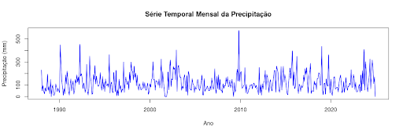

A análise visual sugere que a série apresenta valores extremos pontuais, que podem ser classificados como outliers. Alguns períodos específicos chamam a atenção por apresentarem valores excepcionalmente altos, como os anos próximos a 2010 e 2020, onde há picos que ultrapassam 500 mm de precipitação em um único mês. Esses valores são candidatos a outliers, pois se distanciam do padrão médio da série. No entanto, para confirmar se esses pontos são estatisticamente discrepantes, será necessário utilizar métodos quantitativos, como o boxplot, desvio-padrão e média móvel, que permitirão verificar se esses picos ultrapassam os limites estabelecidos para a detecção de valores atípicos.

##### 5.2.5.1.2 Identificação de Outliers com Boxplot 
	
O boxplot da precipitação mensal ao longo da série temporal é exibido na figura abaixo, permitindo uma visualização da distribuição dos dados e a identificação de possíveis valores extremos.

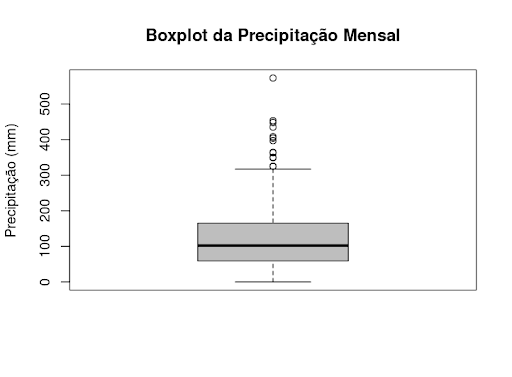

O boxplot da precipitação mensal fornece uma visão clara da distribuição dos valores da série temporal, permitindo identificar valores extremos e a dispersão dos dados.
A estatística descritiva indica que:

- A mediana da precipitação mensal é 102.5 mm, o que significa que metade dos meses apresentam precipitação abaixo desse valor.
- O intervalo interquartil (IQR), que mede a dispersão central dos dados, é 105.5 mm, abrangendo a faixa entre 59.0 mm (Q1) e 164.5 mm (Q3).
- O valor mínimo registrado é 0 mm, confirmando que há meses sem precipitação.
- O valor máximo observado na série é 573.0 mm, indicando um evento extremo de precipitação.

**Identificação de Outliers**

No boxplot, os outliers são os pontos que estão acima do limite superior, calculado como:
Q3+1.5×IQR=164.5+(1.5×105.5)=322.75 mmQ3 + 1.5 \times IQR = 164.5 + (1.5 \times 105.5) = 322.75 \text{ mm}
Ou seja, qualquer valor acima de 322.75 mm é considerado um outlier estatístico. No gráfico, diversos pontos estão acima desse limite, incluindo um valor próximo a 573 mm, evidenciando eventos de precipitação extrema.

A partir da análise estatística (método do intervalo interquartil), os seguintes meses foram identificados como outliers:

| Ano-Mês  | Precipitação Total (mm) |
|----------|------------------------|
| 1990-02  | 448                    |
| 1992-04  | 453                    |
| 1993-05  | 350                    |
| 1995-07  | 364                    |
| 2001-04  | 325                    |
| 2002-12  | 404                    |
| 2009-11  | 573                    |
| 2015-10  | 397                    |
| 2016-04  | 349                    |
| 2019-01  | 435                    |
| 2019-10  | 363                    |
| 2023-09  | 408                    |
| 2024-05  | 325                    |

O gráfico abaixo mostra esses outliers na série temporal.

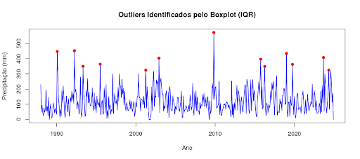

##### 5.2.5.1.3 Identificação de Outliers com Desvio-Padrão

A identificação de outliers pelo desvio-padrão é um método estatístico que detecta valores extremos ao avaliar o quão distantes eles estão da média da distribuição. Esse método é útil especialmente quando os dados seguem uma distribuição aproximadamente normal, pois permite quantificar a variação esperada dentro de um intervalo estatístico bem definido.

O processo segue três etapas principais. Primeiro, calcula-se a média e o desvio-padrão da precipitação mensal ao longo da série temporal. Em seguida, define-se um limite para a identificação de outliers, geralmente considerando valores que ultrapassam três desvios-padrão da média. Por fim, os meses cujos valores excedem esses limites são identificados como potenciais outliers, indicando períodos de precipitação anormalmente alta ou baixa.

O critério adotado estabelece que valores que ultrapassam 3 desvios-padrão da média são estatisticamente raros e, portanto, considerados outliers. Isso significa que esses meses apresentam um comportamento significativamente diferente da tendência central dos dados, podendo indicar eventos climáticos extremos, erros na medição ou variações incomuns no regime de precipitação.
Nesta análise, identificamos 7 meses como outliers estatísticos ao considerar valores que ultrapassam 3 desvios-padrão da média. Estes meses apresentam precipitações significativamente acima do padrão esperado.

| Ano-Mês  | Precipitação Total (mm) | Ano  | Mês |
|----------|------------------------|------|-----|
| 1990-02  | 448                    | 1990 |  2  |
| 1992-04  | 453                    | 1992 |  4  |
| 2002-12  | 404                    | 2002 | 12  |
| 2009-11  | 573                    | 2009 | 11  |
| 2015-10  | 397                    | 2015 | 10  |
| 2019-01  | 435                    | 2019 |  1  |
| 2023-09  | 408                    | 2023 |  9  |

O gráfico abaixo apresenta esses outliers na série temporal.

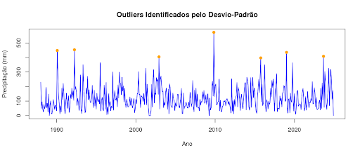

##### 5.2.5.1.4 Identificação de Outliers Médias Móveis

A análise de médias móveis é uma técnica eficaz para detectar valores extremos em séries temporais, pois suaviza flutuações de curto prazo e destaca padrões mais consistentes ao longo do tempo. Essa abordagem é amplamente utilizada na identificação de eventos climáticos anômalos, pois ajuda a diferenciar oscilações naturais de mudanças abruptas no regime de precipitação.

O método consiste em três etapas principais: primeiro, calcula-se a média móvel considerando uma janela de meses adjacentes, criando uma versão suavizada da série. Em seguida, avalia-se a diferença entre o valor real da precipitação e a média móvel, identificando desvios significativos. Por fim, definem-se limiares estatísticos para determinar outliers, geralmente considerando valores que ultrapassam 3 desvios-padrão da média móvel.

Esse método é vantajoso porque é mais sensível a mudanças locais, reduz o impacto de tendências e sazonalidade e melhora a identificação de eventos extremos, como períodos anômalos de seca ou chuvas intensas. Ele é especialmente útil quando se deseja analisar anomalias em um contexto local, evitando que a variabilidade natural distorça a detecção de outliers. A aplicação da média móvel permite uma análise mais precisa e adaptada à dinâmica climática, auxiliando na compreensão de fenômenos sazonais e extremos.

Na tabela abaixo apresenta-se os valores identificados como outliers:

| Índice na Série | Ano-Mês Estimado | Precipitação Total (mm) |
|----------------|-----------------|------------------------|
| 15            | 1990_2        | 448                    |
| 41            | 1992_4        | 453                    |
| 252           | 2009_11        | 573                    |
| 362           | 2019-01        | 435                    |
| 418           | 2023-9        | 408                    |

O gráfico abaixo apresenta esses outliers na série temporal.

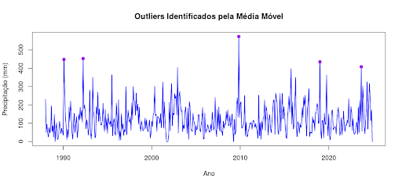

##### 5.2.1.5.5 Comparação entre os métodos
	
A tabela abaixo apresenta a compilação dos resultados da identificação de outliers em nosso estudo de caso.
Aqui está a tabela formatada em Markdown para comparar os outliers identificados por cada método:

 

| Ano-Mês  | Precipitação Total (mm) | Intervalo Interquartil (IQR) | Desvio-Padrão | Média Móvel |
|----------|------------------------|-----------------------------|--------------|------------|
| 1990-02  | 448                    | ✅                          | ✅           | ✅         |
| 1992-04  | 453                    | ✅                          | ✅           | ✅         |
| 1993-05  | 350                    | ✅                          | ❌           | ❌         |
| 1995-07  | 364                    | ✅                          | ❌           | ❌         |
| 2001-04  | 325                    | ✅                          | ❌           | ❌         |
| 2002-12  | 404                    | ✅                          | ✅           | ❌         |
| 2009-11  | 573                    | ✅                          | ✅           | ✅         |
| 2015-10  | 397                    | ✅                          | ✅           | ❌         |
| 2016-04  | 349                    | ✅                          | ❌           | ❌         |
| 2019-01  | 435                    | ✅                          | ✅           | ✅         |
| 2019-10  | 363                    | ✅                          | ❌           | ❌         |
| 2023-09  | 408                    | ✅                          | ✅           | ✅         |
| 2024-05  | 325                    | ✅                          | ❌           | ❌         |

Podemos observar que houve diferenças significativas na identificação de valores extremos. O método do intervalo interquartil (IQR) foi o mais abrangente, identificando 13 outliers, o que demonstra sua sensibilidade para capturar variações atípicas na série. Em contrapartida, o método do desvio-padrão foi mais conservador, detectando apenas 7 outliers, uma vez que assume uma distribuição normal e pode não ser eficaz em séries com assimetria ou caudas longas.

A média móvel foi a técnica mais seletiva, identificando apenas 5 outliers. Esse método prioriza desvios locais mais evidentes, considerando a variação ao longo do tempo e suavizando flutuações globais.
Um ponto relevante é que todos os outliers detectados pelos métodos de desvio-padrão e média móvel também foram identificados pelo IQR, o que reforça a robustez do IQR na análise de eventos extremos. Essa comparação evidencia que diferentes abordagens podem destacar distintos aspectos da variabilidade da série, sendo recomendável a aplicação combinada desses métodos para uma avaliação mais completa dos outliers.

#### 5.2.5.2 Rupturas Estruturais em Séries Temporais

As rupturas estruturais são mudanças abruptas nos padrões de uma série temporal, indicando alterações no processo gerador dos dados. Essas mudanças podem ocorrer na média, variância ou tendência da série e são frequentemente causadas por eventos como mudanças climáticas de longo prazo, impactos de eventos extremos (ex.: El Niño e La Niña), alterações no sistema de medição (troca de sensores meteorológicos) e mudanças no uso do solo ou políticas ambientais.

A ocorrência de uma ruptura estrutural faz com que os padrões da série deixem de seguir a mesma distribuição estatística antes e depois do evento, tornando essencial sua identificação para evitar interpretações equivocadas e ajustes inadequados na modelagem.

**Tipos de Rupturas Estruturais**

As mudanças na série temporal podem se manifestar de diferentes formas:
- Mudanças pontuais: Alterações súbitas, como o impacto de um desastre climático.
- Mudanças graduais: Transições mais suaves ao longo do tempo, refletindo processos sazonais ou padrões de longo prazo.
- Múltiplas rupturas: Ocorrência de diversas mudanças ao longo do período analisado, exigindo segmentação da série para análise mais precisa.
  
A identificação dessas rupturas permite separar diferentes fases da série e modelá-las adequadamente, garantindo que previsões e análises reflitam corretamente as transformações observadas nos dados.

**Importância do Estudo das Rupturas Estruturais**

A detecção de rupturas estruturais é fundamental para garantir a precisão da análise espaço-temporal, evitando equívocos na interpretação dos dados. Alguns dos principais motivos para essa análise incluem:

- Evitar vieses na modelagem, ajustando corretamente os períodos antes e depois da mudança.
- Identificar transições climáticas e seus impactos na precipitação, auxiliando na compreensão de padrões atmosféricos.
- Melhorar previsões meteorológicas, considerando mudanças históricas significativas na série.
- Separar efeitos sazonais de mudanças estruturais, permitindo análises mais precisas.
  
Caso rupturas sejam detectadas, a série pode precisar ser segmentada ou modelada de forma diferenciada. Se não forem identificadas mudanças significativas, a análise pode seguir sem ajustes adicionais.
Por exemplo, se uma ruptura estrutural coincide com eventos de El Niño, isso pode indicar que esse fenômeno está alterando significativamente os padrões de precipitação na região, influenciando decisões sobre gestão de recursos hídricos e políticas ambientais.

A identificação e o estudo das rupturas estruturais são essenciais para garantir que as análises estatísticas e previsões climáticas sejam realistas e confiáveis, evitando conclusões incorretas que poderiam comprometer a interpretação dos dados e a tomada de decisões estratégicas.

**Métodos estatísticos para detecção de rupturas**

Existem diversos métodos para identificar rupturas estruturais em séries temporais. A escolha do método depende do tipo de análise e da natureza dos dados.

**Teste de Pettitt**

O Teste de Pettitt é um método não paramétrico amplamente utilizado para detectar uma única mudança na mediana da série temporal. Ele não assume uma distribuição específica e é útil para identificar transições abruptas.

Hipótese nula (H0H_0): Não há mudança estrutural na série.

Hipótese alternativa (H1H_1): Existe um ponto de mudança estrutural.

Se o p-valor do teste for baixo (p<0.05p < 0.05), rejeitamos H0H_0 e consideramos que há uma ruptura significativa na série.

**Teste de Bai & Perron**

O método de Bai & Perron identifica múltiplas mudanças na estrutura da série ao longo do tempo. Ele ajusta modelos de regressão segmentados e detecta os pontos de transição onde as estatísticas da série mudam significativamente.

Indicado quando há mais de uma ruptura estrutural.

Permite modelar cada segmento da série separadamente.

Muito utilizado em estudos econômicos, financeiros e ambientais.

Se nenhuma ruptura for detectada, isso sugere que a série segue um comportamento estável ao longo do tempo.

**CUSUM Test (Cumulative Sum Control Chart)**

O CUSUM é um método de controle estatístico que monitora variações acumuladas ao longo do tempo. Ele é útil para detectar mudanças progressivas na série, mesmo que não sejam abruptas.
Se os valores ultrapassam os limites críticos, sugere um desvio significativo na série.

Indicado para detectar alterações sutis em tendências e padrões de variabilidade.

##### 5.2.5.2.1 Identificação de rupturas estruturas da série temporal de precipitação

Nesta etapa, iremos verificar a existência de rupturas estruturais na série temporal de precipitação em estudo. A detecção dessas mudanças é essencial para entender alterações significativas no comportamento da série, garantindo que padrões inesperados sejam identificados e considerados na modelagem estatística.

**Teste de Pettitt**

O Teste de Pettitt é um teste não paramétrico que detecta um único ponto de mudança na mediana da série. Os resultados foram os seguintes:
- Estatística U* = 2240
- p-valor = 1
- Provável ponto de mudança: observação 113

O p-valor elevado (1.0) indica que não há evidências estatísticas suficientes para afirmar que ocorreu uma mudança estrutural significativa na série. Embora o teste aponte um possível ponto de mudança na observação 113, esse resultado não é estatisticamente significativo.

**Método de Bai & Perron**

O método de Bai & Perron foi aplicado para detectar múltiplos pontos de ruptura nos resíduos suavizados com uma média móvel de 12 períodos. No entanto, o modelo retornou:

print(modelo_bp$breakpoints)
[1] NA

O método não identificou pontos de ruptura estatisticamente significativos, o que reforça os achados do Teste de Pettitt. Isso pode indicar que a série é relativamente estável ao longo do tempo ou que eventuais mudanças são graduais, e não abruptas.

**Gráfico CUSUM**

O gráfico CUSUM (Cumulative Sum Control Chart) é um método de monitoramento que permite detectar desvios na média da série ao longo do tempo. A figura abaixo ilustra os resultados do teste CUSUM:

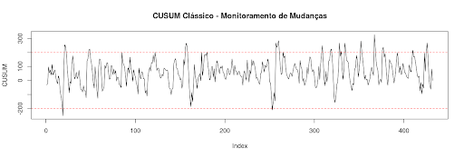

O gráfico ilustra a evolução cumulativa dos resíduos ao longo do tempo, com as linhas vermelhas tracejadas representando os limites de controle. Caso a curva do CUSUM ultrapasse esses limites, isso indicaria a presença de mudanças estruturais. No entanto, na visualização apresentada, a série permanece dentro dos limites, sugerindo a ausência de alterações abruptas significativas.

**Conclusão**

A partir dos três métodos aplicados, não foram encontradas evidências estatísticas robustas de mudanças estruturais significativas nos resíduos. Embora o Teste de Pettitt tenha sugerido uma possível mudança na observação 113, o p-valor alto indica que essa alteração não é estatisticamente relevante. O método de Bai & Perron não detectou pontos de ruptura, e o gráfico CUSUM sugere que a série se mantém dentro dos limites de controle, sem variações abruptas.

Esses resultados indicam que os resíduos da série analisada não apresentam mudanças estruturais evidentes, reforçando a hipótese de que a série pode ser considerada estável ao longo do tempo.

## 5.3 Modelos de Séries Temporais

O estudo de séries temporais envolve a aplicação de modelos estatísticos e computacionais para analisar padrões e realizar previsões. Existem diferentes abordagens para modelagem, que variam de métodos clássicos a técnicas avançadas de aprendizado de máquina.  Esses modelos são divididos em duas categorias principais: **modelos clássicos** e **modelos avançados**. Vamos detalhar cada um deles, destacando suas características, aplicações e vantagens.

Nesta seção, abordaremos os principais modelos utilizados na análise de séries temporais.

#### 5.3.1 Modelos Clássicos

Os modelos clássicos são amplamente utilizados por sua simplicidade e eficácia em diversas situações. Eles são baseados em técnicas estatísticas e são particularmente úteis quando a série temporal apresenta padrões claros, como tendência e sazonalidade.

#### 5.3.1.1 Modelos de Suavização

Os modelos de suavização são métodos simples e eficientes para capturar tendências e padrões sazonais. Eles são amplamente utilizados quando os dados apresentam estrutura clara e previsível.

**Médias Móveis e Suavização Exponencial**

- **Médias Móveis (MA):**

As médias móveis são usadas para suavizar flutuações de curto prazo e destacar tendências ou ciclos. A média móvel simples (SMA) calcula a média de um número fixo de observações anteriores. Outras variações incluem a média móvel ponderada (WMA) e a média móvel exponencial (EMA), que atribuem pesos diferentes às observações.

- **Suavização Exponencial:**

A suavização exponencial é uma técnica que atribui pesos decrescentes aos valores passados, permitindo que o modelo responda mais rapidamente a mudanças recentes.

O modelo mais simples é o **Simple Exponential Smoothing (SES)**, que é eficaz para séries sem tendência ou sazonalidade. Para séries com tendência, utiliza-se o **Holt’s Linear Trend Model**, e para séries com tendência e sazonalidade, o **Holt-Winters Seasonal Model**.

#### 5.3.1.2 Modelos Autorregressivos e ARIMA

Os modelos autorregressivos são amplamente utilizados na modelagem de séries temporais, pois capturam relações entre valores passados e presentes.

- **Modelo Autoregressivo (AR):**
  
# Modelo Autorregressivo (AR)

O modelo **AR** prevê valores futuros com base em uma combinação linear de valores passados. A ordem do modelo (**p**) indica quantos termos passados são usados. Por exemplo, um **AR(1)** usa apenas o valor imediatamente anterior.

Um modelo AR usa valores passados da própria série como preditores. A equação geral de um modelo **AR(p)** é:

\[
Y_t = c + \phi_1 Y_{t-1} + \phi_2 Y_{t-2} + \dots + \phi_p Y_{t-p} + \epsilon_t
\]

Onde:

- \( Y_t \) é o valor atual da série.
- \( \phi_p \) são os coeficientes autorregressivos.
- \( \epsilon_t \) é um termo de erro aleatório.

- **Modelo de Média Móvel (MA):**

   
O modelo **MA** prevê valores futuros com base em erros de previsão passados. A ordem do modelo (**q**) define quantos erros passados são considerados. Um **MA(1)** usa apenas o erro da previsão anterior.

O modelo MA utiliza os erros passados para prever os valores futuros. Um modelo **MA(q)** tem a seguinte forma:

\[
Y_t = \mu + \theta_1 \epsilon_{t-1} + \theta_2 \epsilon_{t-2} + \dots + \theta_q \epsilon_{t-q} + \epsilon_t
\]

Onde:

- \( Y_t \) é o valor atual da série.
- \( \mu \) é a média da série.
- \( \theta_q \) são os coeficientes de médias móveis.
- \( \epsilon_t \) é um termo de erro aleatório.

- **Modelo ARMA (Autoregressivo de Média Móvel):**
  

O modelo **ARMA** combina os modelos **AR** e **MA**, sendo útil para séries temporais **estacionárias** (sem tendência ou sazonalidade). A ordem do modelo é definida por **(p, q)**, onde:

- **p** é a ordem do componente **AR** (Autorregressivo).
- **q** é a ordem do componente **MA** (Médias Móveis).

A equação geral do modelo **ARMA(p, q)** é:

\[
Y_t = c + \sum_{i=1}^{p} \phi_i Y_{t-i} + \sum_{j=1}^{q} \theta_j \epsilon_{t-j} + \epsilon_t
\]

Onde:

- \( Y_t \) é o valor atual da série.
- \( c \) é uma constante.
- \( \phi_i \) são os coeficientes autorregressivos.
- \( \theta_j \) são os coeficientes de médias móveis.
- \( \epsilon_t \) é um termo de erro aleatório.

O modelo **ARMA** é amplamente utilizado para modelar séries temporais estacionárias, capturando tanto a dependência dos valores passados (AR) quanto o impacto dos erros passados (MA).

##### 5.3.1.3 Modelos ARIMA e SARIMA

- **Modelo ARIMA (Autoregressivo Integrado de Média Móvel):**

   
O ARIMA é uma extensão do ARMA que inclui diferenciação para tornar a série estacionária. A ordem do modelo é definida por (p, d, q), onde d é o número de diferenciações necessárias. É amplamente utilizado para séries com tendência.

O modelo ARIMA generaliza o ARMA ao incluir uma etapa de diferenciação para lidar com séries não estacionárias. A notação ARIMA(p, d, q) indica:

p: Ordem da parte autorregressiva.
d: Número de diferenciações aplicadas para tornar a série estacionária.
q: Ordem da parte de médias móveis.
A previsão é feita aplicando diferenciações sucessivas e ajustando componentes AR e MA.

- **Modelo SARIMA (ARIMA Sazonal):**
  
O SARIMA incorpora a sazonalidade ao ARIMA, sendo útil para séries com padrões sazonais. A ordem do modelo é definida por (p, d, q)(P, D, Q, s), onde (P, D, Q) representam os componentes sazonais e s é o período sazonal.

Para séries temporais com sazonalidade, o modelo SARIMA adiciona termos sazonais:

SARIMA(p,d,q)×(P,D,Q)mSARIMA(p,d,q) \times (P,D,Q)_m
Onde:
(P, D, Q) são os parâmetros sazonais.
m é o período da sazonalidade (por exemplo, 12 para dados mensais).

### 5.3.2 Modelos Avançados

Com o avanço da tecnologia e a disponibilidade de grandes volumes de dados, modelos mais sofisticados têm sido desenvolvidos para lidar com séries temporais complexas. Esses modelos são baseados em técnicas de aprendizado de máquina e abordagens espaço-temporais.

##### 5.3.2.1 Modelos Baseados em Aprendizado de Máquina

Com o avanço do aprendizado de máquina, diversas técnicas têm sido aplicadas à previsão de séries temporais.

- **Redes Neurais:**
  
Redes neurais, como as **Redes Neurais Recorrentes (RNN)** e suas variações (**LSTM** e **GRU**), são eficazes para capturar padrões não lineares e dependências de longo prazo em séries temporais. Elas são especialmente úteis para dados complexos e de alta dimensionalidade.

As RNNs são um tipo de rede neural que mantém memória de estados anteriores, tornando-se adequadas para séries temporais. Modelos como LSTMs (Long Short-Term Memory) e GRUs (Gated Recurrent Units) melhoram a retenção de informações ao longo do tempo.

#### 5.3.2.2. Modelos Baseados em Árvore de Decisão

Algoritmos como XGBoost, Random Forest e LightGBM podem ser usados para prever séries temporais considerando múltiplas variáveis exógenas.

- **XGBoost:**
   
O XGBoost é um algoritmo de aprendizado de máquina baseado em árvores de decisão que pode ser aplicado a séries temporais. Ele é conhecido por sua eficiência e capacidade de lidar com dados heterogêneos. Para séries temporais, é comum usar técnicas de engenharia de características para transformar os dados em um formato adequado.

##### 5.3.2.3 Prophet

Desenvolvido pelo Facebook, o Prophet é um modelo robusto para séries temporais, lidando bem com sazonalidade e feriados. Ele usa uma combinação de regressão e decomposição de séries temporais.

##### 5.3.2.3 Modelos Espaço-Temporais

- **STARIMA (Spatial-Temporal Autoregressive Integrated Moving Average):**  

O STARIMA é uma extensão do ARIMA que incorpora dependências espaciais e temporais. É útil para dados que variam no tempo e no espaço, como previsões climáticas ou de tráfego.

- **GWR com Fator Temporal (Geographically Weighted Regression):**  

O GWR é um modelo de regressão que permite coeficientes variáveis espacialmente. Quando combinado com um fator temporal, ele pode ser usado para modelar relações espaço-temporais em dados geográficos.

### 5.3.3 Escolha do Modelo Adequado

A escolha do modelo depende das características da série temporal, como estacionariedade, tendência, sazonalidade e presença de padrões não lineares. Além disso, é importante considerar o volume de dados, a complexidade do problema e a interpretabilidade do modelo.

- **Séries simples:** Modelos clássicos como ARIMA ou suavização exponencial são suficientes.
- **Séries complexas:** Modelos avançados, como redes neurais ou XGBoost, podem ser mais adequados.
- **Dados espaço-temporais:** Modelos como STARIMA ou GWR com fator temporal são recomendados.

A escolha do modelo ideal depende da natureza dos dados e do objetivo da análise. Algumas diretrizes gerais incluem:

| Critério                 | Modelos Recomendados            |
|--------------------------|--------------------------------|
| **Tendência simples**    | Médias móveis, Holt-Winters   |
| **Sazonalidade**         | SARIMA, Holt-Winters, Prophet |
| **Séries estacionárias** | ARMA, ARIMA                   |
| **Séries não estacionárias** | ARIMA, SARIMA           |
| **Alto volume de dados** | XGBoost, LSTM                 |
| **Curto prazo**          | ARIMA, Holt-Winters           |
| **Longo prazo**          | Redes Neurais, Prophet        |

## 5.4 Avaliação e Comparação de Modelos de Séries Temporais

A avaliação e comparação de modelos são etapas essenciais na análise de séries temporais, pois permitem identificar a abordagem mais adequada ao problema e garantir previsões precisas e confiáveis. Para isso, utilizam-se métricas de avaliação, técnicas de comparação e estratégias para selecionar o melhor modelo.  

A qualidade de um modelo preditivo está diretamente relacionada à sua capacidade de generalização, ou seja, à habilidade de prever corretamente valores futuros com base nos dados históricos. Para avaliar essa capacidade, aplicam-se diferentes técnicas de validação e métricas de desempenho. Uma avaliação criteriosa é fundamental para evitar problemas como o overfitting, que ocorre quando o modelo se ajusta excessivamente aos dados de treinamento, comprometendo sua capacidade de previsão em novos cenários.  

A avaliação de modelos tem quatro objetivos principais: medir a precisão das previsões, garantindo que o modelo forneça resultados confiáveis; evitar o overfitting, assegurando que o modelo generalize bem para novos dados; comparar diferentes abordagens, permitindo a escolha do modelo mais adequado ao problema; e identificar oportunidades de melhoria, possibilitando ajustes nos parâmetros ou a inclusão de novas variáveis relevantes.  

Ao compreender e aplicar corretamente essas técnicas, é possível desenvolver modelos mais robustos e eficazes, tornando as previsões mais seguras e úteis para a tomada de decisão.

### 5.4.1 Métricas de Avaliação  

A avaliação do desempenho de um modelo de previsão é fundamental para garantir que ele forneça resultados confiáveis. Para isso, utilizam-se diferentes métricas que quantificam o erro das previsões em relação aos valores reais. A escolha da métrica mais adequada depende do tipo de problema e dos objetivos da análise. Algumas métricas penalizam erros grandes, outras são mais robustas contra outliers, e algumas permitem comparações entre séries de diferentes escalas.  

Abaixo, apresentamos as principais métricas de avaliação, divididas em três categorias: **métricas baseadas em erro**, **métricas baseadas em acurácia** e **métricas específicas para séries temporais**.  

#### 5.4.1.1 Métricas Baseadas em Erro  

As métricas baseadas em erro quantificam a diferença entre os valores previstos e os valores observados. Elas são amplamente utilizadas para medir o desempenho dos modelos preditivos.  

- **Erro Quadrático Médio (MSE - Mean Squared Error):**  

  \[
  MSE = \frac{1}{n} \sum_{t=1}^{n} (y_t - \hat{y}_t)^2
  \]  

  Onde:  
  - \( n \) é o número total de observações.  
  - \( y_t \) é o valor real da série no instante \( t \).  
  - \( \hat{y}_t \) é o valor previsto pelo modelo no instante \( t \).  
  - A diferença \( (y_t - \hat{y}_t) \) representa o erro da previsão para cada ponto da série.  
  - O erro é elevado ao quadrado para penalizar desvios maiores de forma mais intensa.  

O **MSE** mede o erro médio ao elevar ao quadrado a diferença entre os valores reais e as previsões. Ele penaliza erros maiores de forma mais intensa, sendo útil quando se deseja minimizar grandes desvios. No entanto, por ser sensível a outliers, pode superestimar o impacto de valores extremos.  

- **Erro Absoluto Médio (MAE - Mean Absolute Error):**  

  \[
  MAE = \frac{1}{n} \sum_{t=1}^{n} |y_t - \hat{y}_t|
  \]  

  Onde:  
  - \( n \) é o número total de observações.  
  - \( y_t \) é o valor real da série no instante \( t \).  
  - \( \hat{y}_t \) é o valor previsto pelo modelo no instante \( t \).  
  - A diferença absoluta \( |y_t - \hat{y}_t| \) representa o erro da previsão sem considerar a direção do erro (positivo ou negativo).  

O **MAE** calcula a média dos erros absolutos, sem elevar ao quadrado. Isso o torna mais fácil de interpretar e menos sensível a outliers do que o MSE. Ele representa o erro médio em unidades da variável original, facilitando a compreensão do desempenho do modelo.  

- **Raiz do Erro Quadrático Médio (RMSE - Root Mean Squared Error):**  

  \[
  RMSE = \sqrt{MSE}
  \]  

Onde: 

- O **RMSE** é simplesmente a raiz quadrada do MSE.  

O **RMSE** expressa os erros na mesma unidade dos dados originais, tornando sua interpretação mais intuitiva. Como mantém a característica de penalizar desvios maiores, é uma das métricas mais utilizadas em previsões.  

- **Erro Percentual Absoluto Médio (MAPE - Mean Absolute Percentage Error):**  

  \[
  MAPE = \frac{1}{n} \sum_{t=1}^{n} \left| \frac{y_t - \hat{y}_t}{y_t} \right| \times 100
  \]  

  Onde:  
  - \( n \) é o número total de observações.  
  - \( y_t \) é o valor real da série no instante \( t \).  
  - \( \hat{y}_t \) é o valor previsto pelo modelo no instante \( t \).  
  - A fração \( \frac{y_t - \hat{y}_t}{y_t} \) representa o erro relativo em relação ao valor real.  
  - O resultado é multiplicado por 100 para ser expresso em porcentagem.  

O **MAPE** mede o erro médio absoluto em termos percentuais, permitindo comparar modelos aplicados a séries temporais com escalas diferentes. Entretanto, ele pode ser problemático quando os valores reais se aproximam de zero, pois pequenos erros podem gerar valores percentuais muito elevados.  

#### 5.4.1.2 Métricas Baseadas em Acurácia  

As métricas baseadas em acurácia avaliam o quão bem o modelo explica a variabilidade dos dados e a qualidade do ajuste.  

- **Coeficiente de Determinação (R²):**  

  \[
  R^2 = 1 - \frac{\sum_{t=1}^{n} (y_t - \hat{y}_t)^2}{\sum_{t=1}^{n} (y_t - \bar{y})^2}
  \]  

  Onde:
  
  - \( y_t \) é o valor real da série no instante \( t \).  
  - \( \hat{y}_t \) é o valor previsto pelo modelo no instante \( t \).  
  - \( \bar{y} \) é a média dos valores observados.  
  - O numerador representa o erro residual (diferença entre os valores reais e os previstos pelo modelo).  
  - O denominador representa a variância total dos dados.  

  O **R²** mede a proporção da variância dos dados que é explicada pelo modelo. Seu valor varia de 0 a 1, sendo que valores mais próximos de 1 indicam que o modelo é capaz de explicar melhor a variabilidade da série. No entanto, ele pode ser enganoso em séries temporais, especialmente quando há dependência temporal forte, pois pode superestimar a qualidade da previsão.  

#### 5.4.1.3 Métricas para Séries Temporais  

Além das métricas gerais de erro e acurácia, algumas métricas são específicas para séries temporais, levando em conta a estrutura temporal dos dados.  

- **Erro de Previsão Acumulado (Cumulative Forecast Error - CFE):**  
  O **CFE** mede o viés do modelo ao longo do tempo. Um erro acumulado muito positivo ou muito negativo indica que o modelo está consistentemente subestimando ou superestimando os valores reais, o que pode exigir ajustes.  

- **Mean Absolute Scaled Error (MASE):**  
  O **MASE** compara o erro do modelo com o erro de um modelo de referência, como a previsão ingênua (por exemplo, assumir que o próximo valor será igual ao último observado). Isso permite avaliar se o modelo realmente está agregando valor em relação a previsões simples. Ele é útil quando há necessidade de comparar modelos em séries temporais de diferentes escalas.  

Essas métricas fornecem diferentes perspectivas sobre o desempenho dos modelos de previsão e devem ser escolhidas de acordo com as características da série temporal e os objetivos da análise.

### 5.4.2 Técnicas de Comparação de Modelos  

Para garantir que um modelo de previsão seja eficaz, é necessário compará-lo com outras abordagens utilizando técnicas que proporcionem uma avaliação justa e robusta. Isso evita a escolha de um modelo inadequado para a tarefa e melhora a capacidade de generalização da solução.  

#### 5.4.2.1 Divisão dos Dados  

A divisão dos dados é uma etapa básica na avaliação de modelos de séries temporais. Diferente de outras abordagens de aprendizado de máquina, em que os dados podem ser divididos aleatoriamente, em séries temporais é necessário preservar a sequência temporal para evitar vazamento de informações futuras no treinamento.  

Os dados devem ser divididos em três conjuntos principais: 

  - **Treino:** Utilizado para ajustar os parâmetros do modelo.  
  - **Validação:** Usado para ajustar hiperparâmetros e evitar overfitting.  
  - **Teste:** Aplicado para avaliar a capacidade preditiva do modelo em dados nunca vistos.  

Essa abordagem garante que o modelo seja avaliado de forma realista, simulando seu desempenho em novos dados.  

#### 5.4.2.2 Validação Cruzada Temporal  

A validação cruzada tradicional, em que os dados são divididos aleatoriamente em diferentes subconjuntos de treino e teste, **não pode ser aplicada diretamente a séries temporais**, pois violaria a dependência sequencial dos dados. Assim, técnicas específicas foram desenvolvidas para manter a coerência temporal:  

- **Time Series Split:**  

Esse método divide os dados em várias partes, respeitando a ordem cronológica. Cada subconjunto posterior é usado como conjunto de teste, enquanto os dados anteriores são usados para treino. Isso permite avaliar a estabilidade do modelo ao longo do tempo.  

Outras abordagens para validação cruzada em séries temporais incluem:  

- **Validação por divisão simples (Train-Test Split):**  
  - Separa os dados em dois conjuntos: um para treinamento e outro para teste.  
  - O modelo é treinado com a parte mais antiga e avaliado com os dados mais recentes.  

- **Validação em janelas deslizantes (Rolling Forecast Origin ou Walk Forward Validation):**  
  - Treina o modelo em uma janela de tempo fixa e avalia na próxima janela.  
  - O processo se repete ao longo da série, permitindo testar a estabilidade da previsão ao longo do tempo.  

- **Expanding Window Validation:**  
  - Semelhante à abordagem de janelas deslizantes, mas a cada iteração a janela de treinamento cresce, incorporando novos dados antes de realizar a previsão.  
  - Permite que o modelo aprenda continuamente com mais informações históricas.  

Essas técnicas garantem que a validação seja realizada de maneira fiel à realidade, evitando que o modelo utilize informações futuras para treinar, o que poderia levar a previsões irreais.  

### 5.4.3 Testes Estatísticos  

Além das métricas de erro e das técnicas de validação, os testes estatísticos desempenham um papel fundamental na comparação de modelos, pois permitem verificar se as diferenças no desempenho são estatisticamente significativas. 

O **teste de Diebold-Mariano** é utilizado para comparar a precisão preditiva de dois modelos, avaliando se a diferença entre seus erros de previsão é relevante do ponto de vista estatístico, o que auxilia na determinação do modelo mais adequado. 

Já o **teste de Wilcoxon**, um método não paramétrico, é especialmente útil para comparar modelos emparelhados, sendo aplicado quando há múltiplas séries temporais e se deseja testar se um modelo supera consistentemente outro. A aplicação desses testes garante que a escolha do melhor modelo seja fundamentada em evidências estatísticas, evitando decisões baseadas apenas em métricas isoladas. 

### 5.4.4 Estratégias para Seleção do Melhor Modelo  

A seleção do melhor modelo não deve se basear apenas na precisão preditiva, mas também em outros fatores como **complexidade, interpretabilidade, custo computacional e robustez**.  

**Trade-off entre Viés e Variância**

A escolha do modelo envolve um equilíbrio entre viés e variância, pois modelos mais simples tendem a ter alto viés e baixa variância, enquanto modelos mais complexos apresentam baixa interpretabilidade e maior risco de overfitting. Modelos simples, como o ARIMA, são eficientes para séries temporais com padrões claros e fáceis de interpretar, mas podem não capturar relações mais complexas nos dados. 

Por outro lado, modelos mais sofisticados, como redes neurais, XGBoost e LSTM, são capazes de identificar padrões não lineares e interações mais avançadas, porém exigem um volume maior de dados para generalização e correm o risco de se ajustarem excessivamente ao conjunto de treinamento. Dessa forma, a decisão sobre qual modelo utilizar deve considerar o nível de complexidade necessário para capturar os padrões da série sem comprometer sua capacidade de previsão em novos dados.

**Interpretabilidade**

A interpretabilidade é um critério essencial na escolha do modelo, dependendo do contexto da aplicação. Modelos clássicos, como ARIMA e SARIMA, oferecem maior transparência, permitindo que os usuários compreendam claramente como as previsões são geradas e quais fatores influenciam os resultados. 

Por outro lado, modelos avançados, como redes neurais, XGBoost e LSTM, podem apresentar maior precisão em determinados cenários, mas funcionam como "caixas-pretas", tornando a interpretação dos resultados mais desafiadora. Em situações onde a explicabilidade das previsões é fundamental para a tomada de decisão, a interpretabilidade pode ser um fator determinante na escolha do modelo mais adequado.

**Custo Computacional** 

Modelos mais complexos podem demandar um alto custo computacional, o que pode tornar seu uso inviável em aplicações de tempo real ou em cenários com grandes volumes de dados. 

Modelos estatísticos, como ARIMA e SARIMA, são mais eficientes do ponto de vista computacional, podendo ser executados em hardware modesto sem comprometer significativamente o tempo de processamento. 

Em contraste, modelos baseados em aprendizado profundo, como LSTM e Transformers, exigem maior capacidade de processamento, frequentemente necessitando de GPUs ou clusters computacionais, o que eleva tanto o custo quanto o tempo de treinamento. Portanto, a escolha do modelo deve considerar a infraestrutura disponível e a necessidade de previsões rápidas e escaláveis, equilibrando desempenho e viabilidade operacional. 

**Robustez**

Um modelo robusto deve ser capaz de lidar com mudanças nos dados ao longo do tempo. Alguns desafios incluem:  

- **Novos padrões surgindo na série temporal:** Modelos rígidos podem ter dificuldades em se adaptar a novas tendências.  
- **Presença de outliers:** Modelos muito sensíveis a valores extremos podem gerar previsões distorcidas.  
- **Variações sazonais inesperadas:** Modelos que não consideram sazonalidade podem falhar em períodos de alta variabilidade.  

A robustez pode ser testada aplicando o modelo em diferentes períodos históricos e verificando sua estabilidade preditiva ao longo do tempo.  

**Conclusão**

A escolha do melhor modelo de previsão não se resume apenas à métrica de erro mais baixa. **Fatores como interpretabilidade, custo computacional, robustez e equilíbrio entre viés e variância também devem ser considerados.**  

Utilizando técnicas adequadas de **validação cruzada temporal**, **testes estatísticos** e **estratégias de seleção**, é possível garantir que o modelo escolhido seja confiável e adequado às necessidades específicas da análise de séries temporais.

