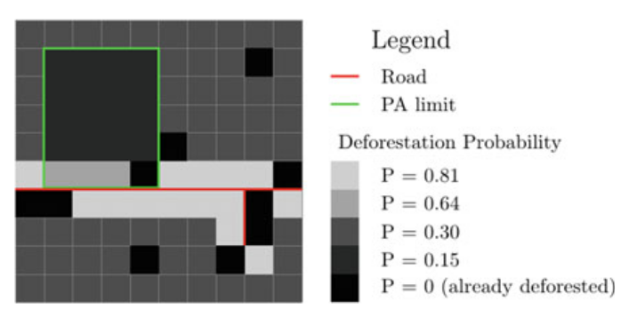

---
jupytext:
  formats: md:myst
  text_representation:
    extension: .md
    format_name: myst
    format_version: 0.13
    jupytext_version: 1.16.4
kernelspec:
  display_name: Python 3
  language: python
  name: python3
---

# 6. DINÂMICA DA PAISAGEM E MODELOS DE MUDANÇA

<section class="cap-audio">
  
<strong>Ouça o resumo do capítulo em áudio:</strong>

  <audio controls preload="none" style="width:100%;max-width:720px">
    <source src="audio/capitulo6.mp3" type="audio/mpeg">
    Seu navegador não suporta a reprodução de áudio.
    <a href="audio/capitulo6.mp3">Baixar MP3</a>
  </audio>
</section>

<section class="cap-video">
  
<strong>Assista ao resumo do capítulo em vídeo:</strong>

<!-- wrapper responsivo 16:9 -->

  <iframe
    src="https://www.youtube-nocookie.com/embed/28oSYM-J6u4"
    title="Vídeo do capítulo"
    allow="accelerometer; autoplay; clipboard-write; encrypted-media; gyroscope; picture-in-picture; web-share"
    allowfullscreen
    loading="lazy"
    referrerpolicy="strict-origin-when-cross-origin"
    style="position:absolute;top:0;left:0;width:100%;height:100%;border:0;">
  </iframe>

  Se o vídeo não carregar, <a href="https://www.youtube.com/watch?v=28oSYM-J6u4" target="_blank" rel="noopener">assista no YouTube</a>.

</section>

A paisagem não é um pano de fundo imóvel: é um mosaico que se reorganiza continuamente pela ação conjunta do clima, do relevo e dos solos, das interações bióticas, de perturbações como fogo e cheias e — cada vez mais — das decisões humanas sobre o uso da terra. Estudar sua dinâmica significa conectar esses motores aos padrões que aparecem nos mapas, explicando o que muda, onde muda, com que velocidade e com quais consequências ecológicas e sociais. Essa leitura processual permite identificar aproximações a limiares de conectividade, comparar cenários de expansão urbana ou agrícola, planejar infraestrutura com menor impacto e orientar ações de conservação e restauração.

Este capítulo oferece um roteiro prático para transformar “mapas de antes e depois” em entendimento e previsão. Começamos pelo essencial: como detectar e quantificar mudanças por meio da comparação pós-classificação e das matrizes de transição — e de sua versão probabilística, a cadeia de Markov —, decompondo os resultados em persistência, ganhos, perdas, mudança líquida e troca. Em seguida, mostramos como esses números alimentam modelos espaciais que respondem às duas perguntas centrais de qualquer simulação de mudança de uso e cobertura da terra (LUCC): quanto deve mudar (demanda) e onde essa mudança será alocada no mapa (alocação).

Para decidir o “onde”, organizamos os fatores que de fato empurram a mudança — vizinhança, acessibilidade, adequação biofísica e regras/zoneamento — na estrutura NASZ. A partir dela, construímos mapas “soft” de propensão/adequação com métodos estatísticos e de aprendizado de máquina e usamos autômatos celulares para garantir padrões espacialmente plausíveis (contiguidade e forma das manchas). O capítulo fecha o ciclo discutindo validação (quantidades e localização; métricas para mapas “duros” e “soft”), sensibilidade e incerteza (o que mais afeta o resultado e como comunicar isso com transparência), e traz um panorama das principais plataformas e fluxos de modelagem — do laboratório didático às aplicações em planejamento e políticas públicas.

Em síntese, você encontrará aqui conceitos e ferramentas para (i) medir a mudança, (ii) explicar seus motores, (iii) simular cenários com hipóteses explícitas e (iv) avaliar a confiança dos resultados. A ambição não é “adivinhar o futuro”, mas oferecer um laboratório virtual — calibrado e honesto sobre suas incertezas — para comparar caminhos possíveis e apoiar decisões melhores no território.

## 6.1 O que é paisagem?

Paisagem é uma área espacialmente heterogênea em pelo menos um atributo de interesse, cujos limites e a relevância do recorte dependem da questão investigada e da escala de observação. O elemento definidor não é o tamanho, mas a variação espacial: o arranjo de classes e formas (padrões) produzido por processos ecológicos e antrópicos que operam no tempo e sobre o espaço. Essa heterogeneidade pode ser descrita como um mosaico de manchas, corredores e, quando aplicável, uma matriz dominante; arranjos policêntricos sem matriz claramente definida são frequentes. Embora a etimologia remeta ao terrestre, o conceito aplica-se igualmente a sistemas aquáticos e costeiros.

A Figura 1 ilustra a paisagem como mosaico em diferentes escalas. 

**Figura 1 - Paisagem como mosaico em múltiplas escalas.**

No painel (a), em microescala (~4 m²), a cobertura herbácea de Bouteloua gracilis e Buchloe dactyloides é interrompida por pequenas lacunas de solo exposto, nas quais bordas e microvazios condicionam processos como retenção de umidade e germinação. 

No painel (b), parcelas experimentais de 16 m² variam sistematicamente a abundância de habitat e o contágio espacial, conforme modelos neutros fractais (With et al., 1999), permitindo isolar os efeitos de quantidade e de configuração sobre a dinâmica de comunidades de artrópodes. 

Em mesoescala, o painel (c) mostra clones de carvalho-de-Gambel (Quercus gambelii) no Colorado, destacando métricas de tamanho, forma, bordas e conectividade funcional, relevantes para propagação clonal, fogo e movimento de fauna. 

Em macroescala, o painel (d) apresenta uma turfeira do tipo string bog no Alasca, na qual padrões auto-organizados emergem de interações entre hidrologia, topografia, permafrost e acumulação de matéria orgânica; aqui, corredores úmidos e manchas elevadas estruturam fluxos e retenção hídrica.

Esses exemplos enfatizam um princípio metodológico: a escala de observação (grão e extensão) condiciona o que é detectável e mensurável. Classes raras discerníveis em escalas finas podem desaparecer com reamostragem para escalas regionais; inversamente, estruturas de conectividade só se tornam evidentes quando a extensão analisada é suficiente. Tal dependência reforça o cuidado com o problema da unidade espacial modificável (MAUP): mudanças no tamanho ou na delimitação das unidades de análise podem alterar métricas de composição, configuração e conectividade, afetando interpretações e conclusões.
Para além do plano biofísico, a paisagem comporta uma dimensão sociocultural — da “fisionomia da natureza” de Humboldt à definição da Convenção Europeia da Paisagem como “área tal como percebida pelas pessoas”. E

## 6.2 Dinâmica da paisagem

A dinâmica da paisagem estuda as relações recíprocas entre padrões e processos no tempo, com foco no surgimento, na manutenção e na transformação da heterogeneidade. Essa dinâmica resulta da ação combinada de impulsionadores que operam em múltiplas escalas e, com frequência, interagem de forma não linear: 

- o molde abiótico (clima, relevo, solos) condiciona fluxos de matéria e energia e a frequência/intensidade de perturbações; 
- interações bióticas (competição, predação, facilitação) — inclusive espécies engenheiras — podem reconfigurar o ambiente; 
- perturbação e sucessão formam um par dinâmico em que eventos discretos alteram estrutura e recursos e a recuperação depende de legados, do tamanho/forma/arranjo das áreas afetadas e da conectividade para recolonização; por fim, 
- o uso humano do solo (LULC) — hoje dominante — altera composição e configuração por conversão, intensificação e fragmentação. 

A Figura 2 mostra um exemplo concreto dessas transformações no tempo.

**Figura 2 — Uso e cobertura da terra (LUC) na região de Múrcia, Espanha, em 1990 (esquerda), 2000 (centro) e 2006 (direita). Classes: áreas urbanas/industriais e transporte (vermelho), vegetação natural e áreas improdutivas/água (verde), agricultura irrigada (laranja escuro) e agricultura de sequeiro (laranja claro). Fonte: Corine Land Cover; adaptado de Olmedo et al. (2018).**

Quatro propriedades tornam a previsão particularmente desafiadora: causalidade contingente (trajetórias distintas podem gerar padrões semelhantes), legados de longa duração, não linearidades e limiares (por exemplo, perda abrupta de conectividade) e interações entre escalas (conflitos ou sinergias entre processos locais e regionais). Para explorar cenários sob tais condições, empregam-se modelos dinâmicos e espacialmente explícitos que representam quanto e onde muda. Uma arquitetura comum separa demanda (quantidade de mudança) de alocação (localização). 

A demanda pode ser estimada por tendências, como cadeias de Markov, ou definida por hipóteses externas (economia, políticas públicas). A alocação combina potenciais de transição organizados por vizinhança, acessibilidade, adequação e restrições/zoneamento (NASZ), eventualmente acrescidos de dinâmicas do ator, e utiliza autômatos celulares para induzir contiguidade espacial. 

Estocasticidade (explícita ou implícita) é útil para representar incertezas e bifurcações; não estacionariedade temporal pode ser incorporada tornando as probabilidades dependentes do período. No campo empírico, modelos baseados em padrões (regressão logística, pesos de evidência, árvores/MLP) ajustam funções às mudanças observadas.

A mensuração complementa a modelagem. Métricas de paisagem capturam composição e configuração (incluindo conectividade e bordas), lembrando que a composição restringe a configuração possível. Para decompor mudanças entre dois instantes, a Análise da Intensidade distingue persistência, mudança líquida e troca (swap), separando variações de quantidade de realocações espaciais. A avaliação deve considerar escala, incerteza e validação espacial (não apenas acurácia global), comparando padrões simulados e observados com atenção à conectividade e a limiares estruturantes.

## 6.3 Ecologia da Paisagem

A Ecologia da Paisagem é o campo interdisciplinar que organiza o estudo das relações entre padrão e processo no tempo, combinando conceitos, dados de sensoriamento remoto, SIG, modelos e evidências sociais para compreender e gerir paisagens reais. Trabalha, portanto, no mesmo enquadramento multiescalar e heterogêneo discutido em 6.1–6.2, no qual a forma do mosaico resulta de interações entre condicionantes abióticos, dinâmicas bióticas, perturbações–sucessão e usos humanos do solo.

A Figura 3 apresenta exemplos de padrões espaciais em escalas e contextos distintos, enfatizando como o arranjo do mosaico revela processos subjacentes. 

**Figura 3 — Exemplos de padrões espaciais em múltiplas escalas. Fontes: (a) STS110-726-6, NASA Johnson Space Center; (b) Corona KH-4A (31 dez. 1965); (c) Derek Jensen (15 jun. 2004); (d) acervo dos autores. Referência: O’Sullivan e Perry (2013).**

No painel (a), o Parque Nacional Egmont (Monte Taranaki, Nova Zelândia) mostra um padrão quase circular com limites abruptos entre coberturas: o gradiente altitudinal, o regime de umidade e as perturbações associadas ao vulcão estruturam um mosaico radial; vias e clareiras no entorno evidenciam a interferência antrópica. 

No painel (b), o brousse tigrée (Níger) exibe faixas alternadas de vegetação e solo exposto produzidas por feedbacks eco-hidrológicos: pequenas variações na infiltração canalizam escoamento, concentrando biomassa em cristas vegetadas e ampliando o contraste entre bandas. 

No painel (c), a cena de rua em Chinatown (Manhattan) destaca uma microescala urbana na qual densidade, mix de usos, sinalização, fluxo de pedestres e veículos configuram conectividade e bordas funcionais; é o nível em que a organização social e econômica imprime textura fina ao espaço. 

No painel (d), a vista de Tóquio evidencia estratificação vertical e setorial (Akasaka, Aoyama, Shinjuku), com gradientes de intensidade construtiva e de uso do solo; a conectividade é mediada por redes viárias e de transporte de alta capacidade, condicionando a distribuição de atividades e a morfologia do tecido urbano.

Nesse escopo, a prática em Ecologia da Paisagem avança em três frentes integradas. Primeiro, diagnostica composição, configuração e conectividade por métricas aplicadas aos níveis de mancha, classe e paisagem, sustentadas por séries históricas multiescala. Em seguida, realiza análises processuais, investigando fluxos de matéria, energia e organismos, regimes de perturbação e sucessão, legados e limiares estruturantes, articulando evidências ecológicas e socioeconômicas. 

Por fim, desenvolve projeção e gestão: modelagem espacialmente explícita (incluindo modelos baseados em padrões e autômatos celulares) para testar cenários sob combinações de adequação, vizinhança, acessibilidade e restrições (zoneamento e políticas), subsidiando conservação, planejamento territorial, serviços ecossistêmicos e sustentabilidade.

Em síntese, a Ecologia da Paisagem oferece o vocabulário conceitual e o instrumental analítico para explicar por que as paisagens assumem certas morfologias, como elas mudam e quais são as implicações desses arranjos para biodiversidade, fluxos ecológicos e vida humana — base direta para os modelos de mudança e as avaliações empregadas neste capítulo.

## 6.4 Escala e efeitos

Na análise de mudança de uso e cobertura da terra (LUCC), escala determina o que é detectável e o que se perde. Trabalhamos com três escolhas interdependentes: grão (resolução), extensão (tamanho/duração do estudo) e vizinhança (entorno considerado em simulações). A elas se soma o cuidado com o MAUP (Problema da Unidade Areal Modificável), pois a forma de particionar e agregar o espaço pode alterar métricas e conclusões.
Grão (resolução). 

O **grão** corresponde ao tamanho do pixel ou unidade mínima. Em resoluções finas, detalhes como filetes ripários, clareiras estreitas e bordas são detectáveis; ao coarsen, bordas são subestimadas, feições delgadas desaparecem e classes raras podem não se manifestar. Isso afeta inclusive a leitura da mudança: realocações miúdas (troca/ swap) tendem a se tornar invisíveis quando os pixels ficam grandes. 

Em modelos com autômatos celulares, é desejável compatibilizar o grão ao tamanho típico das manchas: resolução demasiadamente fina amplifica ruído e custo de calibração; resolução grosseira perde a estrutura espacial relevante. A Figura 4 ilustra esses efeitos ao variar grão e extensão mantendo constantes outras condições; a Figura 5a apresenta o princípio de agregação do grão.

**Figura 4 — Escalas de dados em área florestal.** (a) Dados originais (grão 10 m, extensão 20 km², ~200 000 células, 6 classes). (b) Mesmo recorte com grão 90 m (mesma extensão). (c) e (d) Mantêm ~2 250 células, mas adotam escalas progressivamente mais finas (grão menor e extensão menor). Observa-se redução aparente do número de classes à medida que a escala se torna mais fina. (Após Wiens, 1989.) Fonte: Robert et al. (2022).

**Figura 5 — Componentes da escala espacial.** (a) Efeito de aumento do grão (n = número de células agregadas por nova unidade). (b) Efeito de aumento da extensão (a = área total). Fonte: Turner e Gardner (2015).

**Extensão (área/duração):** A extensão define o universo de observação. Ampliar a área inclui classes raras e contextos novos, altera frequências de transição e dificulta comparações entre regiões muito distintas. Há ainda efeitos de borda: manchas extensas podem ser truncadas pelo contorno do estudo, enviesando métricas de tamanho, forma e conectividade. Mudar a extensão pode também modificar o desempenho do modelo, pois outros drivers tornam-se dominantes ao incluir novas condições ambientais ou socioeconômicas. A Figura 5b sintetiza o impacto de aumentar a extensão mantendo o mesmo grão.

**Vizinhança (neighborhood):** Em autômatos celulares, cada célula decide seu próximo estado a partir de um entorno (por exemplo, 3×3 ou 5×5). Regras de vizinhança favorecem contiguidade e evitam padrões “sal e pimenta”. O raio e o tipo de conectividade (4 ou 8 vizinhos) influenciam o número de manchas, o tamanho médio e a conectividade percebida; a resposta nem sempre é linear, variando com o contexto (urbano, agrícola, florestal). A Figura 6 mostra como diferentes regras (4 vs. 8 vizinhos) alteram clusters e percolação.

**Figura 6 — Vizinhança e identificação de manchas.** Fonte: Turner e Gardner (2001).

**MAUP:** Modificar a unidade areal — por reamostragem raster, redefinição de zonas ou conversão vetor-raster — pode criar ou apagar padrões, alterar médias, variâncias e correlações, e, por consequência, mudar interpretações. A Figura 7 exemplifica como coarsening de grão e recorte de extensão transformam a aparência do mosaico e a contagem de manchas.

**Figura 7 — Efeitos de grão e extensão no padrão.** (a) Padrão original (81×81; cinco classes). (b)–(c) Coarsening do grão por fatores 3 e 9 (regra da maioria). (d) Recorte de extensão (5×5 células centrais de (c)). Perde-se detalhe fino e desaparecem manchas pequenas. Fonte: O’Sullivan e Perry (2013).

**Implicações práticas:**

- (i) Escolha um grão capaz de representar a menor feição relevante e realize teste de sensibilidade com uma resolução acima/abaixo; 

- (ii) defina a extensão para minimizar truncamentos, preferindo recortes com buffer e janelas temporais compatíveis com a velocidade do processo (desmatamento anual, expansão urbana decenal etc.); 

- (iii) documente raio e regra de vizinhança e faça análises de sensibilidade; 

- (iv) explicite como dados foram agregados/reamostrados e, quando possível, replique a análise com particionamento alternativo para avaliar robustez.

## 6.5 Processos de Paisagem

Processos de paisagem são as ações que produzem movimento ou transformação no espaço: água escoa, solo erode e se deposita, vegetação cresce ou é removida, animais se deslocam, pessoas constroem e operam infraestrutura. Eles conectam padrão (arranjo do mosaico) e função (o que efetivamente ocorre), explicando por que o mosaico muda no tempo.

Um modo operativo de organizá-los é pelo conjunto de forças que estruturam os padrões. O molde abiótico — clima, relevo e solos — estabelece limites e gradientes: temperatura e chuva definem a viabilidade de espécies e sistemas produtivos; encostas íngremes favorecem escoamento e erosão; vales retêm água e sedimentos. 

A Figura 8 sintetiza como critérios biofísicos e de acessibilidade podem ser combinados para mapear atratividade por uso: o painel:

(A) deriva preferências urbanas de declividade, exposição e altitude; 

(B) identifica zonas para horticultura considerando clima e solo; 

(C) distingue áreas aptas à agricultura de sequeiro com base em capacidade do solo, temperatura e declividade; 

(D) demarca contextos favoráveis a pastagem/floresta. Esse tipo de mapa torna explícitos os gradientes de adequação que condicionam a localização de transições de uso.

**Figura 8 — Atratividade para usos do solo.**

Perturbação e sucessão constituem o par dinâmico mais evidente. Perturbações (incêndios, cheias, vendavais, surtos de insetos) alteram abruptamente estrutura e recursos; a sucessão reorganiza o sistema, modulada por legados, tamanho/forma/arranjo das áreas afetadas e conectividade para recolonização. 

A Figura 9 ilustra dois casos: mortalidade em massa por besouros-da-casca com regeneração natural subsequente (a) e cicatriz de incêndio em matriz lenhosa (b). Em ambos, o padrão observado em um dado ano é um “quadro” de um ciclo, e não um estado fixo.

**Figura 9 — Exemplos de perturbação. Fonte: Turner e Gardner (2015).**

As interações bióticas também imprimem desenho ao mosaico. Competição, predação e facilitação operam do micro ao regional; espécies engenheiras modificam fisicamente o meio. A Figura 10 exemplifica o papel de grandes vertebrados em corredores ripários africanos: sob baixa perturbação (a), o canal permanece confinado; com perturbação hidrológica moderada (b), formam-se novas poças e conexões laterais; quando hidrologia e uso animal se combinam (c), trilhas e canais ampliam a conectividade, elevando a atratividade para dispersão, forrageio e refúgio de múltiplas espécies. Processos análogos ocorrem com castores, capivaras e gado em planícies aluviais sul-americanas.

**Figura 10 — Engenharia biótica e conectividade ripária. Fonte: Turner e Gardner (2015).**

O uso humano do solo tornou-se, em escala global, o principal motor de mudança. Conversões, intensificação e expansão urbana reconfiguram rapidamente composição e configuração e deixam legados persistentes (traçados viários, drenagens, terraços). A Figura 11 coloca essa transição em perspectiva secular por meio dos biomas antropogênicos (anthromes) de 1700 a 2000, evidenciando a passagem de extensas áreas seminaturais para mosaicos agrícolas, pastoris e urbanos, com implicações diretas para conectividade ecológica, ciclos biogeoquímicos e provisão de serviços ecossistêmicos.

**Figura 11 — Biomas antropogênicos (anthromes) e sua evolução global (1700–2000).**

Além de identificar forças, importa compreender como circulam os processos. Parte deles é predominantemente vertical (p. ex., produtividade primária, decomposição, ciclagem local de nutrientes); outros dependem de fluxos laterais que conectam unidades do mosaico: encostas exportam água e sedimentos a canais; campos transferem nutrientes a corpos d’água; várzeas funcionam como sumidouros temporários. 

Organismos, por sua vez, transportam matéria e informação: sementes e propágulos dispersos por vento e fauna, polinizadores que conectam manchas, herbívoros que redistribuem nutrientes. A combinação desses fluxos explica padrões como a diminuição de manchas pequenas sob regimes de perturbação frequente, ou a formação de bordas “ativas” em bacias com grande energia de relevo e baixa cobertura.

Analisar processos de paisagem é desafiador por três razões recorrentes: multicausalidade dependente de contexto (o mesmo agente produz efeitos distintos em ambientes diferentes), limiares e não linearidades (pequenas mudanças acumuladas cruzam pontos críticos e reorganizam o padrão) e interações entre escalas (dinâmicas locais moduladas por teleconexões climáticas e por redes de infraestrutura). Por isso, recomenda-se trabalhar com séries históricas multiescala, explicitar grão–extensão–vizinhança, quantificar o mosaico por métricas de composição/configuração/conectividade e integrar medidas de processo (fluxos, regimes de perturbação, usos) às avaliações. Esse acoplamento é a base dos modelos de LUCC discutidos neste capítulo.

## 6.6 Métricas de Paisagem

Métricas de paisagem convertem mapas em indicadores quantitativos do arranjo espacial. Com elas respondemos “quanto” de cada classe existe (composição), “como” as classes se distribuem (configuração) e quão conectados estão os elementos do mosaico. Essa quantificação sustenta comparações entre lugares e épocas, a leitura de tendências (fragmentação, expansão, recuperação) e a calibração/validação de modelos de mudança.

A Figura 12 organiza o tema em três eixos: famílias de métricas (área & borda, forma, núcleo, contraste, diversidade; além de morfologia, variabilidade, ranqueamento e valor), escopos de cálculo (paisagem, classe, mancha) e modos de operação (cálculo “normal”, janelas focais/móveis, amostragem e regras de vizinhança). No entorno do “cubo” conceitual estão os condicionantes de escala — grão, extensão e escala do processo (§6.4) — que modulam qualquer resultado. Em termos práticos: a escolha de métricas e de configurações deve ser coerente com a pergunta e com a escala do fenômeno estudado.

**Figura 12 — Mapeamento conceitual das opções e influenciadores de métricas de paisagem. Fonte: Francis et al. (2022).**

Do ponto de vista do escopo, distinguem-se três níveis, ilustrados na Figura 13. Cada métrica produz um único valor para toda a extensão (útil para comparar cenários, mas sujeito a mascarar variações internas). No nível de classe, calcula-se um valor por classe, agregando todas as suas manchas — o que permite contrastar padrões entre coberturas com representações distintas (por exemplo, rios versus florestas). 

No nível de mancha (patch), a métrica é computada mancha a mancha, sob uma regra explícita de conectividade (4 vizinhos/Rook ou 8 vizinhos/Queen); ganha-se detalhe, mas cresce o volume de resultados e o esforço interpretativo. Janelas móveis podem produzir mapas locais de métricas, úteis para localizar “hotspots”, embora sujeitos a vieses de janela e de borda.

**Figura 13 — Escalas de análise para métricas de paisagem. (a) paisagem categórica com três classes; (b) nível de paisagem (um valor); (c) nível de classe (um valor por classe agregada); (d) nível de mancha (um valor por mancha contígua, regra 4-vizinhos no exemplo). Fonte: Francis et al. (2022).**

Para interpretar resultados, é essencial separar composição (o que existe e em que proporção) de configuração (como os elementos se organizam). A Figura 14 resume a lógica: mantendo a composição (mesmas proporções de A e B), aumentar o número de unidades e quebrar contiguidade eleva a fragmentação e a complexidade (entropia maior, equitabilidade menor). Quando a proporção de uma classe excede um limiar de percolação, ela passa a funcionar como matriz (caso c′), com forte efeito sobre conectividade e fluxos. 

**Figura 14 — Composição × configuração: efeitos sobre diversidade, entropia e percolação. Fonte: Francis et al. (2022).**

A Figura 15 mostra que mosaicos com a mesma riqueza podem divergir em Shannon e equitabilidade conforme a distribuição espacial e a dominância; a autocorrelação (I de Moran) auxilia a leitura: valores positivos indicam agregação, zero aproxima aleatoriedade e negativos sugerem arranjos alternados.

**Figura 15 — Exemplos de diversidade e heterogeneidade em pequenos mosaicos. Fonte: Francis et al. (2022).**

Para tornar padrões mais interpretáveis, aplica-se morfologia matemática a mapas binários: a classe de interesse é o primeiro plano e o restante é o fundo. A Figura 16 mostra a rotulagem em sete elementos exclusivos — núcleo, borda, perfuração, ilha, ramo, ponte e alça. Núcleo são áreas afastadas da borda por uma distância mínima; borda é o limite externo; perfurações são “bordas internas”; ilhas são manchas estreitas sem núcleo; ramos são apêndices terminais; pontes conectam dois núcleos; alças saem de um núcleo e retornam ao mesmo. A decomposição facilita comparar paisagens e localizar gargalos estruturais (pontes, ramos) e refúgios (núcleos).

**Figura 16 — Segmentação morfológica (MSPA) em paisagem binária. Fonte: Francis et al. (2022).**

A conectividade amarra composição, configuração e morfologia ao tema do fluxo. Na versão estrutural, medem-se distâncias e adjacências: a distância ao vizinho mais próximo (ENN) expressa isolamento; o índice de proximidade (PROX) combina tamanho e distância de manchas vizinhas dentro de um raio. Na versão funcional, importa como organismos e fluxos se movem; quando faltam dados diretos, usam-se mapas de resistência/custo para estimar permeabilidade. 

A Figura 17 encadeia os passos: (a) mapa florestal; (b) estrutura por MSPA; (c) grafo com nós (núcleos) e ligações (pontes). Sobre essa rede calculam-se métricas como maior componente conectado (ALC) e índices agregados (IIC, ECA). Abordagens inspiradas em teoria de circuitos acrescentam o raciocínio de múltiplos caminhos (densidade de corrente), útil para detectar gargalos e rotas alternativas.

**Figura 17 — Da estrutura à conectividade em rede. Fonte: Adaptado de Saura et al. (2011)**

Boas práticas. Declare o particionamento (grão, extensão, vizinhança) e, quando possível, faça testes de sensibilidade; relacione cada métrica à pergunta (p.ex., borda/forma para espécies sensíveis a efeito de borda; contágio/conectividade para dispersão); evite redundâncias escolhendo um painel parcimonioso; combine níveis complementares (paisagem, classe, mancha, e mapas focais) e contextualize a escala do processo — um valor “baixo” de conectividade em 10 m pode ser “alto” em 90 m; comparações exigem mesmas condições de escala.

## 6.7 Detecção e quantificação da mudança

Entender quanto, como e em que direção a paisagem mudou entre duas datas é o alicerce de qualquer análise de dinâmica (LUCC) e a base para calibrar e validar modelos preditivos. Na prática, comparamos dois mapas categóricos — por exemplo, (t_0) e (t_1) — para responder: o que permaneceu? o que mudou? qual a dimensão dessas mudanças em cada classe? Em seguida, decompomos esses resultados em componentes interpretáveis (persistência, ganhos, perdas, mudança líquida e troca), estimamos taxas e identificamos fluxos dominantes (as transições que mais “pesam” na paisagem).

**a) Comparação pós-classificação e matriz de transição**

A comparação pós-classificação consiste em sobrepor, pixel a pixel, os mapas de LUC de t0 e t1. Como ilustra a Figura 18, a simples sobreposição dos dois mapas produz uma matriz de transição que registra, em cada célula, se houve persistência (diagonal) ou mudança entre classes (fora da diagonal). 

**Figura 18 — Construção da matriz de transição por comparação pós-classificação. Fonte: Olmedo & Mas (2018).**

Esse procedimento é o núcleo do método: o mapa não é apenas “antes e depois”; ele se torna uma contabilidade espacial do que mudou e do que persistiu. A partir dessa sobreposição, construímos a Tabela 1, que é a matriz de transição em área (número de pixels ou hectares). 

Tabela 1 — Matriz de transição (área) entre (t_0) e (t_1)

**(t_0 \rightarrow t_1)**

| (t_0 → t_1) | Black | Grey | White | **Soma (área (t_0))** |
|---|---:|---:|---:|---:|
| **Black** | 7 | 0 | 0 | 7 |
| **Grey**  | 0 | 8 | 0 | 8 |
| **White** | 2 | 2 | 6 | 10 |
| **Soma (área (t_1))** | **9** | **10** | **6** |  |

Ler a Tabela 1 é direto: a diagonal (7, 8, 6) representa a persistência por classe, enquanto as células fora da diagonal são as transições; por exemplo, White → Black = 2 indica que dois pixels que eram White em t0 se tornaram Black em t1. Quando normalizamos cada linha pela sua soma, obtemos a Tabela 2, que é a matriz de probabilidades de transição de Markov para o período T = t1 − t0. 

Essa matriz probabilística, também derivada diretamente da Tabela 1, descreve a propensão de cada classe permanecer ou migrar para outra ao longo de T e é amplamente utilizada para projetar quantidades futuras em modelos de LUCC. 

Vale lembrar, desde já, a hipótese de estacionariedade: ao usar a matriz de t0 → t1 para projetar t1 → t2, assumimos que o regime de mudança se mantém — voltaremos a esse ponto ao discutir taxas e não estacionariedade na Figura 20.

Tabela 2 — Matriz de probabilidades de transição (Markov) no período (T)

**(t_0 \rightarrow t_1)**

| (t_0 → t_1) | Black | Grey | White | **Soma (linha)** |
|---|---:|---:|---:|---:|
| **Black** | 1.0 | 0.0 | 0.0 | 1 |
| **Grey**  | 0.0 | 1.0 | 0.0 | 1 |
| **White** | 0.2 | 0.2 | 0.6 | 1 |

Como ler: na classe White, 60% persistem (White → White), e 20% mudam para Black, 20% para Grey ao longo de (T).

**b) Projeção de quantidades com cadeia de Markov**

Uma vez interpretada a Tabela 2 como probabilidades para o período T, podemos projetar as áreas em t2 = t1 + T. Fazemos isso multiplicando o vetor de áreas em t1 pela matriz de probabilidades: em termos práticos, ponderamos cada linha da matriz de Markov pela área atual da classe. 

A Tabela 3 mostra, passo a passo, esse produto entre o vetor de áreas (9, 10, 6) e as probabilidades de cada transição, explicitando os termos de linha por linha (por exemplo, 0,6 × 6 = 3,6 para White → White) e os totais projetados em t2. 

Tabela 3 — Áreas de transição estimadas por Markov ((t_1 \rightarrow t_2))

| **Origem (\\downarrow) × área em (t_1) (\\rightarrow)** | **Black**             | **Grey**              | **White**               |
|---|---|---|---|
| **Black (1, 0, 0) × 9**  | (1 \\times 9 = 9)  | (0 \\times 9 = 0)  | (0 \\times 9 = 0)  |
| **Grey (0, 1, 0) × 10**  | (0 \\times 10 = 0) | (1 \\times 10 = 10) | (0 \\times 10 = 0) |
| **White (0.2, 0.2, 0.6) × 6** | (0{,}2 \\times 6 = 1{,}2) | (0{,}2 \\times 6 = 1{,}2) | (0{,}6 \\times 6 = 3{,}6) |
| **Totais projetados em (t_2)** | **10,2** | **11,2** | **3,6** |

Quando o horizonte desejado não coincide com T, podemos anualizar a matriz por decomposição espectral (autovetores e autovalores) ou por estratégias de interpolação ao ano, como já implementado em diversos softwares; essa anualização é a forma consistente de ajustar o passo temporal da projeção sem perder a coerência com a matriz original.

**c) Componentes da mudança (LUCC-Budget): ver, medir, interpretar**

Somar mudanças “no atacado” esconde nuances importantes. Por isso, a leitura fina da matriz passa por decompor a variação em partes com significado. A Tabela 4 apresenta a estrutura geral para calcular, a partir da matriz de transição, os ganhos por classe (soma da coluna, excluindo a diagonal), as perdas por classe (soma da linha, excluindo a diagonal), a persistência (soma da diagonal), a mudança total (ganhos + perdas) e a mudança líquida (ganhos − perdas). 

Tabela 4 — Estrutura geral para ganhos/perdas por classe a partir da matriz de transição
Descrição: organização padrão para derivar totais por linha/coluna e calcular ganhos e perdas por classe.
**(t_0 \rightarrow t_1)**

| (t_0 → t_1) | Class A | Class B | Class C | … | Class n | **Total (t_0)** |
|---|---:|---:|---:|:--:|---:|---:|
| **Class A** | 1A | 1B | 1C | … | 1n | ∑1 |
| **Class B** | 2A | 2B | 2C | … | 2n | ∑2 |
| **Class C** | 3A | 3B | 3C | … | 3n | ∑3 |
| **…** | … | … | … | … | … | … |
| **Class N** | NA | NB | NC | … | Nn | ∑N |
| **Total (t_1)** | ∑A | ∑B | ∑C | … | ∑n |  |

**Gains**

|        | Class A       | Class B       | Class C       | … | Class n        |
|--------|----------------|----------------|----------------|---|-----------------|
| Gains  | ∑A − 1A       | ∑B − 2B       | ∑C − 3C       | … | ∑n − Nn        |

A Figura 19 complementa com um exemplo binário simples (floresta versus não floresta), no qual é possível enxergar graficamente ganho, perda, mudança total, mudança líquida e a troca (swap), que é a parte compensada da mudança: perdas em um lugar trocadas por ganhos em outro.

**Figura 19 — Balanço LUCC em mapas binários: persistência, ganhos, perdas, mudança líquida e troca. Fonte sugerida: Paegelow et al. (2018).**

Nesse exemplo, o ganho é 1 pixel, a perda é 2, a mudança total é 3, a mudança líquida é −1 (valor absoluto 1) e a troca é 2 (3 − 1). Essa decomposição importa porque a persistência revela estabilidade, ganho e perda mostram direção, a mudança líquida resume o saldo e a troca indica complexidade espacial — justamente a parte mais difícil de reproduzir em modelos puramente baseados em tendência.

**d) Taxas de mudança e fluxos dominantes**

Depois de saber quanto mudou, precisamos saber com que velocidade e em quais direções principais. A taxa média anual de mudança por classe i pode ser calculada como a mudança total dividida pela área inicial vezes o número de anos; variações desse indicador usam a mudança líquida ou a área média no período, conforme a pergunta do estudo privilegie saldo ou intensidade bruta. 

**Taxa média anual de mudança (por classe $i$)** — *ou intensidade bruta*:

$$
\text{Taxa anual}_i \;=\; \frac{\text{Mudança total}_i}{\text{Área inicial}_i \times \text{nº de anos}}
$$

Variações usam mudança líquida no numerador ou a área média no período, a depender do objetivo (p.ex., foco em saldo vs. intensidade bruta).

A Figura 20 organiza esse raciocínio ao exibir, em períodos sucessivos, a taxa anual de mudança (todas as categorias) para uma área de estudo, com uma linha pontilhada que representa a taxa média do período completo. 

**Figura 20 — Taxa anual de mudança (todas as categorias) em períodos sucessivos**

A leitura da Figura 20 é central: ela evidencia a não estacionariedade, isto é, a alternância entre períodos de baixa e alta intensidade, o que reforça o cuidado com a hipótese de estacionariedade usada pela matriz de Markov. Além da intensidade temporal, é recomendável listar os fluxos dominantes: as transições de maior área (por exemplo, vegetação → agro; agro → urbano; agro → vegetação). 

Um ranking simples das transições por área, com a contribuição percentual de cada fluxo para a mudança total, ajuda a priorizar a modelagem: fluxos dominantes podem ser tratados como subproblemas prioritários e associados a drivers plausíveis (declividade, acessibilidade, distância a estradas, proteção legal), melhorando a etapa de alocação espacial.

**e) Conectando com a modelagem espacial da mudança**

Em muitos frameworks, a quantidade projetada por classe (derivada da Tabela 2 e aplicada como na Tabela 3) é combinada com uma superfície de aptidão (suitability) — construída a partir de variáveis explicativas — e com regras de vizinhança para decidir onde a mudança ocorre. Em resumo, a resposta ao quanto muda vem da matriz de transição (Markov), enquanto o onde muda resulta da combinação entre aptidão, vizinhança e restrições (por exemplo, áreas protegidas). 

Antes de avançar para a simulação espacial, convém fazer um pequeno checklist de qualidade: 

- verificar a consistência temática e o alinhamento espacial dos mapas t0 e t1, 

- relatar acurácia e incertezas (evitando projetar sobre erros de classificação), 

- explorar a não estacionariedade com taxas por subperíodos (como na Figura 20), 
- identificar fluxos dominantes e drivers relevantes e 

- documentar explicitamente as suposições — especialmente a estacionariedade.

---

## 6.8 Modelagem da mudança

Modelar mudança de uso e cobertura da terra (LUCC) é construir um pequeno “laboratório virtual” para testar como a paisagem pode evoluir sob certas hipóteses. Um modelo é uma simplificação operável do real: não pretende reproduzir tudo, mas captar o essencial de como e por que as transformações acontecem. Em LUCC, isso envolve lidar com processos lentos e múltiplos fatores (acessibilidade, restrições legais, topografia, vizinhança), buscando um equilíbrio entre parcimônia (ser simples o bastante para entender e usar) e fidelidade (não perder o que importa).

O ponto de partida é a calibração, que usa o passado para ajustar o modelo. Na Seção 6.7 vimos como sobrepor os mapas de (t_0) e (t_1) gera a matriz de transição e, a partir dela, a matriz de probabilidades de Markov. Essas probabilidades descrevem a quantidade de mudança observada no intervalo (T=t_1-t_0): quanto cada classe tende a persistir ou a se converter em outra. Ao mesmo tempo, preparamos mapas de aptidão (ou potencial de transição), que sintetizam, em valores contínuos, o quão propício é cada pixel para receber determinada classe, combinando variáveis explicativas (ex.: distância a estradas, declividade, proteção) e efeitos de vizinhança. 

Ainda na calibração, praticamos hindcasting: pedimos ao modelo que “recrie” (t_1) a partir de (t_0) e comparamos com o mapa real para medir o acordo. Ajustes finos nos parâmetros são feitos aqui, porque é a calibração que transforma uma boa ideia em uma ferramenta confiável.

Com essas peças prontas, passamos à simulação (ou projeção) de (t_1) para (t_2). O modelo precisa responder, de modo coordenado, a duas perguntas: quanto cada classe deve mudar (a demanda) e onde essa mudança deve ocorrer (a alocação). A demanda vem da parte “quantitativa” — tipicamente, das probabilidades de Markov (eventualmente ajustadas para uma taxa anual quando o horizonte é diferente de (T)). 

A alocação decide a localização: dado que uma classe precisa ganhar X hectares, em quais pixels esses ganhos serão colocados? Aqui entram os mapas de aptidão e as regras de vizinhança (como em autômatos celulares), que induzem padrões espaciais plausíveis de configuração e conectividade. Quando duas transições “disputam” o mesmo pixel, o modelo resolve a competição escolhendo a de maior potencial ou seguindo prioridades definidas pelo pesquisador (por exemplo, priorizar conservação sobre expansão urbana em zonas de conflito).

Esse encadeamento — quantidade → aptidão → competição → alocação — é o coração do fluxo ilustrado na Figura 21. 

**Figura 21 — Fluxo geral da etapa de simulação em modelos de LUCC**

Ele começa com as entradas calibradas (quantidades estimadas e parâmetros do modelo), passa por mapas intermediários “soft” (superfícies contínuas de aptidão/potencial), realiza a alocação espacial considerando padrões e restrições (vizinhança, áreas proibidas, variações de taxa ao longo do tempo) e produz dois tipos de saídas: soft outputs (probabilidades) úteis para analisar incerteza e risco, e hard outputs (mapas categóricos simulados), que representam cenários futuros plausíveis. O objetivo não é “adivinhar o futuro”, mas comparar cenários sob hipóteses explícitas e mensuráveis — por exemplo, o que muda se uma estrada for construída, se a proteção legal for ampliada, ou se as taxas de conversão desacelerarem?

Do ponto de vista prático, alguns cuidados tornam o exercício mais sólido sem complicá-lo: 

(i) certifique-se de que os mapas (t_0) e (t_1) estejam alinhados e tematicamente consistentes (erros de classificação propagam ilusões de mudança); 

(ii) relatar a acurácia do hindcasting ajuda a interpretar as projeções; 

(iii) quando houver sinais de não-estacionariedade (taxas variando muito entre subperíodos), reestime probabilidades por intervalos mais homogêneos; 

(iv) identifique fluxos dominantes (as transições que concentram maior área) e certifique-se de que seus drivers estão representados nos mapas de aptidão; 

(v) quando possível, mantenha também os soft outputs e rode ensembles (múltiplas simulações) para mapear a incerteza espacial das projeções.

Em resumo: a quantidade vem da história (Seção 6.7), o desenho espacial nasce da aptidão e da vizinhança, e o conjunto, calibrado e validado, permite testar cenários com clareza sobre suposições e limitações. É assim que um modelo de LUCC deixa de ser apenas um cálculo e passa a ser uma ferramenta de entendimento e decisão.

## 6.8.1 Demanda (quantidade) — “quanto vai mudar?”

A etapa da demanda responde à pergunta central: quanto de área permanecerá em cada classe e quanto migrará para outras no próximo período. A ferramenta mais comum para estimar isso é a Cadeia de Markov (MC). A ideia é simples: olhamos para dois mapas passados, (t_0) e (t_1), comparamos pixel a pixel e construímos uma matriz de transição que conta tudo o que persistiu (diagonal) e tudo o que mudou (fora da diagonal). 

Ao dividir cada linha pelo total da classe em (t_0), obtemos a matriz de probabilidades: a fração da classe que tende a ficar onde está ou a se converter em outra ao longo do intervalo (T=t_1-t_0). Essas probabilidades, aplicadas ao vetor de áreas em (t_1), produzem a quantidade projetada em (t_2). Se o horizonte desejado não coincide com (T), anualizamos as probabilidades (ou interpolamos) para adequar a projeção.

Esse mecanismo parece trivial, mas depende fortemente de como escolhemos o período de calibração. A Figura 22 mostra a área desmatada anualmente na Amazônia (1989–2015) e a mesma série suavizada por janelas móveis de três e cinco anos. Janelas mais longas amortecem oscilações e revelam tendências de fundo; janelas curtas preservam picos e vales.

**Figura 22 — Área desmatada na Amazônia Brasileira (1989–2015) e médias móveis de 3 e 5 anos.  Fonte: INPE (Brasil).**

Em contextos erráticos, como o do desmatamento, não existe uma regra universal para a melhor janela: com o mesmo conjunto de dados, pares diferentes de datas de treinamento geram taxas de mudança distintas e, portanto, demandas diferentes. Estudos como Paegelow et al. (2014) mostram que a escolha do par (t_0)–(t_1) pode alterar sensivelmente a acurácia do modelo; neste livro, o próprio Paegelow discute o risco de depender apenas de duas datas passadas para projetar via Markov quando a dinâmica oscila muito.

Em termos operacionais, o fluxo fica assim, sem mistério: na calibração ((t_0 \rightarrow t_1)), produzimos a matriz de transição e sua versão probabilística; na projeção ((t_1 \rightarrow t_2)), multiplicamos o vetor de áreas de (t_1) por essa matriz (ou por sua forma anualizada) e obtemos quanto cada classe deverá ter em (t_2) — isto é, a lista de quantidades-alvo que a etapa de alocação precisará colocar no mapa. É exatamente essa lista que muitos softwares entregam de forma automática.

Há, contudo, limitações importantes que ajudam a interpretar (e melhorar) os resultados. Primeiro, Markov não localiza: ela diz quanto, não onde os pixels mudam; a localização é decidida depois, quando combinamos as quantidades com mapas de aptidão e regras de vizinhança. 

Segundo, a hipótese de estacionariedade: projetamos o futuro imediato supondo que o regime observado em (t_0 \rightarrow t_1) se mantém. Quando as taxas variam muito no tempo, essa suposição enfraquece. 

Há três saídas simples e úteis para quem está começando: 

(i) calibrar por subperíodos mais homogêneos (e comparar resultados), 

(ii) ajustar manualmente as quantidades para montar cenários (“e se a fiscalização aumentar?”; “e se a demanda agrícola cair?”) e 

(iii) em casos com metas setoriais, impor demandas externas (top-down) e usar Markov apenas como referência. Em todos os casos, o ponto-chave é o mesmo: MC é ótima para estimar o ‘quanto’, mas o “onde” depende da etapa seguinte do modelo.

**a) Regra de vizinhança — a “cola” espacial da mudança**

Em modelos com Autômatos Celulares, a regra de vizinhança funciona como a cola que dá forma às manchas de mudança. A lógica é simples e observada em muitas paisagens reais: o novo tende a crescer colado ao que já existe. Operacionalmente, o modelo observa uma janela ao redor de cada célula — típica­mente 3×3 ou 5×5 — e atualiza a probabilidade de conversão levando em conta quanto da classe alvo já está presente nas redondezas. 

Se um pixel está cercado por urbano, por exemplo, sua chance de também se tornar urbano aumenta; se está isolado, essa chance diminui. O resultado prático é evitar o indesejado efeito “sal e pimenta” — mapas com pixels alternados que pouco se parecem com bairros, talhões agrícolas ou fragmentos florestais reais — e, em seu lugar, produzir manchas contíguas e coerentes com a configuração da paisagem.

A Figura 23 ilustra esse mecanismo com um exemplo didático. Na parte superior, a mudança total (10 células) é alocada simplesmente às posições de maior probabilidade, sem considerar vizinhança. 

**Figura 23 — Filtragem por vizinhança para formar manchas contíguas. Fonte: Olmedo & Mas (2018).**

O mapa final cumpre a meta quantitativa, mas tende a quebrar a continuidade espacial. Na parte inferior, aplica-se um procedimento de filtragem por vizinhança em duas passagens. Primeiro, a probabilidade é reduzida nas células distantes das áreas já ocupadas pela classe alvo (usando uma janela 3×3), e apenas parte da mudança (cinco células) é alocada nesse passo. Em seguida, recalcula-se a vizinhança incluindo as células recém-convertidas, voltando a atenuar probabilidades longe dos agrupamentos e, então, alocando o restante da mudança. 

Essa estratégia encoraja que as novas conversões se agreguem às existentes, formando aglomerados mais verossímeis. Vale notar que se trata de um exemplo simplificado — apenas duas passagens — e que mapas diferentes podem surgir quando diversas células têm probabilidades idênticas (empates resolvidos por ordem de varredura ou sorteio controlado).

Na prática, escolher o tamanho da janela controla o “alcance” do efeito de vizinhança (3×3 tende a grudar finamente; 5×5 suaviza e amplia a influência), e muitos implementações permitem pesos decrescentes com a distância (os vizinhos mais próximos contam mais). Em todos os casos, a regra de vizinhança não altera a quantidade total a ser convertida — essa vem da etapa de demanda —; ela apenas orienta onde colocar essas conversões para que o desenho espacial final tenha cara de paisagem.

**b) Mapa de propensão (potencial/adequação) — a “nota” de cada lugar**

Além do efeito de vizinhança, o modelo precisa de uma “nota” para cada lugar dizendo o quão propício ele é a receber um uso/cobertura ou a mudar de um uso para outro. Essa nota é um mapa contínuo (escala 0–1, ou 0–10) que ordena os pixels do mais ao menos provável e serve de guia para a etapa de alocação. Há duas formas complementares de construir essa nota, que aparecem com nomes diferentes na literatura, mas que você pode entender assim:

- *Potencial de transição (transition potential):* Aprende onde a transição de interesse ocorreu entre (t_0) e (t_1) e procura locais parecidos. Se, no passado, a mudança “agro → urbano” aconteceu, sobretudo, perto de rodovias e em terrenos planos, então pixels com essas características recebem notas altas para a mesma transição. É especialmente útil quando esperamos continuidade do padrão recente (curto prazo).

- *Adequação (suitability):* Avalia qualidades intrínsecas do lugar (solo, declividade, clima, restrições legais, proximidade de infraestrutura) para dizer o quão apropriado ele é para um estado (por exemplo, “urbano” ou “lavoura”), independentemente de ter havido mudança ali no período de calibração. É muito útil para planejamento e cenários, pois revela áreas aptas que ainda não foram convertidas.

Como mostra a Figura 24, um mapa de adequação (à esquerda) ranqueia onde a classe é mais apropriada, enquanto um mapa de potencial de transição (à direita) ranqueia onde a conversão específica tende a ocorrer, dados os padrões observados no período de calibração.

**Figura 24 — Exemplos de mapas ‘soft’: adequação urbana e potencial de transição agro → urbano. Fonte: Olmedo et al. (2018).**

A diferença conceitual é sutil, mas importante: suitability descreve “quão bom este pixel é para ser classe X”; transition potential descreve “quão provável este pixel é de mudar de A para B”. Alguns softwares trabalham com suitability por classe; outros, com potencial por transição; e há ferramentas que permitem ambos (Camacho Olmedo et al., 2013; Kolb et al., 2013). 

Em termos práticos, ambos viram mapas “soft” que alimentam a alocação: o modelo pega a demanda (quanto precisa mudar, vinda da Markov) e coloca essa quantidade nos pixels com notas mais altas, respeitando a vizinhança e as restrições.

Como se constrói essa nota? Em geral, escolhemos variáveis explicativas (distância a estradas e rios, declividade, altitude, custo de deslocamento, densidade populacional, zonas de proteção, etc.), padronizamos para faixas comparáveis e ajustamos um modelo que combine essas variáveis. 

Para potencial de transição, usamos amostras de onde a transição ocorreu vs. onde não ocorreu no intervalo (t_0 \rightarrow t_1); para adequação, comparamos locais onde a classe está presente vs. ausente no mapa de referência. Métodos típicos vão de regressão logística e MaxEnt a Random Forest, Gradient Boosting e MLP. O resultado é sempre um índice contínuo (por convenção, 0–1): quanto mais perto de 1, maior a propensão.

Do ponto de vista didático, três cuidados simples já melhoram muito a qualidade: 

(i) evitar vazamento de informação (não usar como preditor algo que dependa do próprio mapa futuro), 

(ii) balancear amostras quando a transição é rara (ou calibrar limiares de probabilidade), e 

(iii) validar o mapa “soft” com métricas apropriadas (p.ex., curvas ROC/AUC ou gain curves) para verificar se ele realmente ranqueia bem os lugares que mudaram/que pertencem à classe. 

Lembre que o mapa de propensão não decide a quantidade total (isso vem da demanda); ele indica onde é mais plausível colocar a mudança, muitas vezes em combinação com a regra de vizinhança para garantir manchas contíguas.

** c) Drivers (variáveis explicativas) e métodos de calibração**

Para estimar a propensão de cada pixel mudar (ou receber uma classe), o modelo “olha para trás”: compara onde a mudança aconteceu (ou onde uma classe está presente) com as características desses lugares — os drivers. A intuição é direta: se a conversão para urbano ocorreu, com frequência, em áreas planas, perto de estradas e encostadas à mancha urbana, então pixels com esse perfil recebem nota mais alta para repetir a transição; pixels com perfil oposto recebem nota mais baixa. 

O mesmo raciocínio vale para outras classes: a distância a rios pode restringir (APP) ou favorecer (irrigação), declividades altas tendem a frear conversões agrícolas, e regras de zoneamento delimitam onde pode ou não pode haver mudança.

Na prática, começamos preparando os drivers: padronizamos todos os rasters para a mesma extensão, projeção e resolução, recortamos à área de estudo e tratamos valores faltantes. Muitas variáveis são derivadas de camadas de referência (p.ex., distâncias euclidianas ou de custo até estradas/áreas urbanas, declividade a partir do MDE, camadas binárias de restrição legal). Esse cuidado evita artefatos e garante que cada pixel tenha um vetor de atributos coerente.

Com os drivers prontos, vem a calibração, isto é, aprender a relação “características → propensão”. Existem caminhos com diferentes níveis de complexidade e interpretação. A Regressão Logística é um ponto de partida clássico: simples, transparente e já entrega uma probabilidade entre 0 e 1. Os Pesos de Evidência (WoE), muito usados em GIS, comparam faixas de cada driver (por exemplo, “0–500 m da estrada”) com a presença/ausência de mudança para quantificar evidências favoráveis ou desfavoráveis. 

Métodos de aprendizado de máquina — como Random Forest, Gradient Boosting e Redes Neurais (MLP) — capturam não linearidades e interações (por exemplo, “perto de estrada e terreno plano” aumenta muito a propensão) e costumam ranquear melhor os pixels quando a dinâmica é complexa. O resultado de qualquer uma dessas abordagens é um mapa contínuo de propensão (0–1) que ranqueia do mais ao menos provável — exatamente a entrada que a etapa de alocação precisa para “pintar” a mudança no lugar certo, em conjunto com a vizinhança.

Dois cuidados metodológicos fazem grande diferença, mesmo para quem está começando: (1) evitar vazamento de informação (não usar, como preditor, algo que dependa do mapa futuro ou da própria classificação projetada) e (2) validar de forma honesta. Em dados espaciais, a validação tradicional (k-fold aleatório) costuma ser otimista; sempre que possível, use validação espacial (p.ex., blocos ou spatial k-fold) ou, no mínimo, separe regiões/anos para teste. 

Se a transição é rara, trate o desbalanceamento (amostragem estratificada, pesos de classe, class weights) para não treinar um modelo que “aprende” a dizer sempre “não muda”. Métricas como AUC/ROC, precision–recall e curvas de ganho acumulado ajudam a verificar se o mapa “soft” realmente ordena bem os pixels que mudaram. Em modelos mais ricos, importâncias de variáveis e curvas de efeito parcial (ou SHAP) revelam como cada driver compõe a nota — informação útil para diagnóstico e para discutir mecanismos com o leitor.

Por fim, lembre que drivers também são a alavanca de cenários: podemos modificar a rede viária prevista, endurecer restrições legais, mudar custos de acesso, ligar/desligar políticas — e recalcular a propensão para ver como isso redireciona a alocação. Em síntese, os drivers estruturam o “por que aqui”; a calibração traduz esse porquê em um mapa de prioridades contínuo, e a alocação usa essa prioridade — junto da vizinhança — para transformar a demanda em um desenho espacial plausível. 

Voltaremos a abordar a questão dos Drivers mais adiante, neste capítulo.

**d) Integração de vizinhança e restrições (estrutura “NASZ”)**

Quando colocamos a mudança no mapa, nenhum fator sozinho explica o padrão observado. Por isso, muitos modelos integram os efeitos principais em uma estrutura fácil de lembrar: NASZ. A ideia é combinar, para cada pixel e para cada classe ou fluxo, quatro componentes: Neighborhood (vizinhança), Accessibility (acessibilidade), Suitability (adequação) e Zoning (zoneamento). 

Como mostra a Figura 25, o processo começa com dois mapas de uso/cobertura em datas diferentes, a partir dos quais estimamos a demanda e calibramos os potenciais; em seguida, os quatro componentes NASZ são combinados para formar um mapa de potencial de transição (TP), que alimenta a etapa de alocação para gerar o uso do solo simulado e, por fim, indicadores derivados e cenários futuros.

**Figura 25 — Estrutura NASZ: integrando vizinhança, acessibilidade, adequação e zoneamento. Fonte: Escobar (2018).**

A vizinhança reforça a contiguidade, isto é, o “crescer colado” ao que já existe. A acessibilidade traduz a facilidade de chegar e escoar (proximidade a rodovias, ferrovias e centros). A adequação resume as condições biofísicas e antrópicas que tornam o lugar apropriado àquela classe. O zoneamento aplica regras e políticas que permitem, restringem ou incentivam a conversão. Em várias implementações, acrescenta-se ainda um termo estocástico suave e, quando disponível, dinâmicas de atores e mercado, para evitar resultados deterministas demais e para representar incertezas e choques.

O funcionamento é sequencial e simples de visualizar. Partimos dos dois mapas de uso/cobertura (t0 e t1), dos quais obtemos a demanda de mudança. Para cada classe e em cada passo temporal, calculamos primeiro o efeito de vizinhança segundo a regra escolhida; depois incorporamos a acessibilidade às infraestruturas e centros relevantes, modulando o efeito anterior; em seguida multiplicamos pelo mapa de adequação específico daquela classe; por fim aplicamos o zoneamento, que pode anular, penalizar ou priorizar pixels conforme a política vigente. 

Um ruído estocástico de baixa amplitude quebra empates e reduz superdeterminismo. O produto dessas camadas gera um potencial total de transição por classe, um mapa “soft” que ranqueia pixels do mais ao menos provável.

Com o potencial em mãos e a demanda conhecida, a alocação percorre os pixels em ordem decrescente de potencial e vai preenchendo a quantidade requerida, sempre respeitando as restrições. O mapa simulado resultante é comparado ao mapa observado (hindcasting) para avaliar se a combinação de N, A, S e Z reproduz satisfatoriamente o padrão espacial. 

Uma vez calibrado, o mesmo encadeamento projeta cenários: mudamos a demanda (por novas metas, taxas ou políticas), atualizamos as camadas N, A, S ou Z (por exemplo, uma estrada planejada ou um zoneamento mais rígido) e geramos mapas futuros plausíveis com indicadores derivados.

Em termos práticos, vale usar o NASZ como um checklist mental: a vizinhança favorece (N)? há acesso (A)? o local é adequado (S)? é permitido ou incentivado (Z)? Quanto mais respostas positivas, maior tende a ser o potencial e, portanto, a chance de a mudança ser alocada ali.

**e) Como a decisão é tomada (etapa de alocação)**

Chegando à alocação, já temos dois insumos definidos: a demanda (quantos hectares cada classe precisa ganhar ou perder) e o mapa de propensão do território (a “nota” de cada pixel já modulada por vizinhança, acessibilidade, adequação e zoneamento). A tarefa agora é transformar essa lista de quantidades em um desenho espacial concreto. A lógica mais direta é ordenar os pixels do mais ao menos propenso e pintar a nova classe até atingir a quantidade exigida. Esse procedimento de corte é transparente e eficiente: se a classe Urbano precisa crescer 800 ha, o algoritmo percorre o ranking, respeita as máscaras e escolhe pixels até somar os 800 ha.

Na prática, surgem dois desafios. O primeiro são os conflitos entre classes quando um mesmo pixel tem notas altas para alternativas concorrentes (por exemplo, urbano e agro). Para evitar favorecer sempre a mesma classe, usam-se rotinas como MOLA, que busca um compromisso global entre propensões, ou a seleção estocástica, que introduz uma loteria ponderada entre os pixels bem ranqueados, preservando realismo e variabilidade. O segundo desafio são as áreas proibidas. Máscaras de unidades de conservação, APPs, corpos d’água e zonas de exclusão zeram a possibilidade de alocação, mesmo quando a propensão é alta. 

Com esse encadeamento — ranking de propensão, resolução de conflitos e respeito a máscaras — o modelo produz mapas categóricos coerentes com a demanda e com as regras do território.
Antes de apresentar os números, vale observar como ler um resultado típico de alocação. A Figura 26 mostra, lado a lado, a situação de referência e a projeção espacial para o Brasil central. 

**Figura 26 — Alocação espacial simulada de vegetação nativa, desmatamento e regeneração (2010 e 2050. Fonte: Lima et al. (2018).**

Os tons distintos representam três estados: vegetação nativa preservada, áreas desmatadas e áreas em regeneração. Compare primeiro a distribuição em 2010 e, em seguida, note onde os acréscimos de desmatamento e de regeneração se concentram em 2050; os quadros de detalhe ampliam regiões-chave para facilitar a leitura. Essa figura é um exemplo claro de como a combinação entre demanda, propensão e regras produz padrões plausíveis: as transições emergem em frentes já pressionadas e respeitam as áreas onde a conversão é vetada.
Com essa chave de leitura, o resultado torna-se direto: entre 2009 e 2050, o modelo estimou perda de 14,2 milhões de hectares de vegetação nativa (aproximadamente 6,0% no período, taxa anual de cerca de 0,16%) e ganho de 18,5 milhões de hectares por regeneração (taxa anual de cerca de 0,79%). 

A intensidade e o onde das transições refletem o casamento entre demanda e propensão: o desmatamento concentra-se na porção central de Mato Grosso (ecótono com a Amazônia), no sul do Maranhão, no sudeste do Piauí, no oeste da Bahia e no oeste do Tocantins — a faixa de contato entre floresta e agricultura. Esses padrões mostram que a alocação espacial não apenas cumpre as quantidades como também reproduz configurações plausíveis quando guiada por bons mapas “soft” e por regras claras de competição e restrição.

## 6.8.3 Construindo a adequação (suitability): como dar “nota” a cada lugar

Depois de sabermos quanto vai mudar (demanda) e como a mudança se propaga e é limitada (vizinhança, zoneamento), falta responder onde ela é mais provável. Essa resposta vem de um mapa de adequação/propensão: um índice contínuo (tipicamente 0–1) que atribui a cada pixel uma nota de quão favorável ele é à classe ou à transição de interesse. A ideia é aprender, com o passado, que combinações de características (os drivers) explicam melhor onde a mudança aconteceu (ou onde a classe está presente) e, a partir disso, ranquear todo o território do mais ao menos propenso.

Um caminho simples e interpretável é a Regressão Logística. Reunimos os drivers (por exemplo, declividade, distância a estradas e a manchas urbanas, tipo de solo, proteção legal), padronizamos as camadas e ajustamos um modelo que estima, para cada pixel, a probabilidade de pertencer à classe ou de sofrer a transição. A vantagem é a transparência: cada coeficiente indica quanto e em que direção um driver altera a chance de ocorrência. O limite é a forma funcional: quando as relações são muito não lineares (efeitos combinados, limiares), a logística pode faltar flexibilidade.

Outra via, muito usada em SIG, é o Pesos de Evidência (WoE). Aqui trabalhamos com probabilidades condicionais por faixas de cada driver (por exemplo, 0–500 m da estrada; 500–1000 m; …). Para cada condição ($C$) (estar “perto da estrada”, “dentro de área protegida” etc.), o peso positivo é

$$
w^{+} \;=\; \ln\!\left[\frac{P(C\,|\,E)}{P(C\,|\,\bar E)}\right],
$$

isto é, o logaritmo do quociente entre a probabilidade da condição onde o evento ocorreu ($(E)$, p.ex. desmatamento) e onde não ocorreu ($(\\bar E)$). Valores positivos indicam que a condição favorece o evento; valores negativos, que desfavorece. Os pesos das condições ativas em um pixel somam-se, produzindo um escore total; via transformação logística, obtemos a probabilidade final (0–1). 

As Figuras 27 e 28 mostram um exemplo didático: com 100 células, a probabilidade “bruta” de desmatamento é 0,10; perto da estrada, ela sobe para $P(D\,|\,R)=0{,}29$; dentro da AP, cai para $P(D\,|\,PA)=0{,}05$. O WoE combina essas informações: pixels perto da estrada e fora da AP acumulam pesos positivos (maior propensão), enquanto pixels dentro da AP e longe da estrada acumulam pesos negativos (baixa propensão). A utilidade prática é grande: o método é robusto, fácil de auditar (tabelas por faixas) e funciona bem quando temos conhecimento temático para definir bins coerentes.

**Figura 27 — Onde o desmatamento acontece: estrada e área protegida como condicionantes. Fonte: Mas (2018).**

**Figura 28 — Mapa de probabilidade pelo método Pesos de Evidência (WoE).Fonte: Mas (2018).**

Quando a relação entre drivers e mudança é mais complexa, métodos de aprendizado de máquina — como Random Forest, Gradient Boosting e Redes Neurais (MLP) — capturam não linearidades e interações (por exemplo, “perto de estrada e terreno plano” aumenta muito a propensão), entregando mapas “soft” que costumam ranquear melhor os pixels. Mesmo assim, vale manter a disciplina: separar dados de teste (de preferência validação espacial ou temporal), tratar desbalanceamentos quando a transição é rara e inspecionar importâncias de variáveis e efeitos parciais/SHAP para entender o que o modelo aprendeu.

Há ainda a Avaliação Multicritério (MCE), muito útil quando faltam séries históricas ricas. Nela combinamos fatores contínuos (padronizados em 0–1, como “quão plano” ou “quão perto da estrada”) por Combinação Linear Ponderada (WLC), com pesos derivados, por exemplo, de AHP; e aplicamos restrições (máscaras booleanas) para “pode/não pode”. É uma forma direta de incorporar conhecimento de especialista e regras de planejamento; o resultado também é um mapa 0–1 que alimenta a alocação.

Qualquer que seja o caminho escolhido, o produto final é o mesmo: um mapa de prioridades. Ele não decide a quantidade (isso veio da demanda), mas dirige onde a mudança será colocada quando o algoritmo percorrer o ranking, resolver conflitos entre classes e respeitar restrições. Em suma, a adequação traduz o “por que aqui” em uma nota; a alocação pega essa nota e cumpre a “lista de compras” da simulação.

### Aprendizado de Máquina

Quando a relação entre drivers e mudança é não linear e cheia de interações (“perto de estrada e em terreno plano”), o Aprendizado de Máquina (ML) costuma gerar mapas de potencial/propensão mais fiéis do que métodos estritamente paramétricos. 

Treinamos modelos supervisionados com exemplos do passado — onde a transição ocorreu e onde não ocorreu (ou presença/ausência da classe) — e o modelo devolve, para cada pixel, um índice contínuo (0–1) que o ranqueia do mais ao menos provável. Vantagens práticas: objetividade, reprodutibilidade e agilidade para extrair padrões a partir de muitos drivers, sem impor de antemão a forma da relação.

Como mostra a Figura 29, há uma diferença crucial entre um perceptron de camada única (SLP) — adequado apenas a separações lineares — e um Perceptron Multicamadas (MLP), que incorpora camadas ocultas e, com isso, consegue aproximar funções não lineares. 

**Figura 29 — Estruturas de rede: (a) SLP e (b) MLP.**

É exatamente essa profundidade que permite ao MLP capturar combinações complexas de drivers e, em muitas plataformas de LUCC, modelar várias transições simultaneamente reutilizando o mesmo conjunto de variáveis explicativas. O ponto de atenção é a validação: redes com muita capacidade podem sobreajustar (memorizar o treino). Para evitar isso, use divisão treino/validação/teste com bloqueio espacial/temporal, regularização, parada antecipada (early stopping) e monitore curvas de perda e métricas fora da amostra.

Outra família muito usada são as árvores de decisão e seus conjuntos, como Random Forest e Gradient Boosting (GBM/XGBoost/LightGBM). Elas capturam interações automaticamente, lidam bem com variáveis em escalas diferentes, pedem pouca preparação dos dados e, via importâncias e SHAP, oferecem pistas interpretáveis sobre quais drivers governam o ranqueamento. Em situações específicas aparecem ainda SVM (margens máximas), KNN/SimWeight (analogias por vizinhança no espaço de atributos) e Algoritmos Genéticos (ótimos para ajustar muitos parâmetros/regras).

Independentemente do algoritmo escolhido, a receita de qualidade é parecida: preparar bem os drivers (mesma resolução e projeção, tratar NoData e evitar vazamento de informação), lidar com desbalanceamento quando a transição é rara (amostragem estratificada ou class weights), validar de modo espacial/temporal — k-fold aleatório costuma inflar resultados em dados geográficos — e avaliar com AUC, precision–recall e curvas de ganho, além de inspecionar importâncias/efeitos parciais/SHAP para entender o que o modelo aprendeu. O produto final é sempre um mapa “soft” (potencial/propensão) que alimenta a etapa de alocação.

### Arquitetura híbrida

Na prática, o fluxo integra três peças. A demanda (quanto) é estimada por Markov ou imposta por metas/cenários. A propensão (nota do lugar) vem de ML (ou, conforme o caso, LR/WoE; quando o conhecimento de especialista pesa mais, uma MCE cumpre bem o papel). 

Por fim, a alocação (onde) aplica vizinhança para garantir contiguidade, respeita zoneamento/restrições, resolve conflitos entre classes (via MOLA ou seleção estocástica) e escolhe os pixels de maior nota até cumprir a quantidade. Em uma linha: o mapa de adequação/propensão é a bússola espacial; a demanda é a lista de compras; e a alocação é quem pinta o cenário no mapa — combinando dados históricos, drivers, conhecimento de especialista e regras do território.

## 6.8.4 Outras famílias de modelos: quando a pergunta exige mais do que “tendência + vizinhança”

Até aqui usamos a arquitetura Demanda + Propensão + Alocação, que resolve bem muitos problemas: estimamos quanto mudar (Markov), calculamos onde é mais provável (LR/WoE/ML/MCE) e alocamos respeitando vizinhança e regras. Há situações, porém, em que a pergunta pede mais: testar políticas públicas, representar decisões de atores, ou reproduzir padrões urbanos com comportamentos próprios. Nesses casos, vale recorrer a famílias de modelos que ampliam o repertório.

- *Modelos baseados em regras/planejamento (frameworks de workflow).*
 Plataformas como CLUE/CLUE-S e Dinamica EGO organizam o processo em blocos encadeados — estatística, adequação, vizinhança, restrições — e facilitam montar cenários de planejamento. No CLUE/CLUE-S, a demanda é definida pelo usuário (por exemplo, metas de agricultura e urbano) e o sistema busca a preferência de localização que satisfaça esses totais; se alguma classe “não fecha a conta”, o modelo ajusta a competitividade e itera até equilibrar. O ponto forte é a flexibilidade para combinar evidência empírica com regras de política. O Dinamica EGO oferece um workflow visual para construir modelos com autômatos celulares, operadores de vizinhança e calibração de adequação (p.ex., por WoE), permitindo desde experimentos simples até fluxos multitransição com feedbacks e controle morfológico das manchas.
 
- *SLEUTH: crescimento urbano com CA.*
 Quando o foco é expansão urbana, o SLEUTH é um clássico. Ele usa camadas simples — Slope (declividade), Land use, Exclusions, Urban, Transportation e Hillshade — e regras de crescimento (difusão, surgimento de novos núcleos, expansão orgânica e influência de vias). A calibração originalmente era por força bruta; hoje, muitas aplicações adotam Algoritmos Genéticos para acelerar a busca de parâmetros. Um diferencial é o autoajuste dos coeficientes conforme o sistema evolui, permitindo capturar não linearidades do crescimento urbano sem depender apenas de uma tendência fixa.

- *Modelos baseados em agentes (ABM).*
 Se a questão envolve decisão humana — famílias, produtores, empresas, governo —, os ABMs entram em cena. Em vez de apenas aprender padrões do passado, o modelo representa agentes com regras ou preferências que interagem entre si e com o ambiente. Isso abre espaço para testar políticas (subsídios, restrições, créditos), observar respostas de mercado e acompanhar feedbacks. O desafio é a calibração comportamental: precisamos de dados para parametrizar heterogeneidade de agentes e validar resultados. Uma integração comum é ABM + CA: o CA cuida do desenho espacial (vizinhança/contiguidade), enquanto o ABM governa o quem decide e por quê. Em termos práticos, é como adicionar um “D de Dinâmica do ator” à estrutura NASZ, útil em estudos urbanos e agrícolas onde a política muda o jogo.

Em resumo: quando a pergunta é “o que acontece se mudarmos as regras do jogo?” ou “como diferentes atores reagirão a uma política?”, vá além de “tendência + vizinhança”. Frameworks de planejamento ajudam a orquestrar cenários; SLEUTH é específico e eficiente para crescimento urbano; e ABMs colocam a decisão humana dentro do modelo. Escolher a família certa mantém o modelo simples o bastante para ser usado e rico o bastante para responder à pergunta.

---

## 6.9 Drivers — o que, na prática, empurra a mudança no território

Para descobrir onde a paisagem tende a mudar, não basta comparar mapas “antes e depois”. Precisamos conectar as mudanças observadas às características dos lugares onde elas ocorreram. Essas características — relevo, acesso, restrições, clima, entre outras — são os drivers (variáveis explicativas). Em termos simples, eles facilitam ou dificultam que um pixel se torne urbano, agrícola, ou volte a ser vegetação nativa.

Alguns drivers são estáticos (quase não mudam no horizonte do estudo), como declividade e tipo de solo. Outros são dinâmicos, como rede viária, expansão urbana e condições de mercado. A escolha dos drivers precisa refletir o processo que você quer explicar, respeitar a escala (tamanho do pixel e extensão da área) e usar dados confiáveis e bem alinhados aos mapas de LUC (mesma projeção, resolução e recorte).

### 6.9.1) Fatores biofísicos 

Os fatores biofísicos formam o cenário físico onde tudo acontece. Sozinhos, raramente decidem o resultado, mas limitam ou favorecem certos usos.

Em geral, terrenos planos barateiam obras e mecanização agrícola; encostas íngremes encarecem ou inviabilizam conversões. Altitude e aspecto (orientação de vertente) modulam microclima e umidade; solos mais profundos e férteis são “convidativos” para agricultura; chuva, temperatura, geologia/geomorfologia, distância a rios e índices topográficos (como TWI) completam o quadro, lembrando que a proximidade de cursos d’água pode restringir (APP) ou favorecer (irrigação), conforme a classe modelada.

Quando esses fatores são medidos em dois intervalos de calibração consecutivos, costuma-se observar alta estabilidade: correlações muito elevadas entre os períodos indicam que, do ponto de vista biofísico, o “tabuleiro” permanece praticamente o mesmo — e, portanto, condiciona de forma consistente a localização das mudanças. É por isso que mapas de adequação baseados em relevo e solos tendem a ser úteis ao longo do tempo.

Como aplicar bem. Garanta alinhamento espacial (projeção, resolução, recorte) entre drivers e mapas de LUC; trate NoData; e, quando o método exigir (e.g. WoE), classifique variáveis contínuas em faixas significativas (por exemplo, declividade 0–7°, 7–15°, >15°), coerentes com a realidade local.

Como mostra a Figura 30, a declividade explica padrões tanto de presença de uma classe (aqui, culturas irrigadas) quanto de sua transição no tempo. Os painéis superiores exibem a probabilidade do estado “culturas irrigadas” em 2000 e 2006 em função da declividade; os inferiores mostram a probabilidade de transição para culturas irrigadas nos períodos 1990–2000 e 2000–2006. O comportamento é típico: probabilidades maiores em áreas mais planas e menores conforme a inclinação cresce — um indício de como um driver simples, estável e bem medido orienta a alocação.

**Figura 30 — Culturas irrigadas e declividade. Fonte: Olmedo (2018).**

No Cerrado, por exemplo, estudos combinando modelos econométricos com modelagem espacial mostram que a declividade e a altitude estão diretamente associadas aos fluxos de perda e ganho de vegetação nativa. Áreas planas (declividade < 7°) tendem a perder vegetação com mais frequência (facilitam mecanização e acessibilidade), enquanto altitudes maiores e encostas íngremes desestimulam o desmatamento e até favorecem ganhos por regeneração — um padrão coerente com custos e restrições biofísicas.

Como mostra a Figura 31, os pesos de evidência (WoE) para perda de vegetação nativa aumentam nas faixas planas de declividade (efeito positivo), e diminuem em encostas (efeito negativo). 

**Figura 31 — Perda de vegetação nativa no Cerrado vs. declividade (WoE). Fonte: Carvalho Lima et al. (2018). Fonte: Carvalho Lima et al. (2018).**

O inverso ocorre para ganhos de vegetação: a Figura 32 ilustra pesos positivos em declividades mais altas (regeneração mais provável) e negativos quando o terreno é muito plano (onde a pressão antrópica prevalece). Esses gráficos são especialmente didáticos porque mostram como um driver contínuo pode ser traduzido em faixas interpretáveis, úteis para calibração e para discussão de mecanismos.

**Figura 32 — Ganho de vegetação nativa no Cerrado vs. declividade (WoE). Fonte: Carvalho Lima et al. (2018).**

### 6.9.2) Acessibilidade — quão fácil é chegar e escoar

Acessibilidade é a facilidade de um lugar conectar-se a redes de transporte e a polos de demanda (cidades, entrepostos, agroindústrias). Em LUCC, ela costuma “puxar” a mudança para onde é barato chegar, construir e escoar: quanto mais acessível, maior a pressão para usos urbanos e agrícolas. Na prática, medimos isso com mapas de distância (ou de tempo/custo de deslocamento) até estradas, ferrovias, cidades e infraestrutura hídrica. Diferenciar tipos de via (pavimentada, primária, secundária) e, quando possível, usar custo de viagem (velocidade/impedância) em vez de distância reta, refina o diagnóstico.

Como aplicar bem: comece limpando as camadas vetoriais (trechos sem quebras/topologia consistente), gere distâncias ou cost-distance coerentes com a escala do estudo e, se o horizonte temporal for longo, atualize a rede viária para refletir obras novas — uma rodovia recém-aberta muda o gradiente de acesso e, portanto, redesenha o mapa de propensão. Lembre também que a proximidade a água pode estimular irrigação (canais, reservatórios) ou restringir desmatamento (APPs/faixas de proteção).

Como mostra a Figura 33, a proximidade a centros urbanos tende a elevar a probabilidade de desmatamento: fragmentos de vegetação próximos às cidades (p.ex., até 50 km) sofrem pressão maior por moradia, serviços e logística. 

**Figura 33 — Desmatamento vs. distância a áreas urbanas. Fonte: Carvalho Lima et al. (2018).**

O resultado é consistente com a ideia de que o “cinturão” periurbano concentra conversões. Ao mesmo tempo, áreas protegidas (TI e UCs de proteção integral) aparecem associadas a menor probabilidade de perda, enquanto a proximidade de áreas em regeneração se relaciona a ganhos (regrowth), sinalizando efeitos de vizinhança ecológica.

Já a Figura 34 ilustra um caso que, à primeira vista, parece contraintuitivo: no período analisado para o Cerrado (2002–2009), as áreas com maior desmatamento estão, em média, mais distantes das rodovias/ferrovias. 

**Figura 34 — Desmatamento vs. distância a rodovias/ferrovias. Fonte: Lima et al. (2018).**

A explicação está no tempo: a principal expansão viária que “abriu a fronteira” (como as BR-153 e BR-364) ocorreu décadas antes; assim, no recorte 2002–2009, a rede já estava madura e outras forças (mercado, disponibilidade fundiária, novas frentes agrícolas) dirigiram o processo. Em outras palavras, a ausência de correlação contemporânea não invalida o papel histórico das estradas — apenas indica um descompasso temporal entre o driver e o período de calibração.

Duas dicas finais. (i) Evite colinearidade: distância a estrada e a cidade costumam caminhar juntas; avalie quais trazem sinal independente para o seu caso. (ii) Prefira funções de decaimento (por exemplo, log da distância ou classes de 0–5–10–20 km) a cortes bruscos; a pressão raramente zera de um metro para o outro.

### 6.9.3) Fatores regulatórios — o que as regras permitem (ou proíbem)

Mesmo quando o terreno é favorável e o acesso é ótimo, quem define o jogo são as regras. Políticas e legislação canalizam a mudança de uso: há lugares em que não pode, outros em que pode com restrições, e, em alguns casos, onde se incentiva explicitamente a conversão. Duas camadas aparecem com frequência: áreas protegidas (inclusive terras indígenas) e zoneamentos urbano-rurais. 

Dentro dos limites de proteção, a probabilidade de conversão cai; no entorno, entretanto, pode haver efeito de borda com maior pressão.
Como mostra a Figura 35, mapas de probabilidade de desmatamento revelam faixas em vermelho (alto risco) justamente em zonas de amortecimento ao redor de áreas protegidas. 

**Figura 35 — Probabilidade de desmatamento e áreas protegidas (com destaque para zonas de amortecimento)**

Esse padrão é típico: a proteção desloca parte da pressão para a borda, onde o acesso continua bom e os custos de oportunidade ainda são altos. 

Em termos de modelagem, isso pede duas representações: (i) uma máscara dura para proibir alocação dentro das UCs/TIs (onde a regra é “não pode”), e (ii) um peso/penalidade graduais em buffers externos (por exemplo, 5–10–20 km), para capturar o aumento/queda de propensão na vizinhança da proteção.
Para zoneamentos (planos diretores, macrozonas rurais, APPs), uma codificação simples funciona bem: 0 = proibido, 1 = restrito, 2 = permitido, 3 = incentivado.
 No pipeline, valores 0 viram máscara (probabilidade = 0); 1–3 entram como fator multiplicativo (ou aditivo, conforme o método) no mapa “soft” de propensão.

### 6.9.4) Fatores socioeconômicos — pessoas, mercado e políticas

Além do relevo, do acesso e das regras, gente e incentivos movem a paisagem. Onde a população cresce e a densidade aumenta, multiplicam-se demandas por moradia, serviços e logística — a conversão costuma “puxar” das bordas urbanas para fora. Do lado rural, preços e demanda de mercado (commodities, carne, madeira) e custos de insumos alteram rapidamente a atratividade de converter áreas para agricultura e pecuária; valorização da soja ou da pecuária, por exemplo, tende a acender novas frentes. Políticas públicas e infraestrutura (novas rodovias, crédito, subsídios, acordos comerciais) reorientam fluxos; aspectos culturais e institucionais — preferência por moradia mais espaçada, governança local, regularização fundiária, intensidade de fiscalização — modulam onde e com que velocidade a mudança acontece.

Como aplicar bem: alinhe as séries temporalmente com seu período de calibração/simulação; quando faltar o dado “ideal”, use proxies consistentes (e declare limites), como acesso a crédito por município, PIB setorial, preço médio ao produtor, densidade populacional e projeções demográficas. Em modelos espaciais, muitas dessas variáveis entram como camadas zonais (por município/micro-região) ou como superfícies interpoladas quando houver suporte.
Como mostra a Figura 36, uma maneira prática de trazer conhecimento local e percepções de atores para dentro do modelo é usar Mapas Cognitivos Difusos (FCM). Neles, atores locais (produtores, gestores, ONGs) identificam determinantes e problemas e atribuem forças de influência (pesos), representando relações do tipo “se X sobe, Y tende a subir/baixar”. 

**Figura 36 — Mapa cognitivo difuso (FCM) de determinantes socioeconômicos. Fonte: Kolb et al. (2018); Lazos & Gerritsen (no prelo).**

O resultado é um grafo ponderado que ajuda a priorizar drivers socioeconômicos e a criar alavancas de cenário: por exemplo, testar o que acontece com a propensão à conversão se crédito rural aumentar, se fiscalização se intensificar ou se preço da commodity cair. Esse insumo pode alimentar diretamente os pesos em uma MCE, orientar variáveis nos modelos de ML ou definir metas/demandas para cenários.

---

## 6.10 Validação (mapas e modelos)

Validar um modelo de LUCC é verificar se ele faz sentido para o mundo real e serve ao objetivo do estudo. Alguns modelos prolongam tendências observadas; outros traduzem histórias e cenários discutidos com especialistas. Em qualquer caso, a pergunta-guia é: o que este modelo precisa acertar para ser útil? – quanto muda, onde muda, ou ambos.
O ciclo é simples. Primeiro, checamos se tudo funciona por dentro (regras corretas, cálculos estáveis). Depois, calibramos com um período conhecido. Por fim, validamos de verdade em um período não usado no ajuste. É aqui que nasce a confiança: quando o modelo acerta sem ter visto aquele trecho de dados. Lembre que um encaixe perfeito no treino pode ser apenas memorização; fora do treino, o desempenho pode cair.

As saídas vêm em dois formatos. Em mapas “duros” (categóricos), avaliamos quantidade (área por classe) e alocação (onde essas áreas aparecem). Em mapas “brandos” (probabilidade/propensão), perguntamos se valores altos realmente concentraram as mudanças observadas. Em ambos os casos, olhar apenas um número global costuma esconder problemas; a validação boa separa as peças e mostra onde o modelo acerta e por quê erra.

Como mostra a Figura 37, a etapa de validação fecha o ciclo calibração → simulação → validação e oferece um conjunto de índices de quantidade, leituras de dinâmica (LUCC components, Intensity Analysis, incerteza, efeitos de escala) e comparações para mapas classificados (saídas “duras” e “soft”).

**Figura 37 — Visão geral da validação em LUCC**

**a) Separar os erros: quantidade × alocação (medidas de Pontius)**

Em mapas categóricos, há duas questões distintas: o total de área por classe está certo? (quantidade) e essas áreas foram colocadas nos lugares corretos? (alocação). Métricas que colapsam tudo em um só número (como o Kappa “padrão”) misturam as duas coisas. A contribuição de Pontius é dissociar:

- Discordância de quantidade: diferença entre o total previsto e o observado por classe.

- Discordância de alocação: erro por posicionar as quantidades certas em lugares errados (omissão/comissão pixel a pixel).

A Figura 38 resume as abordagens: no topo, comparar apenas superfícies acumuladas (quantidade); abaixo, a matriz pixel a pixel separa quanto do onde. Se a discordância de quantidade domina, revisamos a demanda (Markov, cenários). Se a de alocação domina, revisitamos propensão/adequação, vizinhança e restrições. Em paralelo, o LUCC-budget (ganhos, perdas, mudança líquida e troca) ajuda a interpretar dinâmica: muito swap sugere processos espaciais complexos – e maior dificuldade inerente em acertar o onde.

**Figura 38 — Duas leituras de validação.**

**b) Medidas focadas na mudança: Figure of Merit e similaridade fuzzy**

Nem sempre precisamos avaliar a paisagem inteira. Às vezes importa saber se o modelo acertou as áreas que mudaram.

Figure of Merit (FoM) mede a sobreposição entre mudança prevista e observada, ignorando áreas estáveis (0% = nenhuma coincidência; 100% = coincidência perfeita).

Similaridade fuzzy introduz tolerância espacial: acertos próximos do local observado contam parcialmente (peso decresce com a distância). Índices como Kappa Simulation (Ksim) e Fuzzy Kappa incorporam essa ideia e são mais justos quando frentes e bordas não são nítidas.

**c) Avaliando mapas contínuos de propensão/adequação: ROC–AUC (e PR–AUC)**

Quando o resultado é um mapa 0–1 de probabilidade/potencial, queremos saber se ele ordena bem os pixels que mudaram. Um jeito didático é comparar o mapa de probabilidades ao mapa binário da mudança real (Figura 39) e, a partir de limiares diferentes, gerar mapas previstos (Figura 40). Cada limiar produz um par (verdadeiros positivos, falsos positivos); variando o limiar, traçamos a curva ROC.

**Figura 39 — Probabilidade de mudança × mudança real (binária). Grade com probabilidades por célula (esquerda) e mapa binário de onde a mudança ocorreu (direita). Base para gerar limiares e construir a curva ROC. Fonte: Mas (2018).**

**Figura 40 — Mapas previstos a partir de diferentes limiares. Três mapas binários produzidos com limiares de 0,75, 0,50 e 0,25; cada limiar gera um par (TP, FP) para compor a ROC. Fonte: Mas (2018).**

A AUC (área sob a curva) resume o poder de separação: 1,0 é perfeito; 0,5 é aleatório. Quanto mais a curva abraça o canto superior esquerdo, melhor. Figura 41 mostra um exemplo com AUC = 0,79 – bom poder de ordenação. Quando a mudança é rara, prefira também PR–AUC (precisão × revocação). 

Métricas como DiP (diferença de potencial entre áreas que mudaram e não mudaram) complementam a leitura. Ponto crucial: calibre com (t_0 \rightarrow t_1) e valide com (t_1 \rightarrow t_2); avaliar no mesmo período da calibração superestima desempenho.

**Figura 41 — Curva ROC e AUC. Fonte: Mas (2018).**

**d) Evitando otimismo indevido em ML: validação cruzada espacial**

Modelos de ML capturam padrões complexos — e podem sobreajustar. Se treino e teste compartilham vizinhanças, há vazamento espacial e o desempenho parece melhor do que é. A solução é bloquear no espaço: treinar em alguns blocos/regiões e testar em outros. Combine isso com múltiplas métricas (AUC, PR–AUC, FoM, discordâncias de quantidade/alocação) e testes de sensibilidade: o resultado muda muito quando ajustamos um peso? Se sim, documente e ajuste o modelo.

**e) Escolhas de escala e tempo**

Mudanças raras pedem janelas temporais mais longas para que o sinal apareça; mudanças rápidas exigem dados mais frequentes. No espaço, pixels grandes apagam detalhes; pixels muito pequenos amplificam ruído. Uma validação honesta usa escalas compatíveis com a dinâmica estudada e explicita o que o modelo representa e o que não representa.

**f) Roteiro prático de validação**

Defina o propósito (prever local de risco, quantificar áreas, reproduzir padrões).

- Separe um período só para teste.

- Meça quantidade e localização (discordâncias de Pontius; FoM/fuzzy).

- Cheque se mapas “soft” ordenam bem as mudanças (ROC–AUC/PR–AUC).

- Explique os erros com bom senso: onde acerta, onde erra e por quê.
 Exemplo: para fiscalização, vale mais um modelo que localiza bem áreas de risco do que um que acerte apenas o total anual.

No fim, validar não é passar numa prova única. É construir confiança: documentar dados e parâmetros, testar sensibilidade e estar pronto para recalibrar quando o mundo muda. Um modelo validado não é perfeito; é aquele que erra do jeito certo – de modo conhecido, mensurável e útil para a decisão.

---

## 6.11 Sensibilidade e incerteza

Todo modelo de LUCC é uma simplificação de um sistema complexo. A qualidade (e o limite) dessa simplificação depende de três frentes que caminham juntas: escala (como representamos o espaço e o tempo), sensibilidade (quais escolhas mais mexem no resultado) e incerteza (o quanto os dados e as suposições podem variar). Tornar essas frentes explícitas aumenta a confiança, melhora a leitura dos mapas e evita conclusões exageradas.

Comecemos pela ideia central: o modelo resume seu comportamento com saídas que capturam a essência do processo — por exemplo, a taxa de sucesso (fração de eventos que “acontecem onde deveriam”) e o esforço necessário para isso (quantos passos até chegar). Ao investigar as fontes de variação, perguntamos: se eu mexer um pouco nos parâmetros-chave, o que muda no resultado? e quão seguros estamos sobre os valores dessas entradas?

Como mostra a Figura 42, uma sensibilidade local simples — variar em ±10% um parâmetro por vez — já revela muito. No exemplo, alterar em ±10% a quantidade de habitat praticamente não abala a taxa de sucesso, enquanto reduzir em 10% a sobrevivência por passo derruba o desempenho para algo próximo de 15% do valor de referência. A mensagem é clara: alguns parâmetros dominam o comportamento do modelo e merecem mais cuidado de medição e calibração do que outros.

**Figura 42 — Sensibilidade local (±10%)**

Quando ampliamos o horizonte e observamos a resposta global do sistema, os papéis se reorganizam. Como mostra a Figura 43, a disponibilidade total de habitat passa a pesar fortemente: com pouca cobertura, o sucesso cai; acima de ~15%, os ganhos entram em platô. 

O tamanho dos fragmentos também interfere — muitas manchas pequenas funcionam como “mais alvos” —, enquanto o formato (quadrados vs. linhas) costuma importar menos, a ponto de adotarmos, por simplicidade, fragmentos quadrados nas simulações. 

Em resumo: localmente, a sobrevivência por passo domina; globalmente, a quantidade de habitat se impõe. Esse contraste orienta prioridades: medir melhor a sobrevivência e garantir níveis mínimos de habitat são estratégias complementares.

**Figura 43 — Resposta global à cobertura de habitat**

A incerteza é a segunda perna do tripé. Ela não é defeito; é propriedade do sistema e dos dados. Vem de mapas de entrada com erro de classificação e posição, de assunções estruturais (estacionariedade, regras de vizinhança), de parâmetros (pesos de drivers, cutoffs, probabilidades) e de cenários (demandas e políticas futuras). O papel do modelador é tratá-la às claras. 

Como mostra a Figura 44, uma análise de incerteza por amostragem do espaço de parâmetros (hipercubo latino) permite desenhar mapas de contorno do resultado: em 44a, pequenas quedas na sobrevivência derrubam a taxa de sucesso, quase independentemente da quantidade de habitat; em 44b, “rebaixar” uma fração do habitat para baixa qualidade pesa menos que o total disponível; em 44c, o comprimento do passo interage com a disponibilidade — passos maiores mitigam paisagens pobres, passos curtos amplificam a escassez. Essas leituras funcionam como uma checagem de sanidade: o comportamento global bate com a intuição do processo?

**Figura 44 — Análise de incerteza (UA) no espaço de parâmetros. Fonte: O’Sullivan & Perry (2018).**

Na prática, a análise de sensibilidade (SA) e a análise de incerteza (UA) andam juntas. A SA aponta o que realmente move o resultado — drivers redundantes podem ser retirados; parâmetros de autômato (tamanho da vizinhança, força da contiguidade, ruído) ajustados; demandas revisitadas (Markov estática vs. dinâmica); critérios de alocação (cutoffs, MOLA, sorteio ponderado) testados. A UA mostra o quanto confiar nas previsões, dado o “vai-e-vem” plausível das entradas.

Como comunicar sem ambiguidade? Entregue dois mapas: o previsto e um mapa de incerteza (por exemplo, o acordo entre execuções estocásticas, isto é, o percentual de vezes em que cada pixel mudou). Use probabilidades quando possível: mapas “soft” (0–1) já expressam confiança — valores intermediários indicam menor certeza. Seja explícito sobre o que é hard (máscaras/zonas onde não pode) e o que é soft (propensão). E reporte onde o modelo é forte (dados bons, drivers dominantes bem medidos) e onde é fraco (políticas incertas, redes viárias desatualizadas).

Em síntese: um bom exercício de LUCC não busca eliminar a incerteza, mas domá-la. A Figura 42 aponta parâmetros críticos (sensibilidade local), a Figura 43 revela limiares e regimes de resposta (sensibilidade global), e a Figura 44 mapeia regiões de comportamento diante de entradas incertas (incerteza). Com isso em mãos, suas conclusões deixam de soar categóricas e passam a ser transparentes, mensuráveis e úteis para a decisão.

---

## 6.12 Softwares (visão geral, conceitos e usos)
A modelagem de LUCC reúne plataformas com filosofias diferentes, mas que se combinam bem em fluxos híbridos. Abaixo organizo as opções por famílias conceituais, explicando o que fazem, quando usar e forças/limites — no mesmo tom prático dos capítulos anteriores.

### a) Modelos baseados em padrões (PBM)

**Ideia central.** Aprender com o passado: detectar mudanças, estimar quantidade (demanda) e construir mapas de propensão/adequação que guiam a alocação.  

**Use quando.** Você tem boa série histórica de LUC, quer capturar tendências observadas e precisa de implementação rápida.

- **Land Change Modeler (LCM) — TerrSet/IDRISI**  
  *O que é.* Suíte integrada: detecção de mudança, potenciais (MLP, logística, SimWeight), Markov para quantidades e MOLA na alocação.  
  *Forças.* Fluxo coeso, curva de aprendizagem amigável, relatórios e validação embutidos.  
  *Atenção.* Tende a herdar o passado; se a dinâmica muda, ajuste cenários e drivers.

- **CA_MARKOV — TerrSet/IDRISI**  
  *O que é.* Combinação clássica Markov + CA + MCE + MOLA (precursor do LCM).  
  *Forças.* Mostra com clareza o encadeamento “quanto → onde” e a vizinhança.  
  *Atenção.* Menos recursos modernos de ML/diagnóstico que o LCM.

- **Dinamica EGO — freeware**  
  *O que é.* Plataforma visual de workflow: de modelos simples a fluxos complexos. Potenciais via WoE, alocação com Expander/Patcher (controlam contiguidade e forma), integração fácil com R.  
  *Forças.* Flexibilidade alta, múltiplas transições, feedbacks e controle morfológico das manchas.  
  *Atenção.* A liberdade exige disciplina de modelagem (documentar operadores, parâmetros, sensibilidade).

- **CLUMondo — FOSS**  
  *O que é.* Responde a demandas exógenas por bens/serviços (não só área); permite expansão e intensificação.  
  *Forças.* Bom para escalas grandes (regional–global) e cenários econômicos.  
  *Atenção.* Depende de demandas coerentes e manejo de trade-offs entre usos.

### b) Modelos CA com restrições (CCAM)

**Ideia central.** A mudança é regida por vizinhança (contiguidade), acessibilidade, adequação e regras — a estrutura NASZ (às vezes com D de dinâmica de atores).  

**Use quando.** O problema envolve planejamento e política (restrições/incentivos), impacto de infraestrutura, e quando contiguidade e regras são decisivas.

- **Metronamica — Geonamica (RIKS)**  
  *O que é.* Framework de política urbana/regional, baseado em NASZ, para efeitos de zoneamento e transportes.  
  *Forças.* Robusto para cenários de planejamento; regras bem parametrizadas.  
  *Atenção.* Exige camadas regulatórias (Z) confiáveis e drivers de acessibilidade atualizados.

- **APoLUS — FOSS (R)**  
  *O que é.* Estende NASZ com D – dinâmica de atores (agentes/políticas).  
  *Forças.* Ideal para intervenções de política (renováveis, agro intensiva) com comportamento de atores.  
  *Atenção.* Maior complexidade conceitual e de dados; documente regras e calibração (ODD ajuda).

- **SLEUTH — C**  
  *O que é.* Clássico de crescimento urbano com camadas Slope, Land-use, Exclusion, Urban, Transport, Hillshade; regras CA (difusão, novos centros, orgânico, vias). Hoje calibra com Algoritmos Genéticos.  
  *Forças.* Excelente para frentes urbanas e cenários com exclusion layer.  
  *Atenção.* Foco urbano; precisa de calibração cuidadosa para evitar super/subestimação.

- **LucSim — Java**  
  *O que é.* Integra Markov (quantidade) e Árvore de Decisão (regras); aloca por ranqueamento + seleção estocástica.  
  *Forças.* Interface amigável e transparência nas regras.  
  *Atenção.* Ecossistema menor de ML; útil como laboratório PBM+CA.

### c) Outras ferramentas e plataformas úteis

- **CLUE/CLUE-S**  
  *O que é.* Framework consagrado que liga drivers a simulação dinâmica, com demanda exógena e ajuste iterativo de competitividade entre usos.  
  *Use quando.* Precisa combinar preferência de localização com metas de área (subnacional–regional).

- **Land Use Scanner**  
  *O que é.* Modelo GIS com alocação por escolha discreta (base microeconômica), parte do toolbox LUMOS.  
  *Use quando.* Cenários de política pública pedem competição de usos com fundamento econômico.

- **MOLAND**  
  *O que é.* Framework para dinâmicas urbanas e regionais (macro e micro), muito aplicado na Europa.  
  *Use quando.* A análise exige integração multiescalar do uso do solo.

- **FRAGSTATS**  
  *O que é.* Não é modelo de mudança; é o clássico pacote de métricas de paisagem (patch, classe, paisagem).  
  *Use quando.* Precisar quantificar padrão (composição/configuração) e comparar cenários.

- **Map Comparison Kit (MCK)**  
  *O que é.* Kit para comparar mapas (inclui medidas fuzzy); muito útil em calibração/validação.  
  *Use quando.* Quiser avaliar similaridade/dissimilaridade entre simulado e observado com tolerância espacial.

### d) Como escolher em 5 perguntas

1) **Qual é a pergunta?** Tendência observada (PBM) ou cenário de política (CCAM/NASZ/ABM)?  
2) **Quais dados você tem?** Série histórica sólida (PBM) ou regras/drivers regulatórios detalhados (CCAM)?  
3) **Qual escala?** Municipal/urbana (SLEUTH, LCM, Dinamica) vs. regional/nacional (CLUMondo, CLUE-S, Metronamica).  
4) **Quanto controle você precisa?** Workflow visual e operadores de forma (Dinamica) vs. frameworks guiados por regras (Metronamica/APoLUS).  
5) **Como vai validar?** Soft (AUC/PR–AUC) + Hard (FoM, fuzzy/Ksim) + sensibilidade (drivers, vizinhança, cutoffs).

